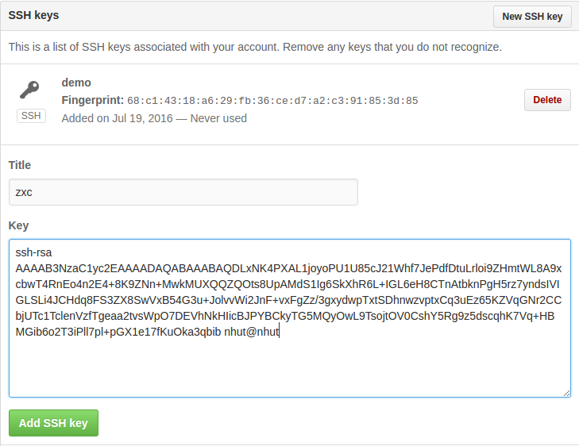
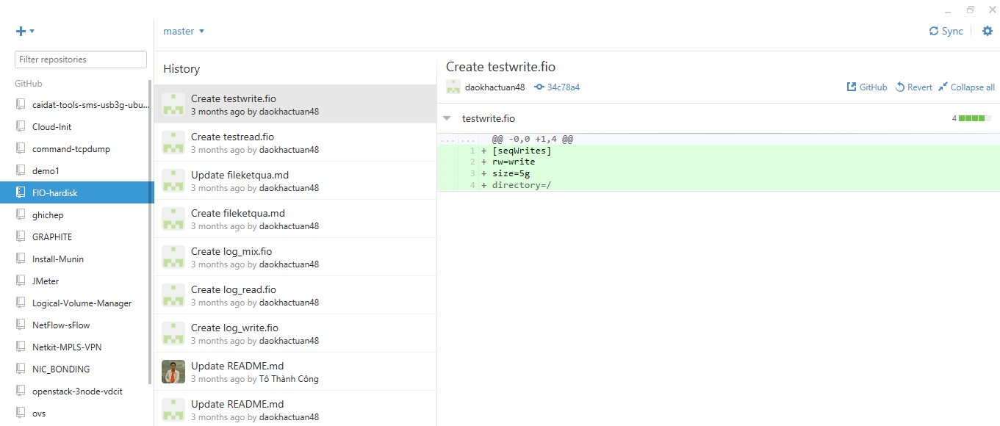
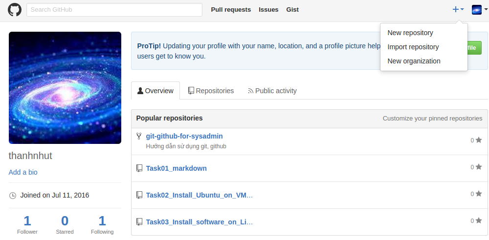
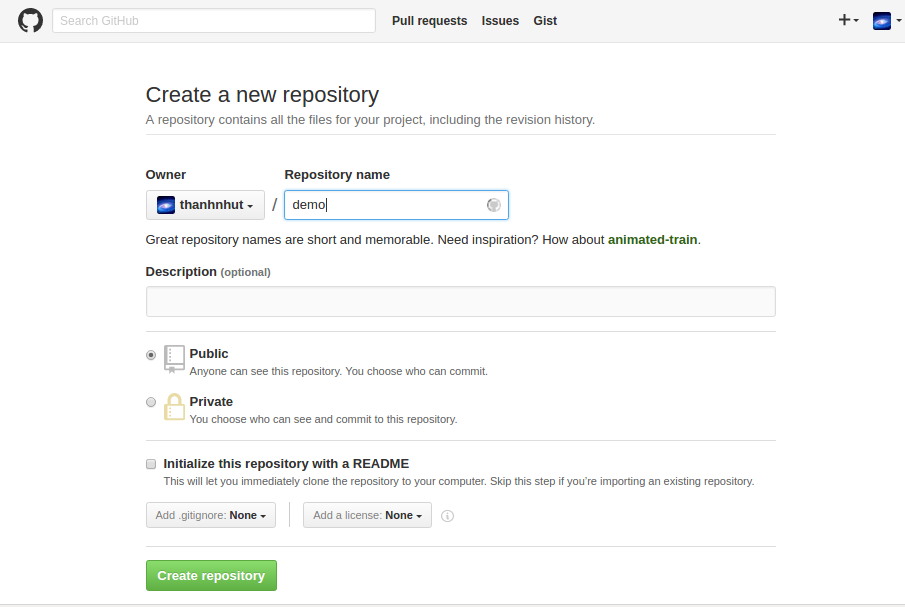
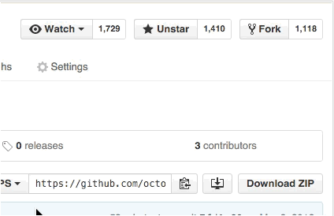
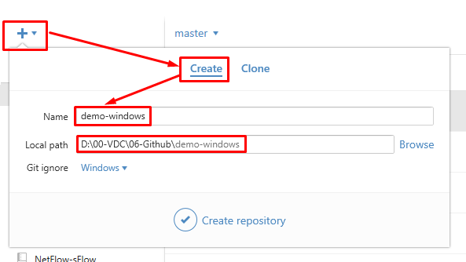
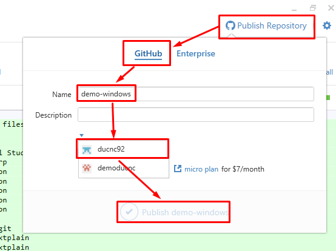
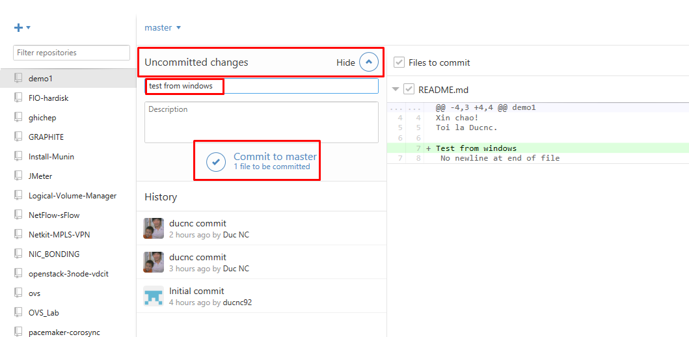

## Tìm hiểu Github

> Tài liệu: Github
> 
> Thực hiện: **Nguyễn Thanh Nhựt**
> 
> Cập nhật lần cuối: **15/07/2016**

### Mục lục

[I.Giới thiệu](#gt)

- [1.1 Sơ lược về lich sử và các dịch vụ](#1.1)

- [1.2 Ưu điểm và nhược điểm của Github](#1.2)

- [1.3 Sự phổ biến của Github](#.13)

- [1.4 Làm thế nào để có thể sử dụng Github](#1.4)

[II.Ngôn ngữ Markdown](#mk)

- [1.Thẻ tiêu đề](#thetieude)

- [2.Chèn link chèn ảnh](#chenlinkchenanh)

- [3.Ký tự in đậm in nghiêng](#kytuindaminnghieng)

- [4.Trích dẫn bo ch](#trichdanbochu)

- [5.Gạch đầu dòng](#gachdaudong)

- [6.Tạo bảng](#taobang)

- [Mẹo](#meo)

[III.Các thao tác với Github](#III)

[1.Cài đặt](#caidat)

- [1.1 Linux](#11linux)

- [1.2 Windows](#12windows)

[2. Thao tác với Repo](#thaotacvoirepo)

 [2.1 Trên Linux](#21trenlinux):

   <ul>

   <li>[2.1.1 Tạo mới](#211taomoi)</li>

   <li>[2.1.2 Clone](#212clone)</li>

<li>[2.1.3 Add,commit,push](#213addcommitpush)</li>

<li>[2.1.4 Pull](#214pull)</li>

<li>[2.1.5 Fork](#fork)</li>

<li>[2.1.6 Nút Star](#star)</li>

<li>[2.1.7 Watch](#watch)</li>

<li>[2.1.8 Remote](#remote)</li>

<li>[2.1.9 Fetch](#fetch)</li>

</ul>

[2.2 Trên Windows](#22trenwindows):

   <ul>

  <li>[2.2.1 Tạo repo](#221taomotrepomoi)</li>

  <li>[2.2.2 Clone](#222clone)</li>

   <li>[2.2.3 Add,commit,push,pull](#223)</li>

</ul>


<a name="gt"></a>
## __I. Giới thiệu__

__GitHub__ là một dịch vụ lưu trữ dựa trên web cho các dự án phát triển phần mềm trong đó sử dụng các hệ thống kiểm soát phiên bản Git. GitHub cung cấp cả kế hoạch trả tiền cho kho tư nhân, và các tài khoản miễn phí cho các dự án mã nguồn mở. GitHub có hơn 3,4 triệu người sử dụng , làm cho nó trở thành máy chủ đang lớn nhất trên thế giới.

<a name="1.1"></a>
####__1.1 Sơ lược về lich sử và các dịch vụ __

- Sự phát triển của nền tảng GitHub bắt đầu vào ngày 19 tháng 10 năm 2007. Các trang web đã được đưa ra vào tháng tư năm 2008 của Tom Preston-Werner, Chris Wanstrath, và PJ Hyett sau khi nó đã được làm sẵn có cho một vài tháng trước như một giai đoạn beta.

- Dự án trên Github có thể được truy cập và thao tác sử dụng một giao diện dòng lệnh và làm việc với tất cả các lệnh git tiêu chuẩn. Github cũng cho phép người dùng đăng ký và không đăng ký để duyệt kho công cộng trên trang web. Và nhiều khách hàng máy tính để bàn đã được tạo ra bởi Github và các bên thứ ba khác mà tích hợp với nền tảng này.

- Trang web cung cấp các chức năng mạng xã hội như thức ăn, người theo, wiki (sử dụng phần mềm Gollum Wiki) và đồ thị mạng xã hội để hiển thị như thế nào các nhà phát triển làm việc trên các phiên bản của họ về một kho lưu trữ.

- Một người sử dụng phải tạo ra một hồ sơ cá nhân để đóng góp nội dung cho trang web, nhưng các kho công cộng có thể được duyệt và tải về bất cứ ai. Với một người dùng đã đăng ký tài khoản, họ có thể thảo luận, quản lý, tạo ra các kho, đóng góp cho người khác kho, và xem xét thay đổi mã.

- GitHub cũng hoạt động dịch vụ khác: một trang web pastebin kiểu gọi Gist  đó là để lưu trữ các đoạn mã; trong khi Github sẽ được cho lưu trữ các dự án lớn hơn. Một dịch vụ lưu trữ được gọi là Speaker Deck.

- Các phần mềm chạy GitHub được viết bằng Ruby on Rails và Erlang bởi GitHub, Inc (trước đây được gọi là logic tuyệt vời) phát triển Chris Wanstrath,[10] PJ Hyett, và Tom Preston-Werner.

- Hệ thống kiểm soát phiên bản (VCS) - ghi lại thay đổi vào một tập tin hoặc thiết lập các tập tin theo thời gian để có thể nhớ lại các phiên bản cụ thể sau.


<a name="1.2"></a>
#### __1.2 Ưu điểm và nhược điểm của Github__

__Ưu điểm__

GitHub chủ yếu được sử dụng để mã, nhưng cũng thường được sử dụng với nhiều loại phi mã của các tập tin như Final Cut hoặc các tài liệu Word.

Ngoài mã nguồn, Github hỗ trợ các định dạng và các tính năng sau đây:

- 3D làm cho các tập tin mà có thể được xem trước bằng cách sử dụng tích hợp trình xem file STL mới hiển thị các tập tin trên một khung 3D.[11] Người xem được hỗ trợ bởi WebGL và Three.js.

- Nguồn gốc định dạng PSD của Photoshop có thể được xem trước và so với các phiên bản trước của cùng một tập tin.

- Lồng nhiệm vụ danh sách

- Tài liệu và Wiki của

- Các trang web nhỏ có thể được lưu trữ từ kho công cộng trên Github. Định dạng URL là http://projectname.github.io. Và có thể được tạo ra bằng cách bắt đầu một kho lưu trữ được định dạng như projectname.io

- Code Snippets (bằng cách sử dụng tên miền phụ Gist)

- Theo dõi vấn đề và tính năng yêu cầu

- Trực quan của dữ liệu không gian địa lý

- Biểu đồ Gantt

__Nhược điểm__

Ý chính xây dựng dựa trên ý tưởng rằng bằng cách thêm điều khiển phiên bản cho các đoạn mã, dễ dàng forking, và mã hóa SSL cho bột nhão tư nhân. Bởi vì mỗi "ý chính" là kho Git riêng của mình, nhiều đoạn mã có thể được chứa trong một dán duy nhất và họ và được đẩy và kéo sử dụng Git. Hơn nữa, đang chia hai có thể được đẩy trở lại các tác giả ban đầu dưới hình thức một bản vá, vì vậy có thể trở bị phân tách các dự án nhỏ.

<a name="1.3"></a>
#### __1.3 Sự phổ biến của Github__

- 24 Tháng Hai năm 2009, trong một cuộc nói chuyện tại Yahoo! trụ sở thành viên trong nhóm __GitHub__ công bố trong một cuộc nói chuyện tại trụ sở trên Yahoo! rằng trong năm đầu tiên __GitHub__ là trực tuyến, nó tích lũy 46.000 kho công cộng, 17.000 trong số họ trong tháng trước đó một mình. Vào thời điểm đó, khoảng 6.200 kho đã được chia hai ít nhất một lần và 4.600 sáp nhập.

- 05 tháng 7 năm 2009, một Blog __Github__ bài thông báo họ đạt đến 100.000 người sử dụng nhãn hiệu. Trong một buổi nói chuyện giao tại Yahoo:

! trên 27 tháng bảy năm 2009, Tom Preston-Werner thông báo rằng những con số này đã tăng lên 90.000 kho công cộng duy nhất, 12.000 đã được chia hai ít nhất một lần, với tổng số 135.000 kho. Vào tháng Bảy năm 2010, __GitHub__ thông báo rằng nó chứa 1 triệu kho. Vào tháng Tư năm 2011, __GitHub__ thông báo rằng nó được lưu trữ 2 triệu kho.

- 16 Tháng 1 năm 2013, __GitHub__ thông báo đã thông qua 3 triệu người sử dụng đánh dấu và sau đó được lưu trữ hơn 5 triệu kho.

- Tháng 7 năm 2012, Peter Levine, đối tác ở nhà đầu tư __GitHub__ của Andreessen Horowitz, nói rằng GitHub đã được phát triển doanh thu 300% mỗi năm kể từ năm 2008 "có lợi nhuận suốt từ đó đến giờ".

<a name="1.4"></a>
#### __1.4 Làm thế nào để có thể sử dụng Github__

- B1: Đăng ký một tài khoản tại [github](http://github.com) và đăng nhập
Tôi chắc chắn rằng một khi bạn đã đọc đến đây thì bạn đã biết thực hiện bước trên như thế nào :)


- B2: Học cách sử dụng ngôn ngữ Markdown:

  <ul>
   <li> Bạn có thể bỏ qua bước này nếu bạn đã biết hoặc các bạn xác định không sử dụng nó để viết. </li>

   <li>Theo cá nhân tôi thì các bạn nên viết bằng Markdown trong Github vì nó sẽ mang lại sự tường minh cho bài viết của bạn. </li>
   <li> Bạn chỉ cần bỏ ra khoảng 2h là đã có thể sử dụng ngôn ngữ này như ý muốn.</li>
 </ul>


- B3: Tạo một repo đầu tiên và gõ Hello world bằng Markdown
Sau đó tạo các repo tùy mục đích, clone nó về client và code.

Bước này sẽ hướng dẫn chi tiết hơn ở phần sau

<a name="mk"></a>
##__II.Ngôn ngữ Markdown__

Ngôn ngữ này khá đơn giản, bạn có thể đọc tại [đây](http://daringfireball.net/projects/markdown/syntax) để biết cách sử dụng.

Tạo một file có tên bất kỳ với đuôi .md. Có thể dùng notepad, notepad++, vi, nano,... hay bất cứ thứ gì mà bạn muốn.

Một số phương pháp  hay sử dụng để viết:

<a name="thetieude"></a>
### 1. Thẻ tiêu đề

Markdown sử dụng kí tự # để bắt đầu cho các thẻ tiêu đề, có thể dùng từ 1 đến 6 ký tự # liên tiếp. Mức độ riêu đề giảm dần từ 1 đến 6

Tùy mục đích và ý thích bạn có thể sử dụng cách này để thể hiện các chỉ mục khác nhau.

Ví dụ:

```
#1.Tiêu đề cấp 1
```

#1.Tiêu đề cấp 1

```
##2.Tiêu đề cấp 2
```

##2.Tiêu đề cấp 2

```
######6.Tiêu đề cấp 6
```

######6.Tiêu đề cấp 6

<a name="chenlinkchenanh"></a>
### 2. Chèn link, chèn ảnh

Để chèn hyperlink bạn chỉ cần paste luôn linh đó vào file .md

```
https://github.com
```

https://github.com

Hoặc bạn cũng có thể sử dụng cú pháp sau để thu ngắn đường dẫn của link

```
[Github](https://github.com)
```

Kết quả là:

[Github](https://github.com)

Để chèn ảnh thì bạn hãy sử dụng cú pháp sau:

```

```

 thường sử dụng công cụ [Lightshot](https://app.prntscr.com/en/index.html) để chụp ảnh màn hình và up hình đó lên trang http://i.imgur.com/ để lấy đường dẫn ảnh đưa vào Github

Hai công cụ này khá dễ sử dụng, bạn chỉ cần chụp màn hình bằng Lightshot ấn Ctrl + C để copy và Ctrl + V để paste vào trình duyệt tại trang web http://i.imgur.com/

<a name=kytuindaminnghieng></a>
### 3. Ký tự in đậm, in nghiêng

- Để in đậm một đoạn text  bạn chỉ cần làm như sau:

```
**từ cần in đậm**
```

**từ cần in đậm**

- Để in nghiên một đoạn text  bạn chỉ cần làm như sau:

```
*từ cần in nghiêng*
```

*từ cần in nghiêng*

<a name="trichdanbochu"></a>
### 4. Trích dẫn, bo chữ

Để bo một đoạn text thì bạn chỉ cần sử dụng cú pháp sau:

```
`đoạn cần bo`
```

Kết quả là: `đoạn cần bo`

Để làm nổi bật một đoạn, chẳng hạn như một đoạn shell hay file cấu hình bạn có thể sử dụng cú pháp như ví dụ sau:

    ```sh
    auto eth0
    iface eth0 inet static
    ipaddress 10.10.10.10
	netmask 255.255.255.0
	gateway 10.10.10.1
	dns-nameservers 8.8.8.8
    ```

Kết quả như sau:

```sh
auto eth0
iface eth0 inet static
ipaddress 10.10.10.10
netmask 255.255.255.0
gateway 10.10.10.1
dns-nameservers 8.8.8.8
```

<a name="gachdaudong"></a>
### 5. Gạch đầu dòng

Để sử dụng gạch đầu dòng bạn chỉ cần sử dụng cú pháp sau:

```
- Gạch đầu dòng thứ nhất
  <ul>
  <li>Thụt với đầu dòng 1</li>
  <li>Thụt với đầu dòng 1</li>
  </ul>
- Gạch đầu dòng thứ hai
  <ul>
  <li>Thụt với đầu dòng 2</li>
  <li>Thụt với đầu dòng 2</li>
  </ul>
```

- Gạch đầu dòng thứ nhất
  <ul>
  <li>Thụt với đầu dòng 1</li>
  <li>Thụt với đầu dòng 1</li>
  </ul>
- Gạch đầu dòng thứ hai
  <ul>
  <li>Thụt với đầu dòng 2</li>
  <li>Thụt với đầu dòng 2</li>
  </ul>

<a name="taobang"></a>
### 6. Tạo bảng

Bạn có thể sử dụng cú pháp sau để tạo bảng:

```
| Cột 1 Hàng 1 | Cột 2 | Cột 3| Cột 4 |
|--------------|-------|------|-------|
| Hàng 2 | 2 x 1 | 2 x 2 | 2 x 3 | 2 x 4 |
| Hàng 3 | 3 x 1 | 3 x 2 | 3 x 3 | 3 x 4 |
| Hàng 4 | 4 x 1 | 4 x 2 | 4 x 3 | 4 x 4 |
```

Kết quả:

| Cột 1 Hàng 1 | Cột 2 | Cột 3| Cột 4 |
|--------------|-------|------|-------|
| Hàng 2 | 2 x 1 | 2 x 2 | 2 x 3 | 2 x 4 |
| Hàng 3 | 3 x 1 | 3 x 2 | 3 x 3 | 3 x 4 |
| Hàng 4 | 4 x 1 | 4 x 2 | 4 x 3 | 4 x 4 |

<a name="meo"></a>
###*Mẹo:*

- Sử dụng trang http://markdownlivepreview.com/ paste vào đó đoạn markdown bạn viết và xem trước để chỉnh sửa cho phù hợp.

- Bạn cũng có thể sử dụng những đoạn markdown của người khác đã viết trước để tham khảo.

Như vậy bạn đã có thể trình bày github của mình một cách sáng sủa bằng markdown.


<a name="III"></a>
## __III.Các thao tác trên Github__


<a name="caidat"></a>
###1. Cài đặt

<a name="11linux"></a>
####1.1. Linux

Với OS là Ubuntu:

> apt-get install git
	
Với OS là Fedora, Centos

> yum instal git

Các thiết lập ban đầu:

- Bạn cần thiết lập tên và email của mình để mỗi khi commit lên server sẽ nhận biết được ai commit lên vì một repo có thể có nhiều người tham gia.
	
> git config --global user.name "thanhnhut"

> git config --global user.email nguyenthanhnhut96@gmail.com

- Lựa chọn trình soạn thảo mặc định, có thể là vi, vim, nano,...

> git config --global core.editor vi

- Liệt kê các thiết lập:

> git config --list

**Liên kết với tài khoản github bằng SSH**

> ssh-keygen -t rsa

```sh
Enter file in which to save the key (/root/.ssh/id_rsa): [Press enter]
Enter passphrase (empty for no passphrase): [Press enter]
Enter same passphrase again: [Press enter]
Your identification has been saved in /root/.ssh/id_rsa.
Your public key has been saved in /root/.ssh/id_rsa.pub.
```

Nếu bạn nhập passphrase thì hãy nhớ pass này!

Kết quả:
> ls ~/.ssh/

```sh
id_rsa       id_rsa.pub   known_hosts
```

> ssh-agent -s

> ssh-add ~/.ssh/id_rsa

> cat ~/.ssh/id_rsa.pub

copy đoạn mã này

Truy cập đường dẫn sau https://github.com/settings/ssh (đảm bảo bạn đã đăng nhập vào github), chọn Add SSH key, đặt tên cho key này tại `Title` và paste nội dung vừa copy vào ô `Key`



Lúc này bạn đã có thể commit lên github tại máy local mà không cần nhập username và password.

<a name="12windows"></a>
####1.2. Windows	

Download tại địa chỉ: https://windows.github.com/

Cài đặt bình thường, yêu cầu phải có .NET 4.5

Giao diện của chương trình:



Thêm tài khoản Github:

- Click vào tool and options (hình bánh răng cạnh biểu tượng Sync) chọn options, Add account. Khai báo username và password trên github.

- Tại mục Configure git thêm Tên và email của mình


Click Update


<a name="thaotacvoirepo"></a>
###2. Thao tác với Repo

<a name="21trenlinux"></a>
####2.1. Trên Linux

<a name="211taomoi"></a>
##### 2.1.1. Tạo mới

Tạo một repo mới trên trang github.com




<a name="212clone"></a>
##### 2.1.2. Clone

Clone repo đó về bằng một trong các cách sau:

**Linux**

***SSH:***
`git clone git@github.com:ducnc92/demo1.git`

hoặc: `git clone git@github.com:ducnc92/demo1.git /opt/demo` để clone vào thư mục /opt/demo

đối với phương pháp này các bạn cần nhập passphrase của ~/.ssh/id_rsa (có thể không cần nếu bạn không đặt passphrase)

***HTTPS:***
`git clone https://github.com/ducnc92/demo1.git`

hoặc: `git clone https://github.com/ducnc92/demo1.git /opt/demo` để clone vào thư mục /opt/demo

Để lấy các link SSH, HTTPS này ta làm như sau: Click vào các hyperlink HTTPS hoặc SSH rồi click Copy to clipboard.


Ở đây tôi sử dụng lệnh `git clone git@github.com:ducnc92/demo1.git`

Lúc này trong thư mục hiện tại sẽ có thêm thư mục demo1 chứa các file trong repo trên github.

Chuyển vào thư mục này:

> cd demo1/

> ls

Lúc này sẽ thấy trong thư mục này có file `README.md`. Để sửa file này ta có thể sử dụng bất cứ trình soạn thảo nào, chẳng hạn vi, nano, gedit,...
 
> vi README.md

Thêm vào nội dung như sau:

```
Xin chao!
Toi la Ducnc.
```

Tạo một thư mục mới, chẳng hạn tên là script để chứa các script của tôi.

> mkdir script

Tạo một script mới trong thư mục đó.

> vi script/script1.sh

```sh
#!/bin/sh
echo "Hello Python Vietnam"
sleep 10
```

bằng cách tương tự các bạn có thể tạo thêm nhiều thư mục, file hướng dẫn, cấu hình, script,... tùy ý

<a name="213addcommitpush"></a>
#####2.1.3. Add, commit, push

Để thực hiện hành động `add` ta sử dụng lệnh sau

> git add README.md
để `add` file README.md

hoặc `git add *` để add tất cả các file hiện có.
 
Để thự hiện hành động commit file README.md ta thực hiện lệnh
> git commit README.md

hoặc `git commit *` để commit tất cả.

ta nên thêm tham số -m để ghi lại một comment cho hành động đó
 
> git commit README.md -m "ducnc sua doi" 

Lúc này các thay đổi của bạn đã được lưu lại trên máy cục bộ. Để đồng bộ lên server Github ta thực hiện lệnh:

> git push origin master

=> nhập passphrase (nếu bạn đặt passphrase ở mục 1.1.) với phương pháp clone ssh hoặc nhập username, password nếu clone bằng https


Lúc này trở lại trang github.com và xem `repo script` lúc đầu sẽ thấy các commit của ta đã được đẩy lên.


Một cách khác nếu bạn không muốn thực hiện clone về máy như bước trên thì bạn có thể làm như sau:

- Tạo một repo mới trên github.com mà không tạo file README.md (giả sử ở đây là repo demo2)

- Tại máy local tạo một thư mục để chứa repo mới này. Ví dụ:

> mkdir /opt/demo2

> cd /opt/demo2

- Thực hiện tạo các file, thư mục như ý muốn. Sau đó thực hiện add, commit, push tương tự như trên
Nhưng ở đây cần thêm lệnh `git remote add origin $git-url` trước khi push. Tham khảo ví dụ sau:

> vi README.md

> git add README.md

> git commit README.md

hoặc `git commit README.md -m noi dung`

> git remote add origin git@github.com:ducnc92/demo2.git

> git push origin master

Sau đó nhập passphrase(nếu cần) hoặc username + password (nếu sử dụng SSH)

<a name="214pull"></a>
#####2.1.4. Pull

Giả sử trên server github của bạn có những thay đổi mà máy local chưa cập nhật những thay đổi đó. Bạn thực hiện lệnh sau:

> cd cd /opt/demo1/

> git pull


<a name="fork"></a>
#####2.1.5 Fork

Tại một thời điểm, chúng ta muốn phân phối project của ai đó, hay chúng ta muốn sử dụng project của một ai đố để bắt đầu. Điều này được định nghĩa là `forking`. Trong phần này, chúng ta sẽ forking một repo tên là awesome.

- Để forking một project, click vào button fork trong github repo.


Sau khi fork một repo, tức là repo đó đã tồn tại trên github repo của chúng ta, chúng ta có thể clone repo đó về local repo. 

Khi một repo đã được clone, nó sẽ có một remote `origin` trỏ đến repo mà chúng ta fork về github của mình, chứ không phải là repo gốc. Để theo dõi (keep track) repo gốc mà đã fork, chúng ta cần add một remote khác có tên là `upstream`:
```
$ cd awesome

$ git remote add upstream https://github.com/NgaNguyenDuy/awesome.git
# Gán repo gốc vào một remote tên là upstream

$ git fetch upstream
```
> push: push thay đổi từ repository local lên repository server

> fetch: cập nhật thay đổi từ repository server về repository local

> pull/rebase: sao chép source code từ server về local workspace (tương đương checkout của SVN)

Như vậy chúng ta đã fork thành công một repo về local repo.

<a name="star"></a>
#####2.1.6 Nút Star

Star một repo lưu trữ cho phép bạn theo dõi các dự án mà bạn thấy thú vị, thậm chí nếu bạn không liên quan đến dự án.

Khi bạn star một kho lưu trữ, bạn đang thực sự thực hiện hai hành động riêng biệt:

- Tạo một bookmark để truy cập dễ dàng hơn
- Hiển thị sự đánh giá cao cho nhà duy trì repo cho công việc của họ

Nhiều người trong bảng xếp hạng repo GitHub của phụ thuộc vào số lượng của các ngôi sao một repo lưu trữ có. Ví dụ, các kho có thể được sắp xếp và tìm kiếm dựa trên số star của họ . Ngoài ra, các trang Khám phá cho bạn thấy repo phổ biến dựa trên số lượng của các star mà họ có.


<a name="watch"></a>
#####2.1.7 Watch

Khi bạn xem một repo lưu trữ, bạn nhận được thông báo cho bất kỳ yêu cầu mới  và các vấn đề mà được tạo ra, bao gồm cả những người không nhắc đến bạn.

Mẹo: Bạn sẽ tự động xem bất kỳ kho bạn tạo ra hoặc được tạo ra bởi nhóm của bạn trong một tổ chức.

Trên GitHub, điều hướng đến các trang chính của các repo lưu trữ.

Chọn menu sát Ở góc trên bên phải, trong danh sách "Watch", chọn Watch.



<a name="remote"></a>
#####2.1.8 Remote

Để xem bạn đã cấu hình tới máy chủ từ xa nào, bạn có thể chạy lệnh git remote. Nó sẽ liệt kê tên ngắn gọn của mỗi máy chủ từ xa bạn đã chỉ định. Nếu bạn sao chép nó từ một kho chứa có sẵn, ít nhất bạn sẽ thấy bản gốc (origin) - tên mặc định mà Git đặt cho phiên bản trên máy chủ mà bạn đã sao chép từ đó:

```
$ git clone git://github.com/schacon/ticgit.git
Initialized empty Git repository in /private/tmp/ticgit/.git/
remote: Counting objects: 595, done.
remote: Compressing objects: 100% (269/269), done.
remote: Total 595 (delta 255), reused 589 (delta 253)
Receiving objects: 100% (595/595), 73.31 KiB | 1 KiB/s, done.
Resolving deltas: 100% (255/255), done.
$ cd ticgit
$ git remote
origin
```

Bạn cũng có thể sử dụng tham số -v để hiển thị địa chỉ mà Git đã lưu tên rút gọn đó:
```
$ git remote -v
origin  git://github.com/schacon/ticgit.git (fetch)
origin  git://github.com/schacon/ticgit.git (push)
```

Nếu bạn có nhiều hơn một máy chủ từ xa, lệnh này sẽ liệt kê hết tất cả. Ví dụ, kho chứa Grit sẽ hiện thị tuơng tự như sau:
```
$ cd grit
$ git remote -v
bakkdoor  git://github.com/bakkdoor/grit.git
cho45     git://github.com/cho45/grit.git
defunkt   git://github.com/defunkt/grit.git
koke      git://github.com/koke/grit.git
origin    git@github.com:mojombo/grit.git
```
<a name="fetch"></a>
#####2.1.9 Fetch
```
$ git fetch [remote-name]
```
Lệnh này sẽ truy cập vào dự án từ xa đó và kéo xuống toàn bộ dữ liệu mà bạn chưa có trong đó cho bạn. Sau khi thực hiện xong bước này, bạn đã có các tham chiếu đến toàn bộ các nhánh của dự án từ xa đó, nơi mà bạn có thể tích hợp hoặc kiểm tra bất kỳ thời điểm nào


<a name="22trenwindows"></a>
####2.2. Trên Windows

<a name="221taomotrepomoi"></a>
#####2.2.1. Tạo một repo mới

Tạo repo trên github.com tự như mục 2.1.1.

Tạo repo bằng phần mềm Github

- Click vào dấu cộng, chọn tab Create, đặt tên và chọn đường dẫn cho repo mới



- Tuy nhiên repo mới sinh ra mới chỉ có ở máy trạm, tại mục `Other`. Chọn chuột phải vào repo đó và chọn `Open in Explorer` để sửa nội dung của repo này.


- Sau khi chỉnh sửa xong, để đẩy repo đó lên github.com ta click vào `Publish this repository` và thực hiện như hình sau. Chú ý cần chọn Organization đặt repo này.


<a name="222clone"></a>
#####2.2.2. Clone

Click vào dấu cộng, chọn tab Clone, lựa chọn tổ chức mong muốn và chọn repo cần clone


Để chỉnh sửa nội dung của repo này ta chọn chuột phải vào nó và chọn `Open in Explorer`


Lúc đó chương trình Windows Explorer sẽ mở ra thư mục chứa repo của github, bạn có thể chỉnh sửa các file trong này, tạo xóa thư mục,... một cách bình thường.

<a name="223"></a>
#####2.2.3. Add, commit, push, pull 

Trở lại với chương trình Github ta sẽ thấy dòng `uncommited changes` tại repo ta vừa sửa. Bạn hãy điền vào đó comment và ấn `commit to master`



Lúc này sự thay đổi của bạn với mã nguồn đã được ghi lại trên máy local, để đồng bộ nó lên server github bạn hãy ấn vào biểu tượng `Sync` ở góc trên cùng bên phải.

Sau khi đồng bộ xong, quay trở lại repo trên trang github.com.


Để đồng bộ những thay đổi trên github.com về máy local (pull) ta cũng click vào biểu tượng `Sync` như bên trên.


