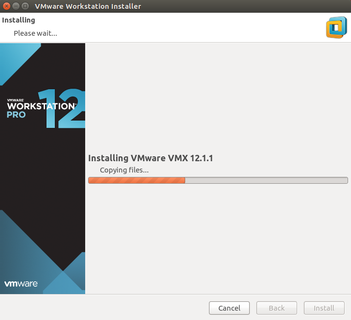

## Cài đặt Ubuntu lên máy ảo VMware Workstation

> Tài liệu: Cài đặt Ubuntu lên máy ảo VMware Workstation
> 
> Thực hiện: **Nguyễn Thanh Nhựt**
> 
> Cập nhật lần cuối: **15/07/2016**

### Mục lục

[1. Cài đặt VMware Workstation](#caidatvmware)

[2. Cài đặt hệ điều hành Ubuntu](#caidatubuntu)

- [2.1. Chuẩn bị](#chuanbi)

- [2.2. Các bước cài đặt](#cacbuoccaidat)

---

### 1. Cài đặt VMware Workstation

**Các bước cài đặt:** 

**Bước 1:** Cài đặt các gói phụ thuộc cho VMware Workstation

_Mở terminal và gõ lệnh sau đây apt_

**Bước 2:** Tải VMware Workstation 12 từ trang web chính thức của nó

_Truy cập địa chỉ sau từ trình duyệt web của bạn để tải về phiên bản dùng thử của VMware Workstation 12 trên hệ thống của bạn_

[http://www.vmware.com/go/tryworkstation-linux-64](http://www.vmware.com/go/tryworkstation-linux-64)

**Bước 3:** Bắt đầu cài đặt VMware Workstation 12 từ terminal 

_Trước khi bắt đầu quá trình cài đặt, hãy thiết lập cho phép thực thi trên các tập tin đã tải_

_Bây giờ Bắt đầu cài đặt VMware Workstation bằng cách thực hiện các tập tin gói đã tải về_

_Chấp nhận thỏa thuận cấp phép và nhấn vào Next_

_Chọn Yes lựa chọn nếu bạn muốn kiểm tra cập nhật khi khởi động nếu không thì chọn No_

_Click Next để tiến xa hơn._

_Trong bước này, chọn Yes hoặc No tùy thuộc vào sự lựa chọn của bạn_

_Nhập tên người dùng sẽ có quyền kết nối VMware Workstation Server_

_Xác định thư mục hoặc thư mục trên các tập tin được chia sẻ máy ảo sẽ được lưu trữ._

_Cổng https cho VMware Workstation máy chủ_

_Trong trường hợp bạn có giấy phép chính của VMware Workstation 12 nhập vào đây nếu không thì để trống cho phiên bản trail._

_Nhấn vào Install  VMware Workstation 12 thiết lập sẵn sàng._

_Trong bước này, chúng ta có thể thấy rằng VMware workstation 12 cài đặt đã bắt đầu và đang tiến hành._

_Cài đặt hoàn tất quá trình._

### 2. Cài đặt hệ điều hành Ubuntu

#### 2.1. Chuẩn bị

- Cấu hình tối thiểu cho quá trình cài đặt Ubuntu Desktop là máy có RAM 256 MB, ổ cứng còn 5 Gb chỗ trống, và card màn hình VGA hỗ trợ độ phân giải 640x480 trở lên. Cấu hình khuyên dùng cho quá trình cài đặt là máy có bộ vi xử lí 700 MHz x86, RAM 384 MB, ổ cứng còn 8 GB trống, và card màn hình VGA hỗ trợ độ phân giải 1024×768.

- Đĩa CD hoặc file cài [http://www.ubuntu.com/download/desktop][http://www.ubuntu.com/download/desktop]

#### 2.2. Các bước cài đặt

- Mở __VMware Workstation__ và click vào __Create a New Virtual Machine__

- Chọn  __custom (advanced)__ vì nó mang đến nhiều lựa chọn

- Click next và chọn phiên bản  __VMware Workstation__ tương ứng 

- Chọn đến thư mục chứa file IOS mà ở trên  đã tải về

- Trong khung hiện lên điền  __Full Name, Last Name và password__

- Đặt tên và thiết lập vị trí cho máy ảo Ubuntu

- Đặt CPU ảo và lõi mà bạn muốn, nên chọn 1 bộ xử lý và 2 lõi để  __Ubuntu__ mạnh hơn

- Điều chỉnh bộ nhớ cho __Ubuntu__ , nếu máy 32bits thì nên chọn 1024MB còn đối với máy 64 bits chọn 2048MB

- Chọn kiểu mạng mà bạn muốn

- Click Next chọn __LSI Logic (recommended)__

- Tiếp tục click next chọn __SCSI (recommended)__

- Click Next chọn __Creata a new virtual disk__ để tạo ổ đĩa mới cho __Ubuntu__

- Chỉ định bao nhiêu không gian đĩa  muốn sử dụng cho  __Ubuntu__  rồi chọn  __store virtual disk as a single file__  tùy chọn này cho phép thực hiện nhiều hơn

- Click Next ở cửa sổ tiếp theo

- Hiện những thông số đã cài đặt click finish

- Quá trình cài đặt sẽ được tự động

- Sau khi qúa trình cài đặt hoàn tất màn hình đăng nhập xuất hiện nhập password vào

Chúc mừng cài đặt thành công

### Hết
