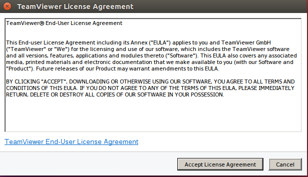

# Các cách cài đặt phần mềm trên Linux 

> Tài liệu: Cài đặt Ubuntu lên máy ảo VMware Workstation
> 
> Thực hiện: **Nguyễn Thanh Nhựt**
> 
> Cập nhật lần cuối: **15/07/2016**

## Mục lục
[1.Giới thiệu](#gt)

[2.Cài đặt phần mềm trên Linux](#2)

- [2.1 Sử dung __sofware__ có sẵn trong Linux](#21)

- [2.2 Sử dụng __apt-get__ với cửa sổ dòng lệnh](#22)


- [2.3 Cài đặt trực tiếp từ  __file. rmp__   và  __.deb__](#23)

[3.Hướng dẫn cài một số phần mềm trên Linux](#huongdancai)


- [3.1 Cài đặt __teamviewew file.deb__ bằng câu lệnh __dpgk__](#team)

- [3.2Cài đặt __ibus-bogo__ bằng mã nguồn](#ibus)

- [3.3 Cài đặt __packet__](#packet)

- [3.4 Cài đặt  __VLC__](#vlc)


---

<a name="gt"></a>
###  __1.Giới thiệu__

__Phần mềm trên Linux được phân phối như thế nào?__
Trên Windows, phần mềm thường được phân phối ra dưới dạng file cài đặt .msi hoặc .exe thì trên Linux cũng gần tương tự như vậy, có điều trên Linux có nhiều hình thức hơn so với Windows. Phần mềm cho Linux thường có ở dưới những dạng sau:

- Trong bộ đĩa cài đặt (thường với những bản phân phối lớn như Redhat, openSuse, Mandriva…)

- Trên trang web của nhà sản xuất (thường có sẵn hướng dẫn cài đặt cho từng hệ thống)

- Trên các repository (gọi tắt: repo) là các nơi chứa phần mềm tập trung trên mạng dành riêng cho một hệ thống nào đó. Trong đó, Ubuntu và Debian sử dụng repo nhiều nhất, kế đến là Fedora và openSuse. Mọi phần mềm đều được chứa tại repo và khi nào người dùng cần thì phần mềm sẽ được tải về từ repo, sau đó cài lên máy. Rất tiện lợi cho việc cập nhật và nâng cấp phần mềm.

Các gói cài đặt phần mềm có thể được lưu ở dạng file chạy trực tiếp (như .exe thường thấy trên Windows…) hoặc ở các định dạng phân phối dành riêng mà phổ biến nhất là .RPM và .DEB (các gói phần mềm này có thể cài đặt dễ dàng và gần như đã thành chuẩn chung cho việc phân phối phần mềm). Phần mềm cũng có thể được phân phối dưới dạng mã nguồn (nhất là phần mềm nguồn mở), người dùng phải tự biên dịch trên máy rồi cài đặt.

__RPM và DEB là gì?__
Như đã nói ở trên, RPM và DEP là hai định dạng phân phối phần mềm rất phổ biến dành riêng cho Linux. RPM (Redhat package manager) và DEB (Debian software package), chúng giống như định dạng file nén mà trong đó chứa tất cả nhưng file chạy và cấu hình của phần mềm, thông tin về phần mềm, nhà sản xuất, những yêu cầu về hệ thống… Hệ điều hành Linux sẽ có một phần mềm chuyên dùng để cài đặt các gói phần mềm dạng này, nói chung thì phần mềm kiểu này rất dễ dàng để cài đặt.

RPM thường được dùng trong các hệ thống của Redhat như Fedora, openSuse,… còn DEB lại được dùng trên các hệ thống của Debian gồm Debian, Ubuntu…

Mỗi file RPM hoặc DEB chỉ chứa một phần mềm hoặc một phần nào đó của phần mềm. Vì vậy thường khi cài một phần mềm phải cài đặt kèm theo 1, 2 hay thậm chí cả chục gói khác, nên đôi khi xảy ra tình trạng không thể cài đặt do thiếu một gói nào đó. Khi cài đặt bao giờ cũng có một quá trình kiểm tra xem toàn bộ gói cần thiết đã có đầy đủ chưa, nếu thiếu một gói nào đó, quá trình cài đặt sẽ dừng lại. Công việc này được gọi là "check dependency".

Chính vì sự ràng buộc đó nên chúng ta mới cần đến những phần mềm hỗ trợ cài đặt. Những phần mềm này sẽ tự động tải về hoặc tìm tất cả những gói có liên quan rồi lần lượt cài đặt chúng theo đúng thứ tự. Nhờ đó mà việc cài đặt sẽ trở nên suôn sẻ và dễ dàng hơn.

<a name="2"></a>
###__2.Cài đặt phần mềm trên Linux__
Trong hệ điều hành Linux, có 3 cách cơ bản nhất để cài đặt phần mềm mới như sau:

<a name="21"></a>
 2.1 Sử dung __sofware__ có sẵn trong Linux

Mở software


chọn phần mềm muốn cài click Install


<a name="22"></a>
 2.2 Sử dụng __apt-get__ với cửa sổ dòng lệnh

```
 sudo apt-get install xyz
 
```

 => lệnh tiến hành tải về và cài đặt gói xyz (xyz là tên gói cần cài đặt - sẽ cài thêm cả những gói liên quan nếu cần)
```
sudo apt-get remove xyz
```
=> lệnh gỡ bỏ gói đã cài (có thể sẽ gỡ thêm cả những gói khác nếu thấy không cần đến nữa)

```
sudo apt-cache search xyz
```
=> lệnh tìm kiếm để đưa ra danh sách những gói có từ cần tìm (giống chức năng search trong Add/Remove)


<a name="23"></a>
 2.3 Cài đặt trực tiếp từ  __file. rmp__   và  __.deb__

 Để cài file .deb trên Ubuntu thì bạn chỉ việc mở file đó ra như một file bình thường khi đang duyệt thư mục trong Nautilus (trình quản lí tập tin trong Gnome), chương trình quản lí file deb sẽ tự chạy. Chúng ta chỉ việc click vào Install mà thôi.


Cửa sổ này sẽ hiện ra chỉ cần click Install phần mềm sẽ tự cài đặt


 Với file .rpm muốn cài đặt lên Ubuntu phải được chuyển đổi sang dạng .deb. Nhưng nói chung không nên làm như vậy vì thường sẽ xảy ra vấn đề là thiếu tính tương thích. Trên những hệ thống Linux dùng định dạng file .rpm bạn có thể cài file bằng lệnh

```
sudo rpm -i xyz với xyz là tên gói cần cài đặt

```

<a name="huongdancai"></a>
### __3.Hướng dẫn cài đặt một số phần mềm__

<a name="team"></a>
3.1 Cài đặt __teamviewew file.deb__ bằng câu lệnh __dpgk__

Bước 1: Mở terminal và nhập câu lệnh
```
wget http://download.teamviewer.com/download/teamviewer_linux.deb
```

Bước 2: Thêm hỗ trợ 32bit nếu như bạn chạy Ubuntu 64bit, bằng cách nhập
```
sudo dpkg –add-architecture i386


```
Bước 3:Cập nhật gói bằng lệnh
```
sudo apt-get update
```
Bước 4: Cài đặt teamviewer vừa tải về bằng lênh

```
sudo dpkg -i teamviewer_linux.deb

```

nếu bạn gặp bất cứ lỗi nào khi cài thì nhập lệnh

```
sudo apt-get -f install
```

Rồi nhập lại câu lệnh trên

Vào search your computer gõ team, teamview sẽ hiện ra nhấn vào đó để khởi động teamview


Cửa sổ tiếp theo sẽ hiện ra click vào  __Accept license Agreements__



Đây là giao diện teamviewer


<a name="ibus"></a>
3.2Cài đặt ibus-bogo bằng mã nguồn

Lệnh sau sẽ cài đặt các gói cần thiết 

```
sudo apt-get install python3 ibus cmake python3-gi pyqt4-dev-tools \
gir1.2-ibus-1.0 gir1.2-wnck-3.0 python3-pyqt4 qt4-linguist-tools \
python3-enchant

```
Sau đó bạn tải mã nguồn tại https://github.com/BoGoEngine/ibus-bogo-python/releases rồi giải nén. Hoặc dùng:

```
git clone https://github.com/BoGoEngine/ibus-bogo.git

```

Chạy lênh sau để cài đặt

```
sudo make install

```
Gỡ cài đặt 

```
sudo make uninstall

```

<a name="packet"></a>
3.3 Cài đặt packettracer 

Bước 1: Vào http://taimienphi.vn/download-packet-tracer-20115/6.2-phien-ban để tải về và giai nén nó ra

Bước 2: Mở terminal nhập lênh để cập nhật gói

```
sudo apt-get update

```

Tiếp theo truy cập tiếp vào thư mục vừa giai nén và nhập lệnh qúa trình cài đặt sẽ được thực hiện

```
sudo ./install

```

Mở packettracer bằng cách vào __terminal nhập packettracer__


Đây là giao diện khi mở packettracer


<a name="vlc"></a>
3.4 Cài đặt VLC

Bước 1: Mở terminal nhập lệnh

```
sudo add-apt-repository ppa:videolan/master-daily

```

Bước 2: Cập nhật gói bằng  câu lệnh 

```
sudo apt-get update
```

Bước 3: Nhập câu lệnh sau để tiến hành cài

```
sudo apt-get install vlc
```

Vào  __search your computer__ gõ  __vlc__ để mở


Đây là giao diện của VLC


