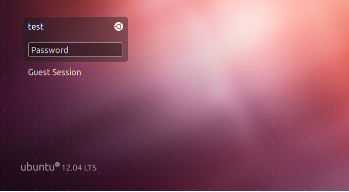

## Tìm hiểu về DE & DM

> 
> 
> Thực hiện: **Nguyễn Thanh Nhựt**
> 
> Cập nhật lần cuối: **26/07/2016**

### Mục lục

[I. Tìm hiểu Desktop environment (DE)](#I)

- [1.Gioi thiệu](#1)

- [2. Lịch sử ](#2)

- [3. Desktop manager thông dụng](#3)

[II. TÌm hiểu Display manager (DM)](#II)

---

## __I. Tìm hiểu Desktop environment (DE)__

#### __1. Giới thiệu__

Trong máy tính , Desktop environment (DE) là một thực hiện của phép ẩn dụ máy tính để bàn đã có một loạt những chương trình đang chạy trên một máy tính hệ điều hành , mà chia sẻ một phổ biến giao diện người dùng đồ họa (GUI), đôi khi được mô tả như một vỏ đồ họa . Các môi trường máy tính để bàn đã được nhìn thấy chủ yếu trên các máy tính cá nhân cho đến khi sự nổi lên của điện toán di động .  Desktop GUI giúp người dùng dễ dàng truy cập và chỉnh sửa các tập tin, trong khi họ thường không cung cấp quyền truy cập vào tất cả các tính năng được tìm thấy trong các lớp dưới hệ điều hành. Thay vào đó, truyền thống giao diện dòng lệnh (CLI) vẫn được sử dụng khi kiểm soát hoàn toàn hệ điều hành được yêu cầu.

Một môi trường máy tính để bàn thông thường bao gồm các biểu tượng , cửa sổ , thanh công cụ , thư mục , hình nền và desktop widgets  (xem yếu tố của giao diện người dùng đồ họa và __WIMP__ ).  Một giao diện cũng có thể cung cấp khả năng kéo  thả các chức năng và các tính năng mà làm cho các phép ẩn dụ để bàn nhiều hơn hoàn thành. Một Desktop environment nhằm mục đích  một cách trực quan cho người dùng tương tác với máy tính sử dụng các khái niệm đó cũng tương tự như sử dụng khi tương tác với thế giới vật chất, chẳng hạn như các nút và cửa sổ.

Trong khi Desktop environment ban đầu được mô tả một phong cách giao diện người dùng theo ẩn dụ máy tính để bàn, nó cũng đã đến để mô tả các chương trình thực hiện các phép ẩn dụ của chính nó.  Sử dụng này đã được phổ biến rộng rãi bởi các dự án như __Common Desktop Environment__ , __K Desktop Envuronment__ , và  __ GNOME __  .

#### __2. Lịch Sử__

Các Desktop environment đầu tiên được tạo ra bởi __Xerox__ và được bán với __Xerox Alto__ vào những năm 1970. Các__ Alto__ thường được coi là của __Xerox__ là một máy tính văn phòng cá nhân nó đã thất bại trên thị trường vì thị trường nghèo nàng và một giá rất cao.  Với __Lisa__ , của __Apple__ đã giới thiệu một Desktop environment vào một giá cả phải chăng máy tính cá nhân , mà cũng thất bại trên thị trường.

Desktop metaphor  đã được phổ biến trên thương mại máy tính cá nhân của bản gốc __Macintosh__ từ của __Apple__ vào năm 1984, và đã được phổ biến rộng rãi hơn nữa bằng của __Windows__ từ __Microsoft__ kể từ những năm 1990. Như năm 2014 , các desktop environment phổ biến nhất là con cháu của những environment trước đó, bao gồm cả __Aero__ environment sử dụng trong __Windows Vista__ và __Windows 7__ , và __Aqua environment__ được sử dụng trong hệ điều hành X . Khi so sánh với X dựa trên _Desktop environment có sẵn cho Unix như hệ điều hành như __Linux__ và __FreeBSD__ , sự độc quyền của các Desktop environment trong __Windows__ và __OS X__ đã tương đối cố định bố trí và các tính năng tĩnh, với tích hợp cao thiết kế "liền mạch" mà mục đích là để cung cấp trải nghiệm khách hàng chủ yếu là nhất quán trên các cài đặt.

__Microsoft Windows__ thống trị trong thị phần giữa các máy tính cá nhân với Desktop environment. Máy tính sử dụng hệ điều hành giống __Unix __ như __OS X__, __Chrome OS__, __Linux__, __BSD__ hoặc __Solaris__ là ít phổ biến. Tuy nhiên, tính đến năm 2015 có một thị trường đang phát triển cho máy tính __Linux__ chi phí thấp bằng cách sử dụng X Hệ thống cửa sổ hoặc __Wayland__ với một sự lựa chọn rộng của desktop environments. Trong số các phổ biến hơn trong số này là của __Google Chromebook__ và __Chromebox__ , __Intel NUC__ , các __Raspberry Pi__ , vv...

Trên máy tính bảng và điện thoại thông minh, tình hình là ngược lại, với các hệ điều hành Unix-như thống trị thị trường, bao gồm iOS (BSD-nguồn gốc), __Android__ , __Tizen__ , __Sailfish__ và __Ubuntu__ (tất cả Linux nguồn gốc). __Microsoft Windows Phone__ , __Windows RT__ và __Windows __ 10 được sử dụng trên một số nhỏ hơn nhiều của máy tính bảng và điện thoại thông minh. Tuy nhiên, phần lớn các hệ điều hành __Unix-like__ chiếm ưu thế trên các thiết bị cầm tay không sử dụng các desktop environment X11 sử dụng bởi hệ điều hành giống như Unix, thay vào đó dựa trên các giao diện dựa trên các công nghệ khác.

#### __3. Desktop Environment thông dụng__

__Unity__

Unity là môi trường màn hình nền riêng của Ubuntu, được phát triển bởi Ubuntu. Không có bản distro nào của Linux sử dụng Unity.
Điều này cho thấy tầm nhìn của Ubuntu về môi trường màn hình nền, và có một chút khác biệt so với các môi trường màn hình nền truyền thống của Windows. Một trong những tính năng tuyệt vời của Unity là "scopes"; tính năng này cho phép bạn tìm kiếm các loại nội dung khác nhau trên trang web và máy tính của bạn từ "bảng điều khiển," liệt kê các ứng dụng đã được cài đặt. Đây cũng là một trong những tính năng hàng đầu của Ubuntu dành cho điện thoại. Unity cũng có một vài tính năng vô song như "HUD", nó cho phép bạn tìm kiếm các tùy chọn thực đơn của một chương trình và kích hoạt chúng ngay từ bàn phím.

Trong lúc có nhiều người dùng Linux đã trải nghiệm và than phiền về Unity, thì nó vẫn là một môi trường màn hình nền đã cải tiến mà mọi người hay sử dụng.
Những người chỉ trích Unity vì không thích việc thiếu cấu hình. Thanh Unity launcher luôn luôn ở bên trái màn hình và không thể di chuyển được. Các nút minimize, maximize, và close thì ở góc phía trên bên trái của mỗi cửa sổ - như trên Mac - và cũng không thể di chuyển được. Trong một vài năm qua, Unity đã có một vài thay đổi nhỏ, nhưng dự án Ubuntu thì đã có sự thay đổi lớn qua phiên bản Unity 8 dành cho máy tính và điện thoại.

__GNOME 3__

Ubuntu đã sử dụng một lần phiên bản cũ hơn của môi trường GNOME, khi các bản distro của Linux phổ biến nhất đã sử dụng. Nhưng, với sự chuyển đổi từ GNOME 2 sang GNOME 3 và GNOME Shell desktop, thì Ubuntu đã quyết định không sử dụng GNOME nữa. Tuy thế, GNOME đã không bị xóa bỏ. GNOME Shell đã được cải tiến một cách đột ngột. Thậm chí những người dùng thích các môi trường màn hình nền truyền thống hơn vẫn có thể sử dụng GNOME Shell thông qua bảng hướng dẫn của GNOME. GNOME cũng lập đầy đủ cấu hình với các tiện ích.

Unity và GNOME thật sự khá giống nhau, và sử dụng nhiều các ứng dụng giống nhau. Cả hai desktop environment đảm bảo phần cứng đồ họa 3D của bạn có hiệu ứng đẹp hơn. GNOME 3.16 đã thêm trung tâm thông báo (notification center). Nhờ vào sự mở rộng của mình, GNOME cũng có nhiều cấu hình hơn Unity.

__KDE Plasma 5__

Trước đây, KDE và GNOME là các desktop environment lớn nhất của Linux. Hiện tại GNOME desktop đã tách khỏi GNOME, Unity, Cinnamon, và MATE, ngoài KDE vẫn đang phát triển mạnh. Plasma 5 interface thì được cải tiến hơn bao giờ hết.
KDE luôn luôn có nhiều cấu hình hơn GNOME và GNOME-derived Linux distro. Một số người dùng thích có nhiều nhiều tùy chọn, trong khi một số khác thì xem xét tất cả các tùy chọn đó và thích sự đơn giản của GNOME. Tuy nhiên KDE đã không có nhiều sự nổi trội.

Việc sử dụng KDE thật sự rất khác so với sử dụng Unity, GNOME, Cinnamon, hay MATE. Các desktop environment đó sử dụng tương tự các ứng dụng của GNOME gắn liền với bộ công cụ GTK. KDE luôn được xây dựng trên Qt, và có bộ ứng dụng của riêng mình. Các ứng dụng này chỉ được hợp nhất trên các desktop environment phù hợp.
Để có được KDE Plasma 5 thì hãy tải về Kubuntu 15.04. Hầu hết các bản distro của Linux vẫn còn đang sử dụng môi trường KDE 4 cũ.

__Cinnamon__

Ban đầu Cinnamon được xây dựng dành cho Linux Mint, nhưng hiện tại nó được dùng cho các distro của Linux khác như Ubuntu, Fedora, và Debian.

Ban đầu đây là một phân nhánh của GNOME 3, được xây dựng dựa trên lập trình hiện đại nhưng được làm lại để mang đến một giao diện desktop truyền thống hơn. Nếu GNOME đã bỏ thanh tác vụ và trình thực đơn Start để hiện thị các ứng dụng đã được cài đặt, thì Cinnamon lại xây dựng desktop environment mang tính truyền thống hơn. Trong khi GNOME chú trọng đến smartphone, thì Cinnamon thêm các tính năng và các cải tiến dành cho người dùng máy tính.
Cinnamon sẽ trở nên quen thuộc với những người dùng yêu thích các desktop environment cũ của Linux, hay những người dùng của Windows mà không thích thanh tác vụ mới trên Windows 7.

__MATE__

MATE và Cinnamon là các desktop environment tương tự nhau. Trong khi Cinnamon nhận các lập trình của GNOME 3 và đã tạo ra một desktop environment truyền thống hơn, thì MATE nhận lập trình của GNOME 2 cũ hơn và bắt đầu cập nhật để nó tiếp tục làm việc trên các bản distro Linux hiện đại.

Nếu trước đây bạn đã từng sử dụng GNOME 2 và đã bỏ lỡ nhiều tính năng của nó, thì MATE là desktop environment của Linux dành cho bạn. Những người dùng mới có thể sẽ thích Cinnamon, một desktop environment truyền thống được xây dựng dựa trên lập trình hiện đại. Tuy nhiên, MATE 2 có thể phù hợp với các máy tính đời cũ hơn. Nếu bạn gặp các vấn đề với hiệu suất khi sử dụng Cinnamon và bạn muốn một cái gì đó tương tự, thì hãy thử dùng MATE 2.
Không giống như các desktop environment hiện đại, các hiệu ứng desktop đòi hỏi 3D acceleration không được kích hoạt mặc định trên MATE. Nhưng hiện tại thì đã có Compiz và có được các hiệu ứng hình ảnh trên MATE desktop.

__Lxde__

Hiện tại Lxde đứng đầu trong số các desktop environment vì nó là một desktop environment thân thiện người dùng và nhanh. Nếu bạn đang sử dụng một máy tình đời cũ và vẫn muốn sử dụng nó, thì hãy thử dùng Lxde thay vì các desktop environment hiện đại khác của Linux mà luôn cần nhiều phần cứng đồ họa, CPU time, và RAM để vận hành một cách phù hợp. Bạn sẽ không tìm thấy các hiệu ứng đồ họa đẹp, mà chỉ có những hiệu ứng cơ bản, và bạn có thể quản lý được các ứng dụng của mình với Lxde.

__Xfce__

Về cơ bản, Xfce là lựa chọn thứ ba sau GNOME và KDE. Xfce thì ít tốn bộ nhớ hơn KDE và GNOME. Sau khi GNOME 3 được phát hành, thì Xfce đã trở thành một desktop environment truyền thống hàng đầu của Linux.
Lxde thì chỉ ít gây tốn bộ nhớ. Cinnamon thì có đầy đủ các tính năng hơn. MATE thì cũng có đầy đủ các tính năng và ít gây tốn bộ nhớ vào thời điểm này. Xfce thì không bị dẹp bỏ, nhưng nó đang phát triển một cách chậm rãi.

##__II.Tìm hiểu Display manager(DM)__ 

Display manager or login manager thường là một giao diện đồ họa người dùng  được hiển thị ở cuối của quá trình khởi động ở vị trí của default shell, có các implementation khác nhau của display manager, cũng như có nhiều loại khác nhau của __window manager__ and __desktop environments__. Thường có một số lượng tùy biến nhất định và khả năng có sẵn với mỗi loại.

####__Một số Display manager __

__Entrance__

Entrance  là một display manager cho các hệ thống __X Window__ . Nó được viết bằng cách sử dụng Enlightenment Foundation Libraries , một bộ công cụ đồ họa viết bằng C .

Entrance là themeable, và có khả năng tung ra các desktop environment khác nhau từ một danh sách, cũng như nhớ người dùng để tự động đăng nhập. Nó cũng cho phép hoạt hình và hiệu ứng hình ảnh. Tùy biến được thực hiện bằng cách chỉnh sửa cơ sở dữ liệu nằm trong /etc/entrance/entrance.conf theo mặc định.

__GDM-GNOM__

GDM(the GNOM Display manager) là một display manager (một chương trình đăng nhập đồ họa) cho _window system 11_ and  _Wayland_

Hệ thống X Window theo mặc định sử dụng  XDM display manager. Tuy nhiên, giải quyết vấn đề cấu hình XDM thường liên quan đến việc chỉnh sửa một tập tin cấu hình . GDM cho phép người dùng tùy chỉnh hoặc khắc phục sự cố các thiết lập mà không cần phải nhờ đến dòng lệnh . GDM 2.38.0 là phiên bản cuối cùng có tính năng tùy biến với các chủ đề  phiên bản tiếp theo không hỗ trợ các chủ đề.

__KDE-KDM__

KDE Display Manager (KDM) là một display manager (một chương trình đăng nhập đồ họa) được phát triển bởi KDE cho các window system X11 và Wayland .

KDE Display Manager được dựa trên mã nguồn của X display manager và là display manager mặc ​​định của KDE Software Compilation , cho đến khi nó đã được nghỉ hưu trong KDE Plasma 5 ủng hộ SDDM . 

KDM cho phép người sử dụng để lựa chọn một desktop environment hoặc window manager lúc đăng nhập. KDM sử dụng Qt application framework . Nó được cấu hình thông qua KDE system setting sự xuất hiện của nó có thể được tùy chỉnh bởi người sử dụng.

Màn hình đăng nhập KDE mặc định có một danh sách người dùng. Mỗi mục bao gồm của người sử dụng tên đăng nhập , tên cá nhân (nếu có), và một biểu tượng. Tiếp theo vào danh sách là một lời chào và một bức tranh. Một trong những lựa chọn tùy biến là để thay thế hình ảnh với một đồng hồ analog . Từ màn hình này, người dùng cũng có thể chạy một công cụ quản lý người dùng, tắt hoặc khởi động lại máy tính, hoặc khởi động lại hệ thống X Window.

__LightDM__

LightDM là một X display manager nhằm muc đích nhẹ, nhanh chóng, mở rộng và đa máy tính để bàn. nó sử dụng front-end để vẽ giao diện đăng nhập,  cũng gọi là Greeter.

Tính năng bao gồm:

- codebase với vài phụ thuộc bên ngoài

- tiêu chuẩn tuân thủ (PAM, logind, vv)

- giao diện rõ ràng giữa máy chủ và giao diện người dùng

- cross-desktop (Greeter có thể được viết bằng bất kỳ bộ công cụ )

- API chào mừng cũng được xác định cho phép nhiều ảnh minh hoạ

- hỗ trợ cho tất cả các màn hình hiển thị quản lý trường hợp sử dụng, với các plugin thích hợp

LightDM có một cơ sở mã đơn giản hơn GDM và không tải bất kỳ GNOME thư viện để làm việc, nhưng với chi phí của một số tính năng, mà người sử dụng có thể có hoặc có thể không cần.  LightDM là quản lý hiển thị mặc ​​định cho Ubuntu , Edubuntu , Xubuntu và Mythbuntu từ 11.10 phát hành,  cho Lubuntu từ 12.04 phát hành, và cho Kubuntu bắt đầu với 12,10  cho đến 15.04. 

__LXDE__

LXDE (viết tắt của Lightweight X 11 Desktop Environment) là một desktop environment miễn phí với yêu cầu nguồn lực tương đối thấp. Điều này làm cho nó đặc biệt thích hợp cho các nguồn lực hạn chế các máy tính cá nhân như netbook hay hệ thống trên một con chip máy tính.

LXDE được viết bằng các ngôn ngữ lập trình C , sử dụng + GTK 2 bộ công cụ, và chạy trên Unix và khác POSIX nền tảng tương thích, chẳng hạn như Linux và BSDs . Mục tiêu của dự án là cung cấp một môi trường máy tính để bàn mà là nhanh chóng và hiệu quả năng lượng.

LXDE là desktop environment mặc định của Knoppix , Lubuntu , LXLE Linux , Peppermint OS Linux và Raspbian , trong số các bản phân phối khác

__SDDM__

Simple Desktop Display Manager (SDDM) là display manager (một chương trình đăng nhập đồ họa và quản lý phiên) cho X11 và Wayland windowing system .  SDDM được viết từ đầu trong C ++ 11 và hỗ trợ theming qua QML . 

SDDM là miễn phí và phần mềm mã nguồn mở tuân theo các điều khoản của GNU General Public License phiên bản hai hoặc sau đó.

Trong năm 2013, Fedora KDE thành viên quyết định để mặc định cho SDDM trong Fedora 21. Simple Desktop Display Manager đã được thông qua như là chương trình mặc định đăng nhập đồ họa của Hawaii . KDE đã chọn SDDM là sự kế thừa của Display Manager KDE cho KDE Plasma 5 .Các LXQt nhà phát triển gioi thiệu SDDM như một display manager.

__SLiM__

Simple Đăng nhập Manager (Slim) là một đồ họa display manager cho X Window System có thể chạy độc lập của người quản lý cửa sổ hoặc desktop environment. Slim nhằm mục đích là ánh sáng, cấu hình toàn, thích hợp cho máy trên đó chức năng đăng nhập từ xa không cần thiết.

Slim đã chia hai từ chương trình Login.app mỗi Liden, với sự đóng góp của Martin parm cho các lớp PAM-liên quan. Slim hiện đang được phát triển bởi Simone Rota và Johannes Winkelmann, và hiện đang duy trì bởi Nobuhiro Iwamatsu.

Slim hỗ trợ các tính năng sau:

- PNG và Xft hỗ trợ cho tính minh bạch alpha và anti-aliased phông chữ

- hỗ trợ các chủ đề bên ngoài

- tùy chọn thời gian chạy cấu hình: lệnh X máy chủ, đăng nhập / tắt máy / khởi động lại

- Single ( GDM -like) hoặc double ( XDM -like) kiểm soát đầu vào

- Có thể tải dùng được xác định trước khi khởi động

- chào đón / tin nhắn tắt máy cấu hình

- lựa chọn chủ đề ngẫu nhiên

