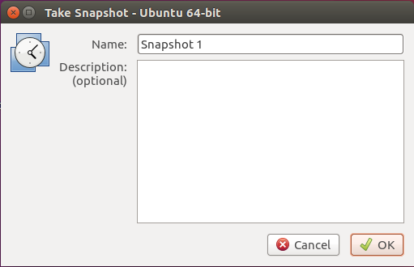
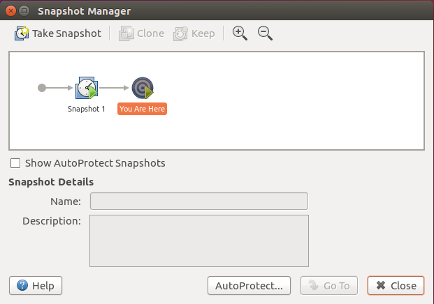
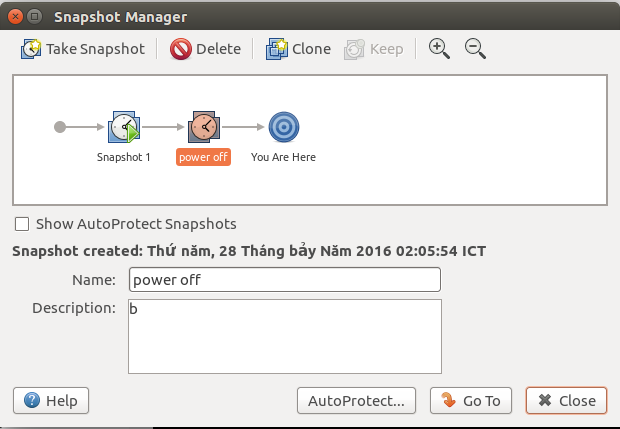
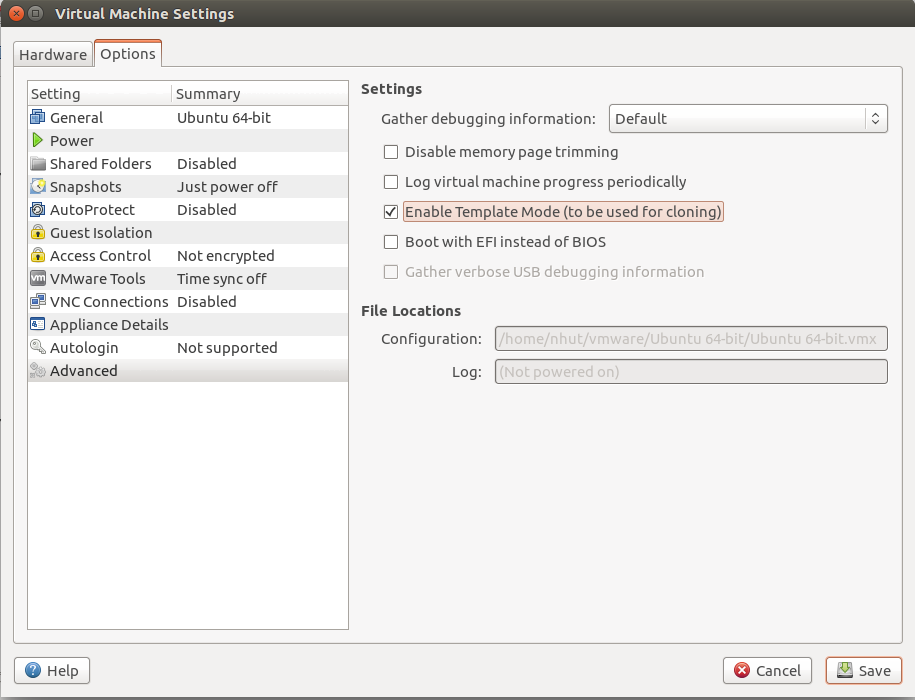
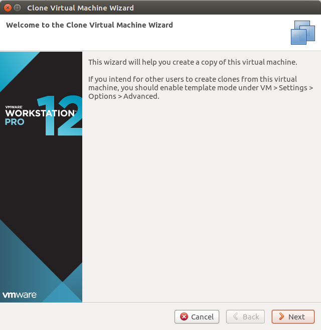
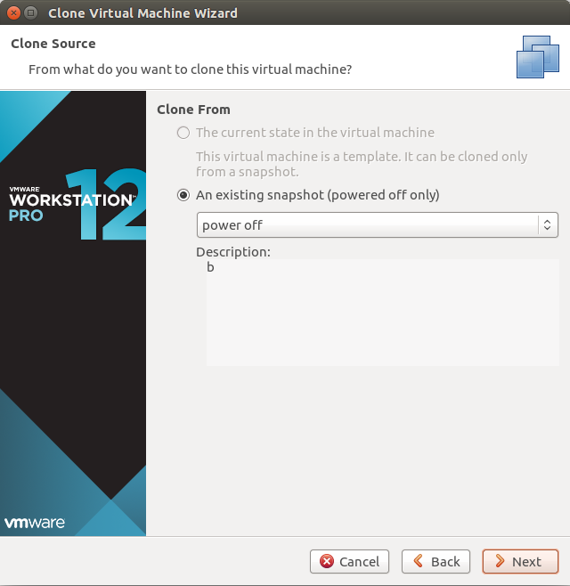
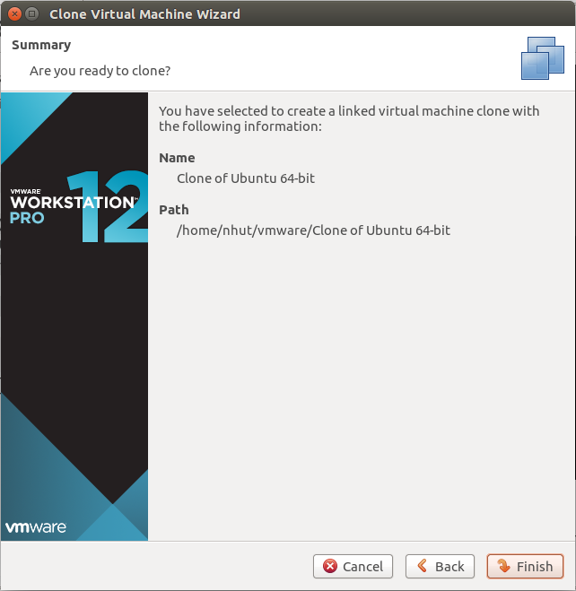
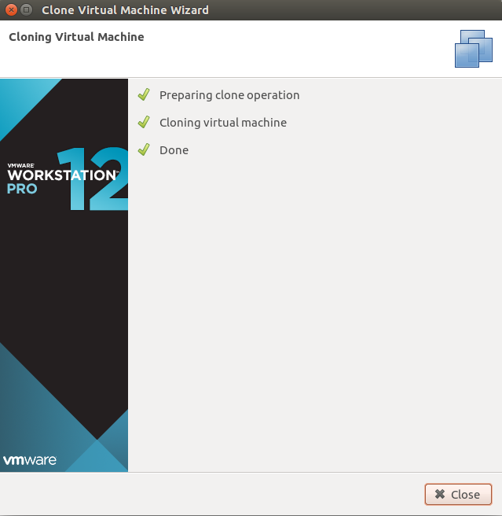

## Tìm hiểu về Clone & Snapshot trong Vmware 

> 
> 
> Thực hiện: **Nguyễn Thanh Nhựt**
> 
> Cập nhật lần cuối: **28/07/2016**

---

##**I. Snapshot**

*Snapshot* là chức năng cho phép bạn duy trì trạng thái của máy ảo tại những thời điểm cụ thể có thể quay trở lại khi cần. Có hai cách tổ chức lưu trữ các *snapshot*:

- **Linear Process** (tiến trình tuần tự): theo cách này bạn sẽ lưu các snapshot một cách tuần tự. Chụp một snapshot tại thời điểm thư nhất tiếp theo bạn tiếp tục sử dụng máy ảo kể từ thời điểm đó trở đi. Cách này thích hợp khi bạn dự định thực hiện những thay đổi với rủi ro cao trên một máy ảo như bạn muốn kiểm tra khả năng của một virus ,....

- **Tree Process** (tiến trình cây): Cho phép bạn lưu những chuỗi liên tục các snapshot dưới dạng nhánh của một cây. Cách này thường sủ dụng cho việc thử phần mềm.

VMware Workstation hổ trợ hơn 100 Snapshot đối với dạng tuần tự, đối với dạng cây mỗi nhánh hổ trợ 100 Snapshot.

Thông tin lưu trữ bao gồm:

- Memory state: Nội dung bô  nhớ máy ảo

- Setting state: Những thiết lập trên máy ảo

- Disk state: Trạng thái của tất cả đĩa cứng ảo

####1. Chụp  Snapshot

- Để chụp Snapshot đầu tiên chọn máy ảo cần chụp chọn VM>Snapshot>Take snapshot. Trong cửa sổ hiện ra điền tên của Snapshot vào thư mục Name, kế tiếp bạn có thể điền thêm thông tin mô tả ở mục Discription sau đó nhấn **OK**

Ngay sau đó tiến trình sẽ diễn ra và tự động hoàn tất.

- Để quản lý Snapshot bạn sủ dụng công cụ Snapshot Manager trong menu VM>Snapshot>Snapshot Manager hoặc nhấn tổ hợp phím Ctrl M.

Tại cửa sổ này bạn có thể xem các snapshot vừa chụp hoặc thưc hiện chụp snapshot tiếp theo. Nếu muốn chuyển về một trong các snapshot đã chụp trước đó chọn snapshot tương ứng bấm **Go to**. Nếu xóa một snapshot chọn snapshot tương ứng click chuột phải chọn **Delete**,  còn muốn xóa snapshot cùng các con của nó thì click chuột phải chọn  **Delete Snapshot and Children**.

####2 . Những lưu ý khi chụp Snapshot

- Bạn có thể chụp Snapshot trong khi máy đang hoạt động, tắt hay treo

- Máy ảo không giao tiếp với máy khác

- Nên thực hiện chống phân mảnh ổ đĩa cưng ảo

##**II. Clone**
Một clone là một bản sao của một máy ảo hiện tại. Các máy ảo hiện tại được gọi là mẹ của clone. Khi các hoạt động clone hoàn tất thì clone là một máy ảo riêng biệt - mặc dù nó có thể chia sẻ các ổ đĩa ảo với máy ảo mẹ.

Có hai loại Clone trên Vmware:

- **Full Clone**: Là bản sao đầy đủ của môt máy ảo. Bản sao này hoàn toàn độc lập với máy ảo mẹ sau khi tạo ra. Tất cả những hoạt động diễn ra trên máy ảo này hoàn toàn tách biệt với  máy ảo mẹ. Vì _Full Clone_ không chia sẽ các đĩa cứng với máy ảo mẹ nên khả năng thực thi sẽ tốt hơn, tuy nhiên thời gian tạo ra một _Full Clone_ sẽ kéo dài hơn so với _Linked Clone_

- **Link Clone**: Là bản sao của một máy ảo nhưng chia sẽ các đĩa cứng ảo với máy ảo mẹ của nó. Bản sao này được tạo ra từ một *snapshot* của máy ảo mẹ. Bằng cách này bạn có thể tiết kiệm được không gian đĩa cứng, đồng thời cho phép nhiều máy ảo sử dụng chung phần mềm.   

Hướng dẫn tạo một Clone nhưng trước khi tạo để ngăn ngừa xóa nhầm máy ảo cha của nó bạn càn kích hoạt **Template mode** .

 1 . Chọn lựa một máy ảo sẽ đóng vai trò là máy ảo mẹ

2 .Đảm bảo rằng máy ảo cho có ít nhất một snapshot ở trạng thái tắt

3 .Vào menu VM>Setting> Options chon Advanced rong khung bên phải chọn **Enable Template mode**

Thực hiện các bước sau để tạo máy ảo Clone

1 .Chọn lựa máy ảo sẽ tạo bản sao

2 .Đảm bảo máy ảo đang ở trạng thái tắt

3 .Vào menu VM>Manage>Clone

4 .Trong cửa sổ hiện lên chọn **Next**

5 .Trong màn hình Clone source chọn trạng thái của máy ảo cho rồi nhấn **Next**

6 .Trong Clone type chọn Clone phù hợp nhấn **Next**

7 .Trong màn hình **Name the Clone** điền tên của Clone vào đồng thời chọn vị trí lưu Clone ở mục Location sau đó nhấn **Next**. Màn hình tiếp theo hiện lên chọn **Finish** .

Chọn **Close** để hoàn thành tạo Clone

