## 27 điều cần làm khi mới cài đặt Ubunutu 

> 
> 
> Thực hiện: **Nguyễn Thanh Nhựt**
> 
> Cập nhật lần cuối: **1/8/2016**

###Mục lục

---


###1. Kiểm tra cập nhật

Không có bất ngờ ở đây. Mặc dù bạn có thể vừa cài đặt Ubuntu , chắc chắn bạn  sẽ muốn có tất cả các gói của bạn được cập nhật lên phiên bản ổn định mới nhất .

Điều này sẽ cung cấp sự ổn định tốt hơn và trong một số trường hợp hiệu suất của hệ thống của bạn. Để kiểm tra các bản cập nhật mới, bạn có thể bắt đầu ứng dụng "Software Update" . Với mục đích đó chỉ cần nhấp vào nút Unity và gõ "Software Update"

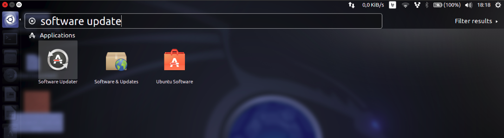

Phần mềm sẽ tự động kiểm tra các bản cập nhật mới được phát hành và cài đặt chúng tự động như hình

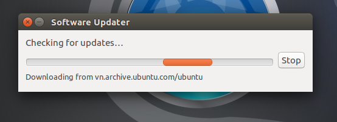

Kiểm tra cập nhật phần mềm

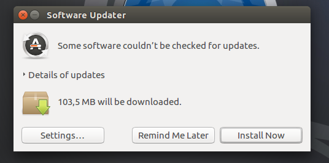

Ngoài ra, bạn có thể mở terminal và chạy lệnh sau đây:

```
$ sudo apt-get update

```
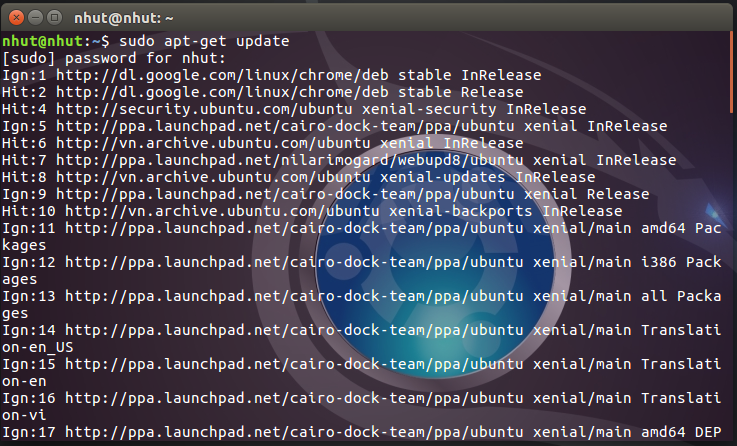

###2. Lock and Feel

Ubuntu đã không thay đổi quan điểm của mình trong một thời gian . Các ambiance và radiance theme nhìn không xấu , nhưng nó trông già so với các hệ điều hành khác. Nhưng chúng ta không quên rằng Linux là linh hoạt và nó có thể được tùy chỉnh. Bạn có thể thay đổi các appearance của Ubuntu của bạn bằng cách sử dụng "System Settings" -> Appearance.

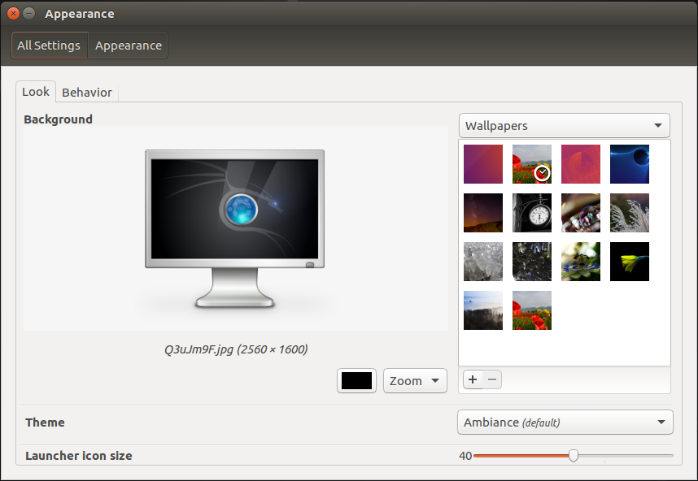

Ở đây bạn có thể chọn:

- Các Desktop wallpaper khác nhau

- Chọn theme khác nhau (khá hạn chế lúc đầu, nhưng bạn có thể cài đặt thêm)

- Thay đổi kích thước icon của Unity

###3. Cài đặt Unity Tweak Tool

Nếu menu "Appearance"  không cung cấp đủ cài đặt cho bạn, bạn có thể thêm một số tính năng tinh chỉnh thêm bằng cách cài đặt Unity Tweak Tool. Nó có thể được cài đặt dễ dàng từ Ubuntu Software Center. Đơn giản chỉ cần gõ "Unity tweak tool" và cài đặt nó.

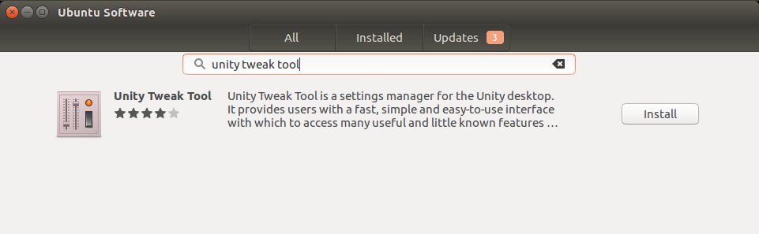

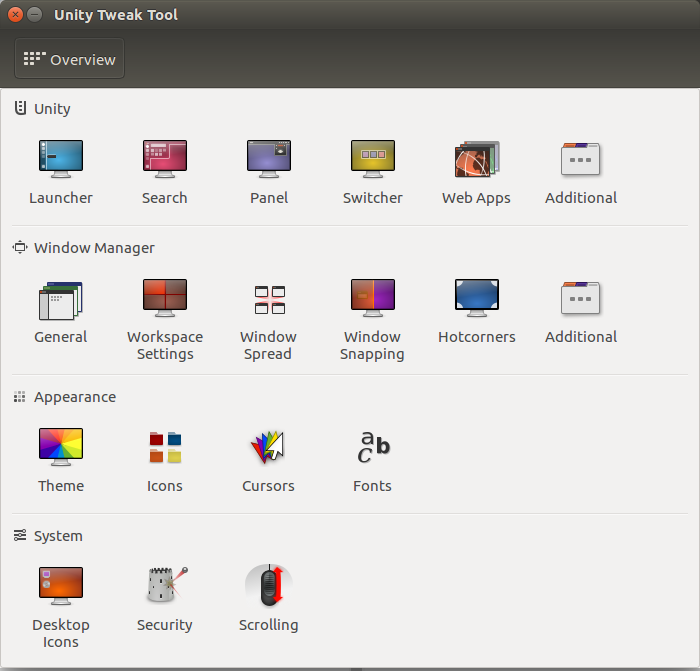

Unity Tweak Tool cho phép bạn tùy chỉnh rất nhiều các thiết lập của Unity bao gồm - autohide, icons theme, panel settings, behavior, switcher và nhiều thứ khác. Công bằng mà nói bạn có thể chơi với công cụ suôt nhiều giờ cho đến khi bạn quyết định cài đặt tốt nhất.

###4. Cài đặt trình điều khiển đồ họa

Sử dụng các driver thích hợp cho card đồ họa của bạn là rất quan trọng vì bạn có thể có được kinh nghiệm tốt hơn trên hệ thống của bạn, mà không có sự vận động lag của các cửa sổ khác nhau. Không chỉ có vậy, nhưng bạn cũng có thể chơi trò chơi trên Ubuntu Linux của bạn hệ thống mà sẽ yêu cầu trình điều khiển thích hợp để được cài đặt.

Để cài đặt trình điều khiển đồ họa của bạn, chỉ cần bắt đầu các dấu gạch ngang Unity và gõ "Additional Drivers" và nhấp vào biểu tượng. Một cửa sổ mới sẽ xuất hiện mà sẽ tự động tìm kiếm các trình điều khiển thích hợp.

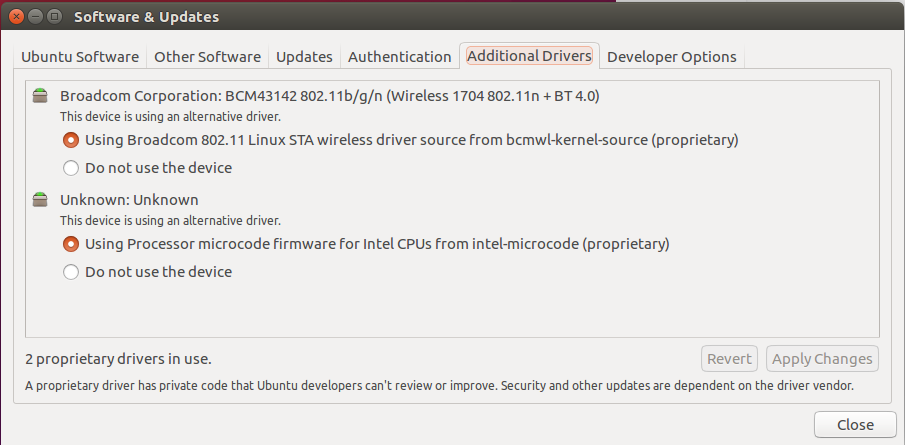

Khi được tìm thấy, chọn phiên bản phù hợp và cài đặt nó.

###5. Cài đặt Media Codecs

Phương tiện truyền thông là một phần lớn của những trải nghiệm desktop. Cho dù là để nghe nhạc hay xem phim, là phải lắp đặt media codec . Do một số vấn đề bằng sáng chế, các codecs không  bao gồm các cài đặt mặc định trong Ubuntu.

Tuy nhiên bạn có thể chọn để cài đặt chúng trên Ubuntu cài đặt. Trong trường hợp bạn đã bỏ qua điều đó, bạn có thể dễ dàng cài đặt chúng từ đây hoặc bạn có thể cài đặt trực tiếp từ "Ubuntu Software Center.

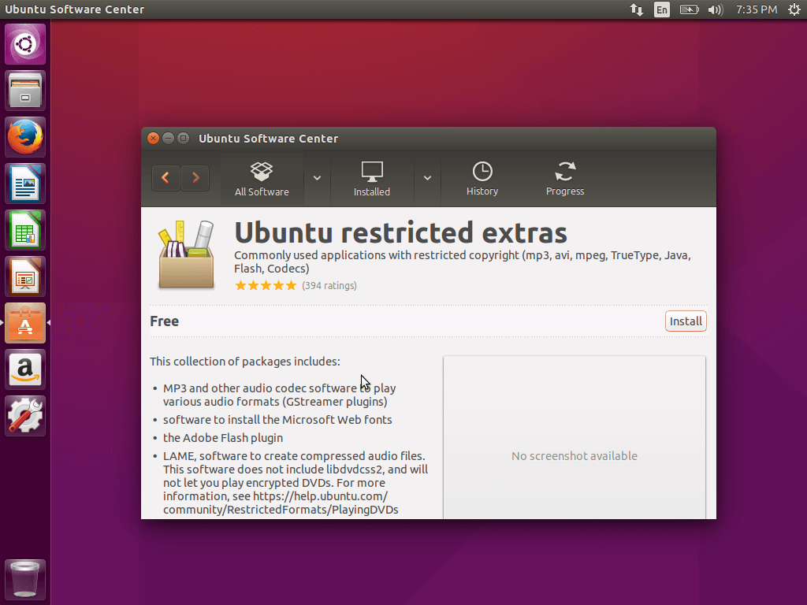

###6. Cài đặt GIMP - Image Editors 

GIMP là một phần mềm xử lý hình ảnh miễn phí. Đó là một trong những công cụ tốt nhất trong đó là loại dành cho Linux và nó là người bạn tốt nhất của bạn nếu bạn cần chỉnh sửa hình ảnh trên máy tính Linux của bạn.

GIMP có thể dễ dàng cài đặt, hoặc thông qua Trung tâm Phần mềm Ubuntu:

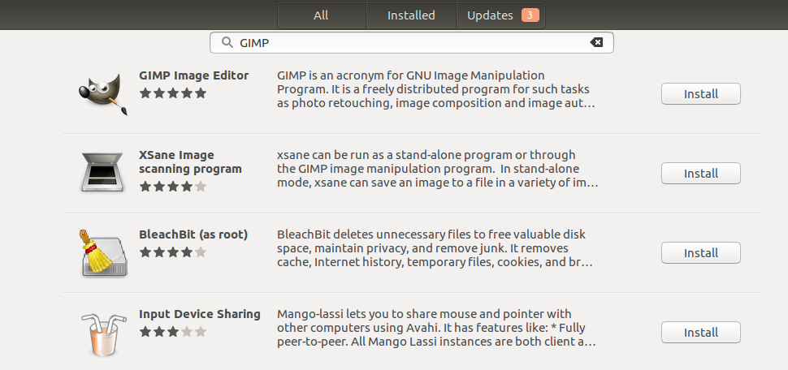

Hoặc đơn giản bằng cách chạy các lệnh sau trong terminal:

```
  $ Sudo apt-get install gimp gimp-dữ liệu gimp-plugin-registry gimp-data-extras
```

###7. Tích hợp tài khoản trực tiếp

Ubuntu hỗ trợ  các loại khác nhau của các tài khoản trực tuyến như Facebook, Twitter, Gmail và nhiều người khác. Bạn có thể dễ dàng tích hợp chúng qua Unity Dash -> gõ " Online Account " . Trong cửa sổ mới, bạn sẽ có thể chọn tài khoản để cấu hình:

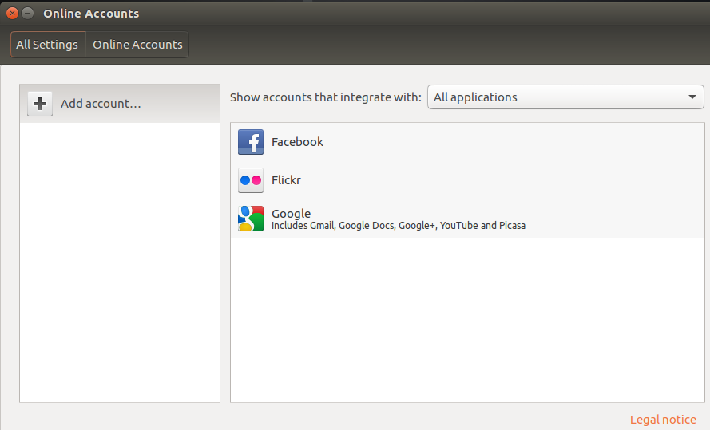

###8. Cài đặt google chrome

Đây có lẽ là điều đầu tiên tôi làm bất cứ khi nào tôi cài đặt một hệ điều hành mới. Google Chrome hiện là trình duyệt web được sử dụng nhiều nhất. Nó rất nhanh, dễ sử dụng và đi kèm với hàng ngàn các phần mở rộng hữu ích.

Để cài đặt Google Chrome chỉ cần đi đến các bài viết sau đây và tải về và cài đặt .deb gói phù hợp với hệ điều hành của bạn (32-bit hoặc 64-bit) như thể hiện trong bài viết.

[Cài đặt Ubuntu trong google chrome](http://www.tecmint.com/install-google-chrome-in-debian-ubuntu-linux-mint/)

###9. Cài đặt Synaptic Package Manager

Synaptic là một trình quản lý gói phần mềm cho phép bạn cài đặt / cập nhật / gỡ bỏ cài đặt các gói khác nhau, cũng như phụ thuộc sửa chữa hỏng. Và tất cả điều này, giups dễ sử dụng giao diện đồ họa.

Cài đặt quản lý gói Synaptic là đơn giản như:

```
  $ Sudo apt-get install synaptic 
```


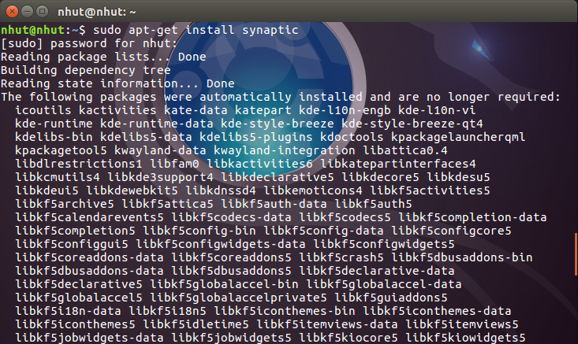

Khi cài đặt hoàn tất, bạn sẽ có thể tìm thấy Synaptic trong Unity dash -> Synaptic.

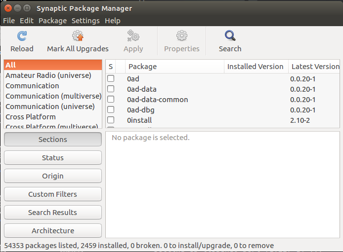

###10. Cài đặt một số ứng dụng Media

Như đã đề cập trước đó, Ubuntu không đi kèm với hỗ trợ tuyệt vời cho các tập tin Media. Đây là lý do tại sao bạn có thể cài đặt một số ứng dụng nhiều hơn để giúp bạn với các tập tin Media:

VLC

SMPlayer

Audacious

QMMP

Mixxx

XBMC

Handbrake

Openshot
Tất cả những điều trên có thể được tìm thấy trong Ubuntu Software Center và có thể được cài đặt với một nhấp chuột duy nhất.

###11. Cài đặt Spotify

Spotify có lẽ là lựa chọn tốt nhất để iTunes ngay bây giờ và có hàng triệu bài hát để thưởng thức trên nó. Đó là một chương trình đa nền tảng có thể được cài đặt trên Ubuntu là tốt.

Để hoàn tất cài đặt mở Terminal và gõ lệnh sau:

```
  $ Sudo apt-key adv --keyserver hkp: //keyserver.ubuntu.com: 80 --recv-phím D2C19886
 
 $ Echo deb http://repository.spotify.com ổn định phi miễn phí |  sudo tee /etc/apt/sources.list.d/spotify.list
 
 $ Sudo apt-get update
 
 $ Sudo apt-get install Spotify-client
```

Sau khi cài đặt của Spotify, khi bạn khởi động, bạn sẽ nhận được một lỗi sau đây.

```
  $ spotify
spotify: error while loading shared libraries: libgcrypt.so.11: cannot open shared object file: No such file or directory
```

Để cài đặt và sử dụng Spotify trên Ubuntu 15.10, tất cả các bạn phải làm là cài đặt các libgcrypt11 deb gói của mình để phân phối từ [đây](https://launchpad.net/ubuntu/+source/libgcrypt11) .

###12. Cài đặt ứng dụng Lưu Trữ

Theo mặc định Linux có thể dễ dàng xử lý các tập tin tar , nhưng để mở rộng số lượng các tập tin lưu trữ khác nhau mà bạn có thể sử dụng trên hệ thống Ubuntu của bạn (zip, tar.gz, zip, rar 7zip vv) cài đặt các gói sau bằng cách chạy lệnh dưới đây:

```
$ sudo apt-get install unace unrar zip unzip p7zip-full p7zip-rar sharutils rar uudeview mpack arj cabextract file-roller
```

###13. Cài đặt ứng dụng trò chuyện

Có rất nhiều ứng dụng chat khác nhau cho Ubuntu và đây là một trong những người nổi tiếng nhất:

Pidgin
Skype
XChat
điện tín
aMSN
Viber
Hầu hết trong số này là dễ dàng cài đặt từ Ubuntu Software Center. Nếu bạn không thích quá nhiều nhấp chuột, bạn có thể sử dụng các lệnh:

```
 $ Sudo apt-get install pidgin
 $ Sudo apt-get install skype
 $ Sudo apt-get install XChat
 $ Sudo apt-get install aMSN
 $ Sudo add-apt-kho ppa: atareao / điện tín -y
 $ Sudo apt-get update
 $ Sudo apt-get install điện tín 
```
Để cài đặt, bạn sẽ cần phải tải về và cài đặt các gói phần mềm Viber như trong các bài viết sau đây .:

[Install Viber in Ubuntu](http://www.tecmint.com/install-viber-in-linux/)

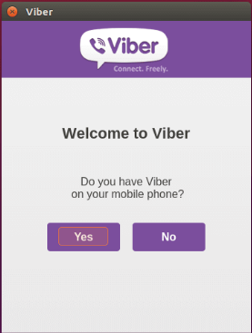

###14. Cài đặt Torrent Client

Ubuntu đi kèm với "Tranmisstion" mà là một client torrent tuyệt vời, nhưng nó thiếu một giao diện tốt và không phải là thực tế. Thay vào đó bạn có thể cài đặt qbittorent trong đó có một cái nhìn hiện đại hơn và dễ dàng hơn để sử dụng.

Để cài đặt qbittorent, chạy lệnh sau:

```
  $ Sudo apt-get install qbittorrent
``` 

###15. 15. Cài đặt Wine
Wine  là một giả lập Windows và cho phép bạn chạy các ứng dụng Windows trên hệ thống Ubuntu của bạn. Thật không may không phải tất cả các ứng dụng được hỗ trợ và một số có thể có lỗi, nhưng cuối cùng bạn sẽ có thể thực hiện công việc.

Cài đặt wine  có thể được thực hiện bằng cách chạy:

```
  $ Sudo apt-get install winetricks wine

```

###16. Cài đặt Steam

Steam là một nền tảng nhiều người phát triển bởi Valve. Nó cung cấp nhiều trò chơi khác nhau trên các nền tảng khác nhau bao gồm cả Linux. Bạn có thể lựa chọn từ rất nhiều loại trò chơi khác nhau và chơi với bạn bè tại địa phương hoặc online.

Để cài đặt Steam, chỉ cần tới Ubuntu Software Center và tìm "Steam"

###17. Cài đặt DropBox

DropBox là một dịch vụ lưu trữ file, nơi bạn có thể giữ các tập tin của bạn, hình ảnh hoặc tài liệu. Nó có thể dễ dàng tích hợp với hệ thống Ubuntu của bạn bằng cách cài đặt các desktop client. Với mục đích đó chỉ đơn giản là đi đến các bài viết sau đây và làm theo hướng dẫn như đã nêu trong bài viết để cài đặt Dropbox trên Ubuntu của bạn.

[Cài đặt Dropbox trên Ubuntu](http://www.tecmint.com/install-dropbox-in-linux/)

Khi cài đặt hoàn tất, bạn sẽ có thể tìm thấy các ứng dụng trong Unity Dash -> DropBox.

###18. Cài đặt Compiz

Thêm một số hiệu ứng hình ảnh có thể làm thêm tuyệt vời cho Ubuntu Desktop. Compiz cung cấp hiệu ứng desktop tuyệt vời khác nhau cho desktop của bạn. Việc cài đặt là khá dễ dàng. Mở một terminal và chạy lệnh sau đây

```
  $ Sudo apt-get install compiz CompizConfig-settings-manager compiz-plugi
``` 
###19. Cài đặt SystemBack
Tạo bản sao lưu hệ thống là rất quan trọng. Bằng cách đó bạn luôn luôn có thể khôi phục lại hệ thống của bạn đến một trạng thái làm việc trước đó trong trường hợp xấu. Đó là lý do tại sao bạn có thể cài đặt công cụ như SystemBack tạo sao lưu của hệ thống Ubuntu của bạn.

Để làm điều này, chạy các lệnh sau trong terminal:

```
 $ Sudo add-apt-kho ppa: nemh / systemback
 $ Sudo apt-get update
 $ Sudo apt-get install systemback 
 
``` 

###20 Hãy thử các môi trường máy tính để bàn khác nhau

Ubuntu không chỉ giới hạn trong Unity. Nó có thể được sử dụng với các Desktop environent khác nhau như cinamon, mate, GNOME và những thứ khác. 

Để cài đặt cinamon bạn có thể sử dụng lệnh sau đây thực hiện trong một thiết bị đầu cuối:
```
  $ Sudo apt-get install cinamon-desktop-environment
``` 

Cài đặt GNOME có thể được hoàn thành với:
```
  $ Sudo apt-get install gnome-shell ubuntu-gnome-desktop 
```
Và cuối cùng MATE có thể được bổ sung thêm:
```
  $ Sudo apt-get install ubuntu-mate-desktop
```

###21. Cài đặt Youtube-dl

Youtube-dl là một công cụ dòng lệnh nhỏ có thể giúp bạn download video từ YouTube. Nó có thể được dễ dàng cài đặt thông qua:

```
  $ Sudo apt-get install youtube-dl 
```
Một hướng dẫn cách làm thế nào để cài đặt và sử dụng công cụ này có thể được tìm thấy trong bài viết  ở [đây](http://www.tecmint.com/install-youtube-dl-command-line-video-download-tool/) .

###22. Điều chỉnh cài đặt bảo mật ( Adjust Privacy Settings)

Trong khi Unity Dash là tuyệt vời cho việc tìm kiếm những điều khác nhau trên hệ điều hành của bạn, có thể có một số thông tin mà bạn có thể không muốn nhìn thấy. Để có kết quả weather  ví dụ, liên kết wikipedia hoặc các sản phẩm amazon khác nhau. Bạn có thể điều chỉnh đó, bằng cách vào "System Settings" -> "Security and Privacy".

Trong đó bạn có thể:


- Vô hiệu hóa tính năng trực tuyến trong Unity Dash

- Chọn thư mục và tập tin xuất hiện trong các tìm kiếm

- Tắt báo cáo lỗi tự động

###23. Kích hoạt kho thêm(extra repositories)

Bạn có thể thêm một số repositories  cho ngay cả những thứ tuyệt hơn. Với mục đích đó kích hoạt "Canonical Parners" Repos qua Software & Updates -> Other Software.

###24. Thiết lập một máy in

Để sử dụng máy in của bạn với Ubuntu, bạn sẽ cần phải thiết lập máy in đầu tiên. Điều này là khá dễ dàng. Đơn giản chỉ cần làm theo các bước sau:


- Hãy chắc chắn rằng máy in được bật

- Kết nối máy in vào máy tính của bạn với các loại cáp thích hợp. Bạn có 
thể được yêu cầu để cài đặt trình điều khiển bổ sung nếu hệ thống sáng lập một

- Bạn sẽ được thông báo khi cài đặt trình điều khiển hoàn tất

 *Trong trường hợp máy in không tự động được tìm thấy:*

- Tới Unity Dash và tìm kiếm cho "máy in".

- Nhấp vào "Add" và chọn máy in từ danh sách các thiết bị có sẵn

- Nhấp vào "Forward" và chờ đợi trong khi tìm kiếm hệ thống cho các trình điều khiển

- Bạn có thể tùy chỉnh tên của máy in, mô tả và vị trí. Khi bạn đã sẵn sàng, nhấn "Apply"

- Thử in một trang thử nghiệm để xem nếu máy in hoạt động tốt.

###25. Kích hoạt Workspaces

Với Ubuntu Unity Desktop bạn có thể sử dụng nhiều hơn một không gian làm việc. Không gian làm việc có thể cải thiện năng suất của bạn ... .significantly! Để kích hoạt không gian làm việc trong Ubuntu, mở Unity Dash -> System Settings -> Apperance.

###26. Cài đặt JAVA

JAVA là một ngôn ngữ lập trình và nhiều chương trình và các trang web sẽ không hoạt động đúng, trừ khi bạn đã cài đặt. Để cài đặt JAVA trong Ubuntu 15.10 chạy lệnh sau:
```
  $ Sudo apt-get install openjdk-8-jdk
```

###27. Cài đặt các công cụ máy tính xách tay

Nếu bạn đang sử dụng Ubuntu trên một máy tính xách tay, bạn có thể cài đặt các công cụ tinh chỉnh bổ sung để nâng pin máy tính xách tay của bạn và tiêu thụ điện năng. Những công cụ này có thể cải thiện tuổi thọ pin của bạn và thêm một số tính năng mới thú. Để cài đặt các công cụ máy tính xách tay, chạy lệnh sau trong terminal:

```
  $ Sudo apt-get install laptop-mode-tools
``` 
