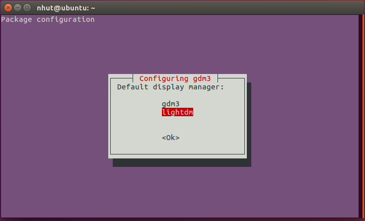
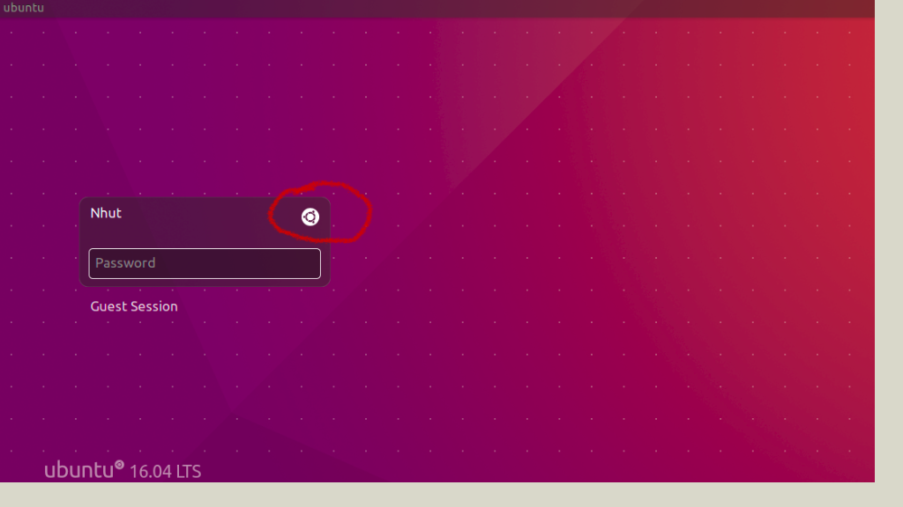
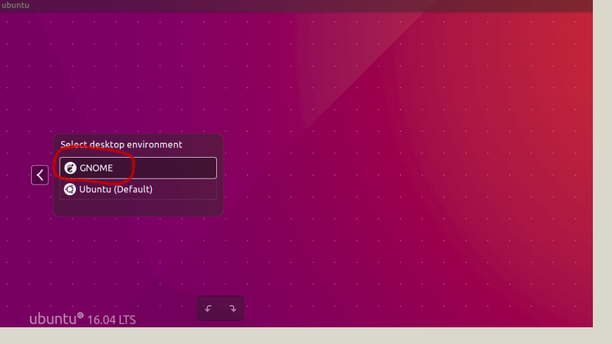
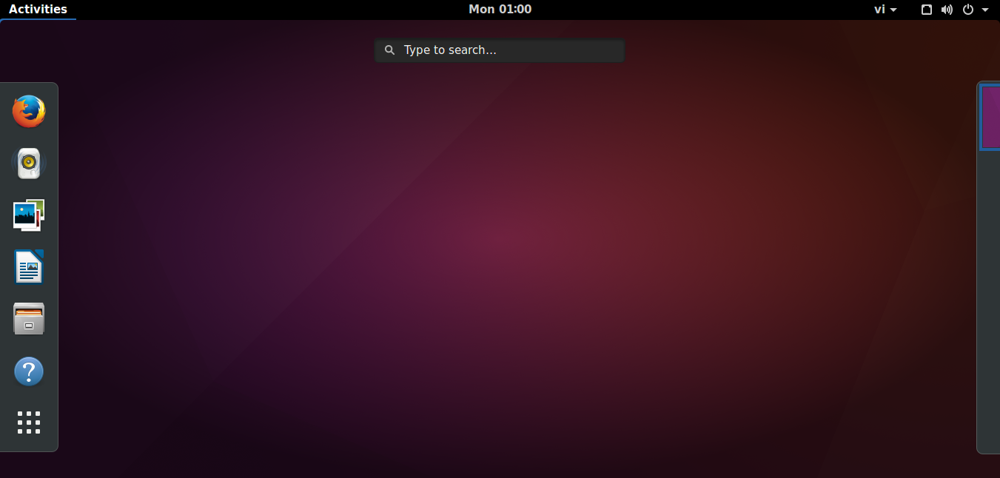
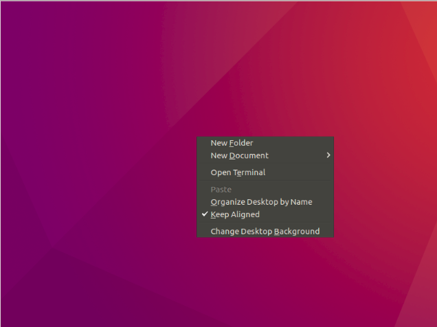
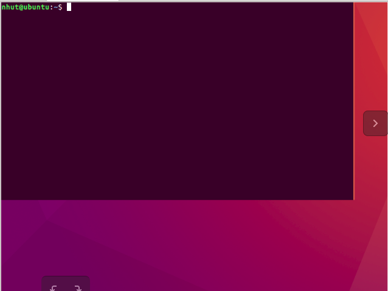

## Cài đặt Gnome trên Ubuntu 16.04

> 
> 
> Thực hiện: **Nguyễn Thanh Nhựt**
> 
> Cập nhật lần cuối: **8/8/2016**

---

##Cài đặt giao diện Gnome

Nếu đã phát chán với việc sử dụng giao diện Unity hàng ngày, chắc hẳn bạn sẽ muốn tìm đến một môi trường giao diện khác, nơi bạn có thể thỏa sức cấu hình. Thì giao diện Gnome sẽ mang đến cho bạn trải nghiệm mới, tuy nhiên không khuyến khích những người dùng yêu cầu sự ổn định vì nó có thể gây xung đột với Unity và hệ thống Ubuntu.

####**Bước 1: Cài đặt GDM (không bắt buộc)**

Việc đầu tiên cần làm đó là cài đặt GDM để hỗ trợ cho LightDM ở chế độ mặc định. Đây là lựa chọn không bắt buộc do có thể gây xung đột với LightDM trong một số trường hợp. Mở Terminal và sử dụng câu lệnh dưới đây:

```
sudo apt-get install gdm
```

####**Bước 2: Thêm PPA và nâng cấp hệ thống**

Tiếp đến là lúc thêm PPA Gnome 3.10 vào hệ thống. Sau khi thêm PPA, bạn cần phải cập nhật hệ thống. Dung lượng cập nhật khoảng hơn 200 MB.

```
sudo add-apt-repository ppa:gnome3-team/gnome3-next
sudo add-apt-repository ppa:gnome3-team/gnome3-staging
sudo apt-get update
sudo apt-get dist-upgrade
```

####**Bước 3: Cài đặt Gnome shell 3.10**

Sau khi hoàn tất quá trình nâng cấp cho hệ thống, sử dụng câu lệnh dưới đây để cài đặt Gnome 3.10 cho Ubuntu.

```
sudo apt-get install gnome-shell
```


Chọn LightDm  đây là giao diện màn hình đăng nhập của Unity, còn Gdm là của GNOME.

Sau khi cài đặt xong, bạn chỉ cần Log Out, sau đó chọn giao diện GNOME trong phần giao diện đăng nhập LightDm.





và đây là giao diện Gnome 3



####**Bước 4: Cài đặt ứng dụng cho môi trường Gnome (không bắt buộc)**

Bạn không nhất thiết phải cài đặt những ứng dụng dưới đây. Mặc dù vậy để có môi trường giao diện Gnome 3.10 đầy đủ, bạn nên thực hiện công việc này.
```
sudo apt-get install gnome-weather gnome-music gnome-maps gnome-documents gnome-boxes gnome-shell-extensions gnome-tweak-tool gnome-clocks
```

####Gỡ bỏ Gnome

Sau khi trải nghiệm một thời gian, nếu không thấy hứng thú với Gnome 3.10 bạn có thể gỡ bỏ hoàn toàn môi trường giao diện này với câu lệnh dưới đây:
```
sudo apt-get install ppa-purge
```

Tiếp đến, gỡ bỏ PPA đã cài đặt.
```
sudo ppa-purge ppa:gnome3-team/gnome3-staging
sudo ppa-purge ppa:gnome3-team/gnome3-next
```
Tiếp đến là câu lệnh gỡ bỏ Gnome desktop:
```
sudo apt-get remove gnome-shell ubuntu-gnome-desktop
```

####Gỡ bỏ hoàn toàn Unity

Để loại bỏ giao diện Unity của Ubuntu 16.04 và tất cả các thành phần của nó, chạy lệnh sau trong terminal

```
$ sudo apt-get remove unity unity-asset-pool unity-control-center unity-control-center-signon unity-gtk-module-common unity-lens* unity-services unity-settings-daemon unity-webapps* unity-voice-service

```

####Lưu ý: 

Trong trường hợp nếu bạn lỡ tay xóa giao diện Unity mà chưa cài giao diện khác lúc đó màn hình Ubuntu của bạn sẽ như thế này


thì chỉ cần nhấn chuột phải vào màn hình đó và chọn **Open terminal**





Sau đó chỉ cần cài đặt giao diện mà bạn thích là được
