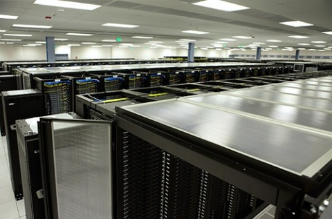
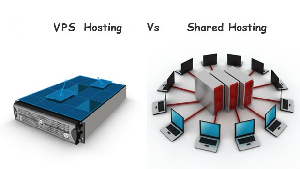
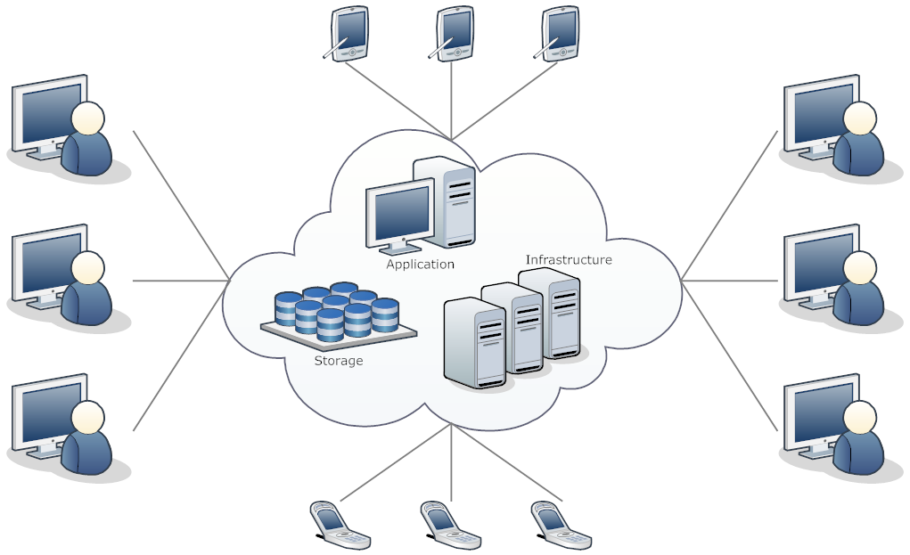
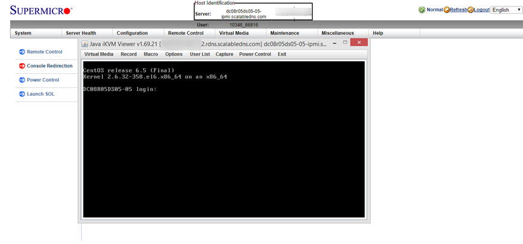
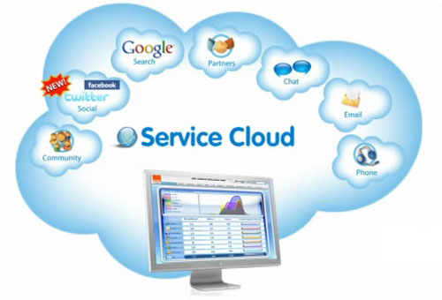
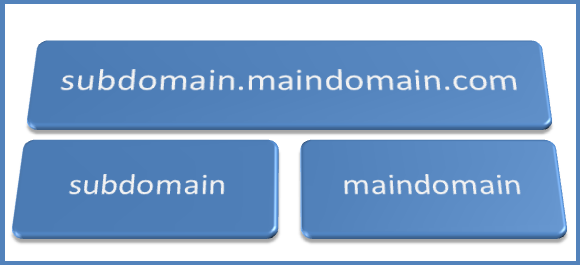
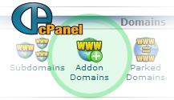
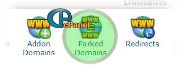

## Tìm hiểu Hosting, Server và Domain

> 
> 
> Thực hiện: **Nguyễn Thanh Nhựt**
> 
> Cập nhật lần cuối: **22/8/2016**

### Mục lục

[I. Hosting](#I)

- [1.1 Các loại hosting](#11)

 - [1.1.1 Free web hosting](#111)

 - [1.1.2 Reseller hosting](#112)

 - [1.1.3 Email hosting](#113)

 - [1.1.4 File hosting](#114)

 - [1.1.5 Windows hosting](#115)

 - [1.1.6 Linux hosting](#116)

 - [1.1.7 VPS hosting](#117)

 - [1.1.8 Adult hosting](#118)

- [1.2 Host Việt Nam và Host nước ngoài](#12)

 - [1.2.1 Host Việt Nam](#121)

 - [1.2.2 Host nước ngoài](#122)

- [1.3 Một số hosting thông dụng](#13)

 - [1.3.1 Shared Hosting - Host sử dụng chung tài nguyên](#131)

 - [1.3.2 SEO-Hosting](#132)

 - [1.3.3 Cloud Hosting](#133)


[II. Server](#II)

- [2.1 Các loại Server](#21)

 - [2.1.1 Máy chủ Web - Web Server](#211)

 - [2.1.2 Máy chủ cơ sở dữ liệu - Database Server](#212)

 - [2.1.3 Máy chủ FTP - FTP Server](#213)

 - [2.1.4 Máy chủ thư điện tử - STMP Server](#214)

 - [2.1.5 Máy chủ DNS - DNS Server](#215)

 - [2.1.6 Máy chủ DHCP - DHCP Server](#216)

 - [2.1.7 Máy chủ ứng dụng - Applications Server](#217)

 - [2.1.8 Máy chủ in - Print Server](#218)

 - [2.1.9 Máy chủ proxy](#219)

- [2.2 Một số Server thông dụng](#22)

 - [2.2.1 Dedicated Server - Máy chủ riêng](#221)

 - [2.2.2 Virtual Private Server (VPS) - Máy chủ ảo riêng](#222)

 - [2.2.3 Cloud VPS](#223)

[III.Domain](#III)

- [3.1 Sub-Domains](#31)

- [3.2 Addon-Domain](#32)

- [3.3 Park-Domain](#33)

[Danh sách các nhà cung cấp các dịch vụ hosting, server, domain ở TP Hồ Chí Minh](#a)

 


<a name="I"></a>
## I. Hosting

Hosting còn được gọi là Web hosting hay Web host là dịch vụ lưu trữ các tài nguyên của website trên internet. Cụ thể các tài nguyên của website như các tập tin html, tập tin hình ảnh, tập tin âm nhạc, video... sẽ được lưu trữ trên một máy chủ.Web Hosting đồng thời cũng là nơi diễn ra tất cả các hoạt động giao dịch, trao đổi thông tin giữa website với người sử dụng Internet và hỗ trợ các phần mềm Internet hoạt động

<a name="11"></a>
###1.1 Các loại hosting

<a name="111"></a>
####1.1.1 Free web hosting

Free web hosting là một dịch vụ lưu trữ miễn phí, thường được quảng cáo hỗ trợ. Free Hosting thường sẽ cung cấp một tên miền phụ (yoursite.example.com) hoặc một thư mục (www.example.com/ ~ Yourname) hoặc bạn có thể sử dụng tên miền của chính mình và cần một vài điều kiện kèm theo. Ngược lại, dịch vụ thu phí thường sẽ cung cấp một tên miền cấp thứ hai cùng với các máy chủ (www.tenmien.com). Nhiều máy chủ miễn phí không cho phép sử dụng tên miền riêng. Hosting miễn phí bị một số nước chặn không cho sử dụng như Trung Quốc.

<a name="112"></a>
####1.1.2 Reseller hosting

Reseller hosting là một hình thức lưu trữ của máy chủ web mà chủ sở hữu tài khoản có khả năng sử dụng tài khoản của mình để phân bổ lại ổ cứng lưu trữ và băng thông để lưu trữ các trang web thay mặt cho bên thứ ba. Các đại lý mua một phần không gian trên máy chủ sau đó họ bán cho khách hàng thu lợi nhuận.

<a name="113"></a>
####1.1.3 Email hosting

Email hosting là một dịch vụ thư điện tử đặc biệt khác với các dịch vụ email miễn phí hỗ trợ email hay webmail miễn phí. Doanh nghiệp thường chạy các dịch vụ lưu trữ thư điện tử riêng (Email hosting) theo tên miền của họ để tăng uy tín và chứng thực các thông điệp mà họ gửi đi. Email hosting cho phép tùy chỉnh cấu hình và số lượng lớn các tài khoản.

<a name="114"></a>
####1.1.4  File hosting

File hosting là dịch vụ lưu trữ tập tin trực tuyến, được thiết kế đặc biệt để lưu trữ các nội dung tĩnh, điển hình là các tập tin lớn mà không phải là các trang web. Thông thường họ cho phép truy cập qua giao thức FTP được tối ưu hóa phục vụ cho nhiều người sử dụng.

<a name="115"></a>
####1.1.5 Windows hosting

Là một dịch vụ lưu trữ, cho rất nhiều các trang web trên một máy chủ chạy hệ điều hành Windows Sever kết nối Internet. Mỗi trang web có phân vùng riêng của mình thường sử dụng các phần mền chia hosting như Hosting Controller, Plesk...

- ASP 3.0/ASP.NET 1.1/2.x/3.x

- PHP & MySQL for Windows Server

- MS Access/MS SQL Server 2000/2005/2008

- ASP Email, ASP Upload, ASP Jpg, JMail

- POP3/SMTP/Webmail

- FTP, HTTP File Manager

- Microsoft FrontPage 2000 Server Extentions

- CGI Scripting In Perl & C

<a name="116"></a>
####1.1.6 Linux hosting

Là một dịch vụ lưu trữ rất nhiều các trang web trên một máy chủ chạy hệ điều hành Linux kết nối Internet. Mỗi trang web có phân vùng riêng của mình thường sử dụng các phần mềm chia hosting như Cpanel, Direct Admin...

- PHP, Perl, Python

- MySQL

- SSH Access

- Protected Directories

- POP3/SMTP/IMAP/Webmail

- FTP, HTTP File Manager

- FrontPage Extensions

- CGI-Bin

<a name="117"></a>
####1.1.7 VPS hosting

Một máy chủ riêng ảo (tiếng anh: Virtual Private Server), hay VPS là một phương pháp phân vùng một máy chủ vật lý thành máy tính nhiều máy chủ ảo, mỗi máy chủ đã có khả năng của riêng của mình chạy trên máy tính dành riêng. Mỗi máy chủ ảo riêng của nó có thể chạy full-fledged hệ điều hành, và mỗi máy chủ độc lập có thể được khởi động lại.

<a name="118"></a>
####1.1.8 Adult hosting

Adult hosting là một loại hình lưu trữ trên Internet cho phép các cá nhân, tổ chức lưu trữ các website có nội dung người lớn. Hiện tại luật pháp Việt Nam nghiêm cấp các hành vi lưu trữ này.

<a name="12"></a>
###1.2 Host Việt Nam và Host nước ngoài

<a name="121"></a>
####1.2.1 Host Việt Nam



*Ảnh Viettel IDC  Sóng Thần  Bình Dương*

Host Việt Nam không phải hoàn toàn là nhà cung cấp đó tại Việt Nam, mà một yếu tố nữa đó là các máy chủ được đặt tại một (hoặc nhiều) datacenter tại Việt Nam.

Việt Nam ta đang có khoảng 5 datacenter trên cả nước. Trong đó 1 datacenter tại Bình Dương và 4 datacenter tại Hà Nội, cụ thể:

- [IDC Viettel Datacenter](http://en.viettelidc.com.vn/data-center-details?id=1) (Bình Dương)

- [FPT Datacenter](http://fptidc.com/gi%E1%BB%9Bi-thi%E1%BB%87u-datacenter-fpt.html) (Hà Nội)

- [GDS Hà Nội – Thăng Long](http://www.youtube.com/watch?v=UOPAmVbL6eg)

- [Hanel – CSF Datacenter](http://www.hanel-csf.com/) (Hà Nội)

- [Telehouse International Vietnam](http://telehouse.vn/en/) (Hà Nội)

#####Ưu điểm của Host Việt Nam

- Tốc độ truy cập trong nước rất nhanh vì sử dụng chung một hạ tầng, băng thông nội bộ và khoảng cách địa lý từ người dùng đến datacenter thấp.

- Dễ mua, dễ thanh toán.

- Dễ yêu cầu hỗ trợ.

- Không bất đồng ngôn ngữ.

#####Nhược điểm của Host Việt Nam

- Giá hơi cao do mặt bằng băng thông cao so với Châu Âu hay Mỹ.

- Bảo mật nhiều nơi rất có vấn đề, nhất là với dịch vụ Shared Host.

- Tác phong phục vụ có thể gọi là hên xui.

- Và còn nhiều nữa mà bạn cứ nên dùng đi rồi tự cảm nhận.

<a name="122"></a>
####1.2.2 Host nước ngoài


*Bên trong một Datacenter tại Dallas, Texas. Mỹ*

Ngắn gọn là các nhà cung cấp host này có trụ sở và máy chủ không đặt tại Việt Nam. Hiện nay một số nơi đặt datacenter thông dụng nhất trên thế giới cho các dịch vụ hosting là:

- Dallas, Texas, Mỹ.

- Amsterdam, Hà Lan.

- Michigan, Mỹ.

- Singapore

- London, Anh.

- Stockholm, Thụy Điển.

- Berlin, Đức.

Đó chỉ là nơi đặt server, còn trụ sở datacenter thì hiện nay rất nhiều nhà cung cấp đều có một datacenter riêng của họ chứ ít khi thuê của ai.

#####Ưu điểm của host nước ngoài

- Tác phong phục vụ chuyên nghiệp.

- Nhiều chương trình khuyến mãi.

- 100% đều có hỗ trợ hoàn tiền trong 30 ngày nếu không hài lòng.

- Tốc độ truyền tải đi toàn cầu rất tốt. Ở Việt Nam nếu ping sang host nước ngoài thì chỉ khoảng từ 250 đến 300ms. Nhưng ở nước ngoài ping về VN thì ít nhất là 450ms (mình dùng mạng 30MB).

- Cấu hình phần mềm của host phổ biến, đáp ứng tốt nhu cầu của WordPress.

#####Nhược điểm của host nước ngoài

- Bất đồng ngôn ngữ.

- Khó khăn khi mua và thanh toán. Khi mua họ cần phải chứng thực qua CMND hoặc gọi điện. Và bạn chỉ có thể thanh toán qua Credit Card (Visa/Mastercard) hoặc PayPal.

- Số lượng quá nhiều khó chọn.

- Nhiều chỗ không chào đón người Việt cho lắm.

<a name="13"></a>
###1.3 Một số hosting thông dụng


<a name="131"></a>
####1.3.1 Shared Hosting – Host sử dụng chung tài nguyên

Shared Host không phải là hosting do người khác share (chia sẻ) miễn phí với bạn, mà shared hosting nghĩa là các gói host (bao gồm miễn phí và trả phí) được sử dụng chung một nguồn tài nguyên trên máy chủ như RAM, CPU, Dung lượng đĩa, Băng thông,…Và dĩ nhiên, các gói shared hosting đều nằm trên chung một máy chủ vật lý.



*Mô hình so sánh VPS-Shared*

Đây là loại host phổ biến nhất và thường được dùng để làm host chính thức cho các website từ nhỏ tới trung bình.Thường thì ở đây người ta sẽ không gọi là shared hosting mà chỉ gọi ngắn gọn là host mà thôi. Nếu bạn là người mới xây dựng website thì sẽ dùng loại này.

#####Ưu điểm của Shared Host

- Dễ sử dụng vì luôn có control panel (bảng điều khiển) riêng. Ai cũng có thể sử dụng được, làm quen chỉ mất vài giờ là xong.

- Được kỹ thuật viên hỗ trợ kỹ thuật khi có sự cố, lỗi.

- Rẻ, thường có giá dao động từ  ```2$```   cho đến   ```12$```  /tháng.

- Có thể cài nhiều website lên một gói Shared Host.

- Có cài các phần mềm cần thiết để chạy website. Bạn chỉ cần mua Shared   Host về rồi vào cài mã nguồn WordPress lên mà thôi. 

- Tốc độ cao nếu bạn mua shared host tại các nha cung cấp uy tín (Xem thêm 7 dịch vụ host tốt nhất cho WordPress giá từ rẻ đến cao).

#####Nhược điểm của Shared Host

- Bị giới hạn tài nguyên sử dụng. Một số nhà cung cấp thì giới hạn CPU, một số nhà cung cấp thì giới hạn băng thông, dung lượng.

- Bảo mật tương đối. Do là dùng chung một hệ thống server nên nếu các website khác trên server bị tấn công thì bạn ít nhiều cũng bị ảnh hưởng.

- Thi thoảng sẽ bị downtime (thời gian mất kết nối) khiến website không truy cập được.

- Chỉ thích hợp với các website nhỏ và vừa (khoảng 0 đến 5000 lượt truy cập mỗi ngày).


<a name="132"></a>
####1.3.2 SEO-Hosting

SEO Hosting  là dịch vụ Hosting đặc thù, cho phép Website có địa chỉ IP riêng biệt chạy trên cùng một tài khoản Host. Khi gán cho mỗi Website một địa chỉ IP riêng biệt sẽ tối ưu hóa, nâng cao uy tín các liên kết giữa các website vệ tinh. Điều này hỗ trợ cho việc nâng thứ hạng của web trên các công cụ tìm kiếm. 

 

#####Tính năng SEO-Hosting

-  1 IP duy nhất cho một website

-  Tốc độ truy cập nhanh do máy chủ cấu hình khủng và đường truyền mạnh

-  Độ ổn định cao

-  Công cụ quản lý dễ

-  Dễ dàng nâng cấp

-  Chi phí thấp

<a name="133"></a>
###1.3.3 Cloud Hosting

Đây là một mô hình web hosting mới được sử dụng rộng rãi vài năm gần đây nhưng bù lại mô hình này đáp ứng được một số nhược điểm của VPS và Dedicated Server cũng như cải thiện hiệu suất sử dụng lên nhiều lần.



Cloud VPS (hệ thống host sử dụng công nghệ điện toán đám mây – Cloud Computing) nghĩa là một mạng nhiều máy chủ tập hợp lại thành một mạng đám mây và cho phép người dùng truy cập nó cùng thời điểm. Nói chính xác hơn, nghĩa là nhiều máy tính tập hợp lại và cung cấp tài nguyên cho người dùng.

Hiện nay đa phần mô hình Cloud VPS đều áp dụng vào việc tạo Cloud VPS hoặc Cloud Dedicated Server chứ Shared Host thì chưa có. Giá cả về dịch vụ này khoảng từ $5 đến $500 mỗi tháng.

#####Ưu điểm của Cloud Hosting

- Sử dụng nhiều tài nguyên hơn.

- Tiết kiệm chi phí. Họ sẽ tính phí dựa trên thời gian bạn sử dụng, chẳng hạn như họ mặc định mỗi giờ sử dụng là $0,002. Bạn không dùng lúc nào thì tắt đi thì sẽ tiết kiệm hơn.

- Thời gian khởi tạo server cho khách hàng nhanh và có thể hoàn toàn tự động.

- Bạn có thể xóa nếu không dùng nữa.

- Có đầy đủ quyền quản trị như VPS hoặc Dedicated Server.

- Hỗ trợ nhiều datacenter ở khắp các châu lục.

######Nhược điểm của Cloud Hosting

- Đa phần các dịch vụ này kiêm luôn phí quản trị nên giá hơi cao.

- Không dành cho newbie.

- Bị phụ thuộc vào mạng đám mây, nếu nó offline thì bạn cũng offline.

- Khó nhận được hỗ trợ tối ưu vì hệ thống quá lớn, các kỹ thuật viên mất rất nhiều thời gian để hỗ trợ.

- Cloud Hosting nghĩa là dữ liệu của bạn sẽ không nằm cố định trên một datacenter nào cả. Làm sao bạn chắc chắn nó được bảo mật tốt?

#####Các website dịch vụ Cloud Hosting tiêu biểu:

- Amazon S3

- RackSpace

- Heroku

- Linode

- DigitalOcean

- Microsoft Azure

- Google App Engine


<a name="II"></a>
##II. Server ( máy chủ)

Máy chủ (Tiếng anh là Server) là một máy tính được nối mạng, có IP tĩnh, có năng lực xử lý cao và trên máy đó người ta cài đặt các phần mềm để phục vụ cho các máy tính khác (máy trạm) truy cập để yêu cầu cung cấp các dịch vụ và tài nguyên. Như vậy về cơ bản máy chủ cũng là một máy tính, nhưng được thiết kế với nhiều tính năng vượt trội hơn, năng lực lưu trữ và xử lý dữ liệu cũng lớn hơn máy tính thông thường rất nhiều. Máy chủ thường được sử dụng cho nhu cầu lưu trữ và xử lý dữ liệu trong một mạng máy tính hoặc trên môi trường internet. Máy chủ là nền tảng của mọi dịch vụ trên internet, bất kỳ một dịch vụ nào trên internet muốn vận hành cũng đều phải thông qua một máy chủ nào đó.

<a name="21"></a>
###2.1 Các loại Server

<a name="211"></a>
####2.1.1 Máy chủ Web - Web Server

Máy chủ Web Server là máy tính mà trên đó cài đặt phần mềm phục vụ web, đôi khi người ta cũng gọi chính phần mềm đó là web server. Tất cả các web server đều hiểu và chạy được các file *.htm và *.html. Tuy nhiên mỗi web server lại phục vụ một số kiểu file chuyên biệt chẳng hạn như llS của Microsoft dành cho *.asp, *.aspx…; Apache dành cho *.php…; Sun Java system web server của SUN dành cho *.jsp…

Ở phần lõi của máy chủ web là một dịch vụ web phục vụ nội dung tĩnh cho một trình duyệt bằng cách tải một tập tin từ đĩa và chuyển nó lên mạng, tới một người sử dụng trình duyệt web. Sự trao đổi hoàn toàn này được thực hiện gián tiếp thuông qua một trình duyệt và một máy chủ kết nối tới một thiết bị khác sử dụng HTTP. Bất kỳ máy tính nào cũng có thể vào trong một dịch vụ web bằng cách cài đặt phần mềm dịch vụ và kết nối internet. Trên mạng có rất nhiều các phần mềm ứng dụng dịch vụ web, bao gồm các phầm mềm cung cấp tên miền từ NCSA và Apache, và các phần mềm thương mại của Microsoft, Netscape và của nhiều hãng khác.

<a name="212"></a>
####2.1.2 Máy chủ cơ sở dữ liệu - Database server

Máy chủ Database Server là máy tính mà trên đó có cài đặt phần mềm Hệ quản trị cơ sở dữ liệu. Chúng ta có hệ quản trị CSDL chẳng hạn như: SQL server, MySQL, Oracle…

Một dịch vụ cơ sở dữ liệu là một ứng dụng cơ bản trên mô hình kiến trúc máy chủ / máy trạm. Ứng dụng được chia làm hai phần. một phần chạy trên một máy trạm (nơi mà người sử dụng tích luỹ và hiển thị thông tin cơ sở dữ liệu) và phần còn lại chạy trên máy chủ, nơi có nghĩa vụ như là kết nối dữ liệu và lưu trữ – được thực hiện.

<a name="213"></a>
####2.1.3 Máy chủ FTP - FTP Server

Máy chủ FTP server: FTP (viết tắt của File Transfer Protocol dịch ra là “Giao thức truyền tập tin”) thường được dùng để trao đổi tập tin qua mạng lưới truyền thông dùng giao thức TCP/IP (chẳng hạn như Internet – mạng ngoại bộ – hoặc intranet – mạng nội bộ). Hoạt động của FTP cần có hai máy tính, một máy chủ và một máy khách). Máy chủ FTP, dùng chạy phần mềm cung cấp dịch vụ FTP, gọi là trình chủ, lắng nghe yêu cầu về dịch vụ của các máy tính khác trên mạng lưới. Máy khách chạy phần mềm FTP dành cho người sử dụng dịch vụ, gọi là trình khách, thì khởi đầu một liên kết với máy chủ.

Một dịch vụ FTP là một phần mềm ứng dụng chạy giao thức truyền dẫn file, giao thức này trao đổi các tập tin qua mạng internet. FTP làm việc tương tự như cách mà HTTP làm, truyền các trang web từ một máy chủ tới một người sử dụng trình duyệt, và SMTP dùng cho việc gửi các thư điện tử qua mạng internet. Cũng giống như các công nghệ này, FTP sửu dụng giao thức TCP/IP của internet để có thể truyền dữ liệu. FTP được sử dụng rộng rãi để tải về một tập tin từ một máy chủ sử dụng internet hoặc ngược lại (chẳng hạn tải một trang web lên máy chủ).

<a name="214"></a>
####2.1.4 Máy chủ thư điện tử - STMP Server

SMTP server: SMTP (Simple Mail Transfer Protocol – giao thức truyền tải thư tín đơn giản) là một chuẩn truyền tải thư điện tử qua mạng Internet. SMTP server là máy chủ giúp bạn gửi mail đến các địa chỉ email khác trên internet.

Hầu hết các dịch vụ web và mail chuyển và lưu trữ mail trên mạng tổng và đưa qua internet. Ngày nay hầu hết mọi người nghĩ rằng dịch vụ mail là thuật ngữ viết tắt của internet. Tuy nhiên các dịch vụ mail được phát triển trước tiên trên trên nền chung của mạng internet.( LANs và WANs).

<a name="215"></a>
####2.1.5 Máy chủ DNS - DNS Server

DNS Server là máy chủ phân giải tên miền. Mỗi máy tính, thiết bị mạng tham gia vào mạng Internet đều kết nối với nhau bằng địa chỉ IP (Internet Protocol). Để thuận tiện cho việc sử dụng và dễ nhớ ta dùng tên (domain name) để xác định thiết bị đó. Hệ thống tên miền DNS (Domain Name System) được sử dụng để ánh xạ tên miền thành địa chỉ IP.

<a name="216"></a>
####2.1.6 Máy chủ DHCP - DHCP Server

DHCP server: DHCP (Dynamic Host Configuration Protocol – giao thức cấu hình động máy chủ) là một giao thức cấu hình tự động địa chỉ IP. Máy tính được cấu hình một cách tự động vì thế sẽ giảm việc can thiệp vào hệ thống mạng. DHCP server là máy chủ có cài đặt dịch vụ DHCP, nó có chức năng quản lý sự cấp phát địa chỉ IP động và các dữ liệu cấu hình TCP/IP. Ngoài ra còn có nhiệm vụ trả lời khi DHCP Client có yêu cầu về hợp đồng thuê bao.

<a name="217"></a>
####2.1.7 Máy chủ ứng dụng - Applicaions Server

Nó còn được gọi là AppServer. Là một chương trình mà điều khiển tất cả các hoạt động ứng dụng giữa những người sử dụng và các ứng dụng tầng cuối của một tổ chức doanh nghiệp hoặc là các cơ sở dữ liệu. Các dịch vụ ứng dụng điển hình được sử dụng điển hình cho các ứng dụng liên hợp giao dịch cơ bản. Để hỗ trợ yêu cầu cao, một dịch vụ ứng dụng phải có sự dư thừa bên trong, điều khiển cho khả năng xuất hiện cao, trình diễn mức độ cao, phân bố các dịch vụ ứng dụng và hỗ trợ liên kết truy cập cơ sở dữ liệu.

<a name="218"></a>
####2.1.8 Máy chủ in - Print Server

Dịch vụ in được cài đặt trên một mạng để định tuyến các yêu cầu in từ các máy tính trạm của mạng đó. Các máy chủ điều khiển in tập tin yêu cầu và gửi tập tin đó tới máy in được yêu cầu – Một dịch vụ in cho phép nhiều nguời cùng sử dụng một máy in trên mạng.

<a name="219"></a>
####2.1.9 Máy chủ proxy 
Đó là một máy chủ đứng giữa một ứng dụng, như là một trình duyệt web, và một máy chủ thực sự. Nó ngăn chặn tất cả các yêu cầu tới máy chủ thật nếu nó có khả năng trả lời đầy đủ các yêu cầu, nếu không nó sẽ chuyển các yêu cầu tới máy chủ thật. Các máy chủ uỷ nhiệm có hai mục đích chính: Có thể tăng linh động cho các hoạt động của các nhóm người sử dụng, là vì nó lưu trữ kết quả của tất cả các yêu cầu cho một lượng thời gian nào đó. Các máy chủ uỷ nhiệm cũng yêu cầu lọc để khoá hoặc là không cho phép một kết nối đặc biệt nào đó yêu cầu ra hoặc vào máy chủ.


<a name="22"></a>
###2.2 Một số Server thông dụng


<a name="221"></a>
####2.2.1 Dedicated Server – Máy chủ riêng

Dedicated Server là một lựa chọn cao cấp dành cho các website lớn hoặc cần nhiều tài nguyên hơn cả VPS. Dedicated Server nghĩa là thuê cả một máy chủ riêng được đặt trong hệ thống, và cách sử dụng có thể gọi là gần giống như VPS nhưng bạn sẽ có nhiều quyền hạn hơn, tài nguyên dồi dào hơn, bảo mật tốt hơn.



*Quản trị Dedicated Server thông qua IPIM và KVM*

Hiện nay giá của một Dedicated Server thường ít nhất là $100/tháng và cao nhất có thể lên đến vài nghìn đô-la Mỹ.

#####Ưu điểm của Dedicated Server

- Chịu được lượng truy cập cực lớn.

- Tài nguyên sử dụng dồi dào.

- Tự ý cài hệ điều hành và phần mềm tùy thích.

- Bảo mật tối đa.

#####Nhược điểm của Dedicated Server


- Khó sử dụng cho người không chuyên.

- Tự quản trị server, nếu bạn thuê phí quản trị thì sẽ trả giá có khi bằng một nửa giá thuê server.

- Tự chịu trách nhiệm các dữ liệu của bạn.

- Giá cả đắt đỏ.

#####Các dịch vụ Dedicated Server tiêu biểu

- OVH – Rẻ, tốt nhưng chỉ dùng nếu bạn không cần trợ giúp bất cứ cái gì liên quan tới kỹ thuật.

- InmotionHosting – Cấu hình mạnh, tốc độ mạng tốt, hỗ trợ nhanh.

- Online.Net – Tốt nhưng hỗ trợ khách hàng không tốt

<a name="222"></a>
####2.2.2 Virtual Private Server (VPS) – Máy chủ ảo riêng

Nếu như website bạn phát triển vượt quá mức tài nguyên cho phép của các dịch vụ Shared Host thì giải pháp mà bạn cần hướng đến đó là các dịch vụ VPS.

VPS thì cũng có chức năng như host thôi (vì nó cũng nằm trên một server vật lý mà) nhưng cái khác là nó được cấp một lượng tài nguyên nhất định để sử dụng độc lập, không ảnh hưởng bởi các website khác trên cùng một server.

Ở Shared Host là bạn đã được cài sẵn hệ điều hành, các ứng dụng liên quan để chạy website. Nhưng ở VPS lại khác, nó không được cài gì cả ngoại trừ hệ điều hành như Microsoft Windows Server, Ubuntu, CentOS, Debian, Fedora,… (bạn có thể tự chọn hệ điều hành) và nhiều nhà cung cấp VPS hiện nay đều hỗ trợ bạn tự cài lại hệ điều hành khi có vấn đề.

Giá trung bình cho một dịch vụ VPS ở thời điểm này là từ  ```$15/tháng đến $300/tháng```  tùy theo mức độ “khủng” của nó.

#####Ưu điểm của VPS

- Tốc độ cao do không bị ảnh hưởng bởi các website khác.

- Bảo mật tốt vì không bị ảnh hưởng bởi các “hàng xóm”.

- Tự do tùy chỉnh mọi thiết lập trong server để web chạy tốt nhất.

- Cài bao nhiêu phần mềm tùy thích.

#####Nhược điểm

- Cần có kiến thức về quản trị mạng máy tính và hiểu cơ chế hoạt động của nó. Nói chung là khó sử dụng cho người tay ngang.

- Nếu bạn không tự quản trị được thì chi phí các dịch vụ quản trị VPS thường hơi đắt, từ  ```45$ đến 100$ mỗi tháng```

- Bạn chịu trách nhiệm hoàn toàn về dữ liệu được lưu trên đó, trừ khi bạn có dùng thêm các dịch vụ hỗ trợ backup VPS.

#####Các dịch vụ VPS tiêu biểu:

- SSD VPS tại AZDIGI

- DigitalOcean

- Linode

- A2Hosting VPS

- Site5 VPS (có máy chủ Hongkong, Singapore)

<a name="223"></a>
###2.2.3 Cloud VPS

Cloud VPS là một hệ thống được xây dựng trên nền tảng điên toán đám mây cloud sử dụng công nghệ vmware. Cloud Vps là một giải pháp lưu trữ web, bạn hãy thử tưởng tượng nếu một máy chủ web có thể uptime 99,99% thời gian hoạt động với hệ thống dự phòng đầy đủ và khả năng mở rộng cao.Cloud server có tính năng khôi phục và thay thế ngay khi một vps xảy ra sự cố. Đặc biệt với hệ thống lưu trữ dữ liệu tập trung SAN “Storage Area Network” giúp giảm thiểu thời gian bảo trì và khả năng nâng cấp mở rộng dung lượng lưu trữ lên đến hơn 1000 TB.



#### Những tính năng vượt trội của Cloud VPS

#####Tính sẵn sàng cao.​

- Các VPS thông thường được host trên 1 máy chủ vật lý, nên nếu có sự cố xảy ra với máy chủ này thì các VPS đều bị ảnh hưởng.

- Còn đối với các VPS cloud, thì các VPS được host trên 1 hệ thống gồm nhiều máy chủ vật lý, nên giả sử 1 VPS  host ở 1 trong các máy chủ đó, mà máy chủ đó gặp sự cố, thì VPS đó tự động được chuyển qua host trên 1 máy khác trong hệ thống. Điều này đảm bảo được tính sẵn sàng cho VPS.

#####Thuận tiện trong việc quản lý.​

- Các dịch vụ VPS thông thường hiện nay đa số chỉ cung cấp cho khách hàng tài khoản admin hay root để khách hàng truy cập từ xa. Các công việc như khởi động , backup, cài lại OS thì khách hàng phải gửi yêu cầu lên nhà cung cấp dịch vụ. Có chỗ làm miễn phí nhưng cũng có chỗ tính phí. Nói chung là khách hàng không được chủ động.

- Còn trên VPS cloud, khách hàng được cung cấp tài khoản portal, khách hàng có thể chủ động khởi động, tắt, backup, cài lại OS từ image ở local hoặc có sẵn trên hệ thống. Khách hàng sẽ được chủ động trong mọi tình huống.

#####Khả năng mở rộng linh hoạt.​

- Các VPS thông thường được host trên 1 máy chủ riêng lẻ, khi khách hàng muốn nâng cấp VPS , nếu máy chủ đó vẫn còn tài nguyên thì không sao, nhưng nếu máy chủ đang hết tài nguyên dự trữ thì việc nâng cấp lên sẽ gián đoạn VPS 1 khoảng thời gian , tuy là không nhiều.

- Còn đối với các VPS cloud thì tài nguyên dự trữ là rât nhiều và lúc nào cũng sẵn sàng để nâng cấp VPS, việc cấp phát cũng rất nhanh chóng.

<a name="domain"></a>
##III. Domain

Tên miền là một chuỗi các ký tự trong bảng chữ cái Alphabet được sắp xếp giống như tên riêng và có hoặc không có ý nghĩa. Tên miền được sử dụng để định danh địa chỉ Internet(IP) của một máy chủ gồm các dãy ký tự cách nhau bằng dấu chấm "."


###Tính chất cơ bản của một tên miền:


-  Tên miền là duy nhất và được cấp phát cho chủ thể nào đăng ký trước.

-  Tên miền bắt buộc phải có phần Tên và phẩn đuôi (com, net, org, vn, us,..).

-  Tên miền không được vượt quá 63 ký tự (đã bao gồm phần đuôi .com, .net, .org, .info).

-  Tên miền chỉ bao gồm các ký tự trong bảng chữ cái (a-z), các số (0-9) và dấu (-). Khoảng trắng và các ký tự đặc biệt khác đều không hợp lệ.

-  Không bắt đầu hoặc kết thúc tên miền bằng dấu (-).

-  Tên miền của bạn không cần bắt đầu bằng http:// hoặc www hay http:// www.

###Một số đuôi tên miền phổ biến:


-  .com: là kí hiệu viết tắt của từ "commercial", nghĩa là thương mại, là phần mở rộng tên miền phổ biến nhất thế giới hiện nay. Hầu hết các doanh nghiệp đều mong muốn sở hữu một tên miền loại này bởi vì nó khẳng định vị thế cao của doanh nghiệp trên mạng Internet.

-  .net: viết tắt của từ "network", nghĩa là mạng lưới, thường được sử dụng bởi các nhà cung cấp dịch vụ Internet, các công ty kinh doanh website, và các tổ chức khác có liên hệ trực tiếp đến hạ tầng Internet. Ngoài ra, các công ty cũng thường chọn tên miền .net cho các website trên mạng Intranet.

-  .org: viết tắt của từ "organization", có nghĩa là tổ chức, thường được sử dụng bởi các tổ chức phi lợi nhuận và các tổ chức liên kết thương mại.

-  .biz: thường được sử dụng cho các trang web nhỏ, các trang thương mại điện tử của một số cửa hàng nhỏ, web giải trí về nhạc, phim…

-  .info: viết tắt của từ "infomation", có nghĩa là thông tin, thuờng được đặt tên cho các trang web "tài nguyên" có uy tín và là dấu hiệu nhận biết một trang web tài nguyên. Đây cũng là phần mở rộng phổ biến nhất ngay sau các loại tên miền .com, .net và .org

-  .gov: tên miền dành cho các cơ quan tổ chức thuộc chính phủ.

-  .edu: tên miền dành cho các tổ chức giáo dục, trường học…

-  Và những tên miền quốc gia(.vn, .com.vn…) thường được người trong nước tin tưởng hơn là tên miền quốc tế (.com, .net, .org…)

###Những tên miền mới xuất hiện:


-  .tv: dành cho các công ty truyền thông, các đài truyền hình

-  .mobi: dành cho các công ty viễn thông, công ty sản xuất thiết bị di động…

-  .name: là một loại tên miền đặc biệt chỉ sử dụng cho các cá nhân. Nó thường được sử dụng để mọi người dễ nhớ địa chỉ email hoặc website cá nhân của một người nào đó và thường trình bày những hình ảnh hay các thông tin cá nhân về người này.

-  .asia: dành cho khách hàng, tổ chức thuộc khu vực châu á

-  .tk: tên miền thuộc chủ quyền của nước Tokelau. Là một tên miền cho phép đăng ký miễn phí, trước đây, người dùng chỉ có thể sử dụng chức năng redirect tên miền nầy tới blog/website của họ mà thôi. Gần đây dot.tk đã cho người dùng sử dụng chức năng DNS để gắn tên miền nầy vào host hoạt động như một website riêng.

-  .mp: là tên miền quốc gia cấp cao nhất (ccTLD) của Quần đảo Bắc Mariana. Trong khi có một số ít trang liên quan đén Quần đảo Bắc Mariana (như trang chính phủ dưới .gov.mp và một ít trang ở .org.mp và .com.mp)

*Trong phần Domain này ta cần biết thêm một số Domain khác*

<a name="31"></a>
###3.1 Sub-Domains

www.tenban.com là domain name. Còn www.diendan.tenban.com là 1 subdomain. Sub-domain tạo điều kiện cho việc sử dụng nhiều thành phần trên web site với địa chỉ URL riêng.



<a name="32"></a>
###3.2 Addon-Domain

Addon Domain tức bạn chạy thêm 1 site khác trên hosting của bạn.Site này có thể coi là site con của domain chính (VD trong trường hợp trên : Bạn addon domain tenmien3.com vào site có domain gốc là tenmien1.com thì bạn sẽ tạo được 1 site riêng biệt nằm trên hosting đó, ví dụ ``` http://www.tenmien1.com/tenmien3/```  =  ```http://www.tenmien3.com/``` là thư mục của addon domain)

Site có thể hiểu là một "website con" có trong một website. Một website của Web7Màu có thể có từ một đến nhiều site. 




<a name="33"></a>
###3.3 Park-Domain

Parked Domain tức là bạn sử dụng thêm 1 hay nhiều domain chính của site bạn (VD : Bạn có hosting với domain chính là tenmien1.com thì khi bạn parked 1 domain tenmien2.com thì 2 domain tenmien1.com và tenmien2.com sẽ chạy 1 site duy nhất)




<a name="a"></a>
### Danh sách các nhà cung cấp các dịch vụ hosting, server, domain ở TP Hồ Chí Minh

| STT     | Tên công ty     | Năm thành lập     | Tên thương hiệu     | Trang chủ     | Địa chỉ     | Lĩnh vực kinh doanh     | Mức độ lớn     |
|:---:    |:-----------:    |:-------------:    |:---------------:    |:-----------------------:    |:---------------------------------------------------------------------------:    |---------------------    |:----------:    |
| 1     | Mắt Bão     | 2002     | BPO Mắt Bão     | https://www.matbao.net/     | M1-05 Chung cư Carillon - 171A Hoàng Hoa Thám - P.13 - Q. Tân Bình - TP HCM     | ...     | Lớn     |
| 2     | VinaHost     | 2008     | VinaHost     | https://vinahost.vn/     | C/c Cửu Long, 351/31 Nơ Trang Long, P.13, Bình Thạnh, TP. Hồ Chí Minh     | ...     | Trung bình     |
| 3     | Pa Việt Nam    | 2001     | PaVietnam     | https://pavietnam.vn/    | Tầng trệt tòa nhà Pico Plaza Cộng Hòa (kế siêu thị Lotte Mart, mặt đường Quách Văn Tuấn) 20 Cộng Hòa, P.12, Quận Tân Bình, Tp. Hồ Chí Minh, Việt Nam     | ...     | Lớn     |
| 4     | Nhân Hòa     | 2002      | Nhanhoa      | https://nhanhoa.com/     | 270 Cao Thắng(nối dài),Phường 12,Quận 10,HCM     | ...    | Lớn         |
| 5     | Hostvn      | 2007       | HOSTVN      | https://hostvn.net/       | Số Q12 Bạch Mã – Phường 15 – Quận 10 – Tp. Hồ Chí Minh        | ...      | Trung bình        |
| 6     | FPT        | 2008        | FPT Telecom      | https://ods.fpt.net/        | Tầng 1, Lô L 29B-33B Tân Thuận, KCX Tân Thuận, P Tân Thuận Đông, Quận 7, TP HCM       | ...      | Lớn        |
| 7     | Digistar       | 2009         | Digistar      | https://www.digistar.vn/       | 85 Nguyễn Trọng Tuyển, P 15, Q Phú Nhuận, TP.Hồ Chí Minh.       | ...         | Trung bình         |
| 8     | Beehost      | 2009        | BEEHOST       | https://www.beehost.vn/         | 31C/1 Ngô Tất Tố, P.22, Q.Bình Thạnh, TP.HCM            | ...         | Trung bình     |
| 9     | Digipower         | 2006        | DIGIPOWER        | https://digipower.vn/        | U9 Bạch Mã - Phường 15 - Quận 10 - TP.HCM           | ...            | Lớn        |
