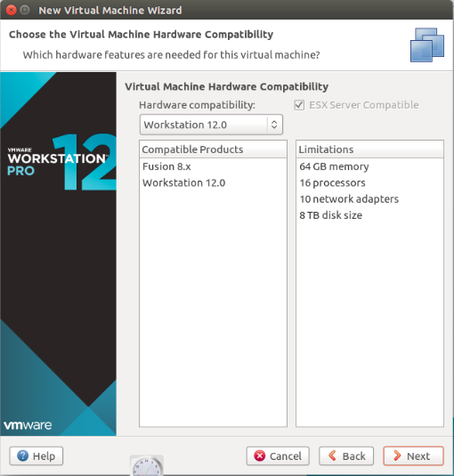

## Ubuntu Lab


> 
> Thực hiện: **Nguyễn Thanh Nhựt**
> 
> Cập nhật lần cuối: **25/08/2016**

### Mục lục
[1.Phần cài mới Ubuntu 16.04](#1)

[2.Cấu hình IP , DNS tĩnh](#2)

[3.Cấu hình tắt firewall iptables](#3)

[4.Cài đặt và cấu hình SSH](#4)

[5.Gỡ hoàn toàn DE DM](#5)


---


<a name="1"></a>
### 1.Phần cài mới Ubuntu 16.04


- Mở __VMware Workstation__ và click vào __Create a New Virtual Machine__


- Chọn  __custom (advanced)__ vì nó mang đến nhiều lựa chọn


- Click next và chọn phiên bản  __VMware Workstation__ tương ứng 



- Chọn I will install operating system later


- Đặt tên và thiết lập vị trí cho máy ảo Ubuntu


- Đặt CPU ảo và lõi mà bạn muốn, nên chọn 1 bộ xử lý và 2 lõi để  __Ubuntu__ mạnh hơn


- Điều chỉnh bộ nhớ cho __Ubuntu__ , nếu máy 32bits thì nên chọn 1024MB còn đối với máy 64 bits chọn 2048MB


- Chọn kiểu mạng mà bạn muốn


- Click Next chọn __LSI Logic (recommended)__


- Tiếp tục click next chọn __SCSI (recommended)__


- Click Next chọn __Creata a new virtual disk__ để tạo ổ đĩa mới cho __Ubuntu__


- Chỉ định bao nhiêu không gian đĩa  muốn sử dụng cho  __Ubuntu__  rồi chọn  __store virtual disk as a single file__  tùy chọn này cho phép thực hiện nhiều hơn


- Click Next ở cửa sổ tiếp theo


- Hiện những thông số đã cài đặt click finish


- Đến đây  hãy nhấp chuột vào biểu tượng *CD/DVD (SATA)* để đi đến đường đẫn của iso linux


- Chọn *Use ISO image file* để tìm file ISO ubuntu để cài đặt sau đó bấm ok


- Khi thiết lập xong thì hãy nhấn vào biểu tượng hình tam giác để khởi động máy ảo Ubuntu.


- khởi động xong cửa sổ này sẽ hiện lên chọn *Install Ubuntu*


Nếu mạng nhanh thì chọn cả 2 tùy chọn này, nếu không thì chọn cái bên dưới sau khi cài xong có thể Update System sau


- Chọn *Installnow*


- Chọn khu vực *Ho Chi Minh* và click continue


- Tiếp theo chọn kiểu bàn phím, dù lúc đầu bạn chọn ngôn ngữ tiếng Việt hay tiếng Anh thì vẫn chọn kiểu bàn phím là English(US) nhé, sau đó lại click Continue


- Điền thông tin đăng nhập sau đó click continue


Quá tình Ubuntu sẽ tự động cài và sau khi hoàn tất nó sẽ hiện thông báo kêu bạn khởi động lại máy


- Màn hình Login hiện ra nhập password và sử dụng 


<a name="2"></a>
##2.Phần cấu hình IP tĩnh, DNS tĩnh

####Vào *search your computer* nhập network


####Tiếp theo chọn *Option*


#### Trên cửa sổ hiện lên chọn *IPv4*, phần *Method* chọn *Manual* rồi gán địa chỉ IP và DNS


####Sau khi cấu hình xong restart lại network bằng cách vào terminal nhập lệnh sau

```
/etc/init.d/networking restart
```

<a name="3"></a>
##3. Cấu hình tắt Firewall Iptables

####Tắt firewall

```
$ sudo ufw disable
```
####Mở firewall

```
$ sudo ufw enable
```

####Reload firewall

```
$ sudo ufw reload
```

####Để tắt Iptables

```
$ sudo iptables -X

$ sudo iptables -t nat -F

$ sudo iptables -t nat -X

$ sudo iptables -t mangle -F

$ sudo iptables -t mangle -X

$ sudo iptables -P INPUT ACCEPT

$ sudo iptables -P FORWARD ACCEPT

$ sudo iptables -P OUTPUT ACCEPT
```

<a name="4"></a>
##4.Cài đặt openssh-server

####Vào *terminal* nhập lệnh sau

```
$ sudo apt-get install openssh-server
```

####Xác thực bằng key

**Tại máy server**

######Tạo key bằng lệnh sau

```
$ ssh-keygen -t rsa
```

######Copy pub-key vào authorized_keys

```
mv ~/.ssh/id_rsa.pub ~/.ssh/authorized_keys
```
###### Cấp quyền cho ~/.ssh/authorized_keys

```
chmod 600 ~/.ssh/authorized_keys 
```
**Tại máy Client**

######Tạo thư mục và cấp quyền

```
$  mkdir ~/.ssh

$ chmod 700 ~/.ssh/
```
#####Copy private-key đến máy cần trao đổi bằng  *scp*


<a name="5"></a>
##5. Gỡ bỏ hoàn toàn DE DM

####Gỡ bỏ Unity hoàn toàn

```
$ sudo apt-get remove unity unity-asset-pool unity-control-center unity-control-center-signon unity-gtk-module-common unity-lens* unity-services unity-settings-daemon unity-webapps*
```

####Gỡ bỏ DM

```
$ sudo apt-get purge lightdm
```


 
