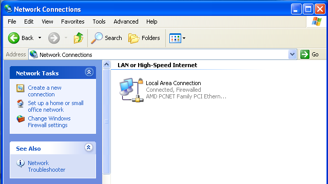
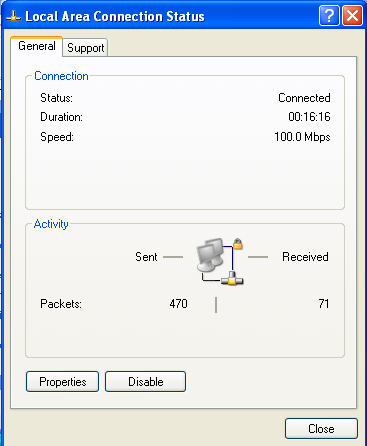
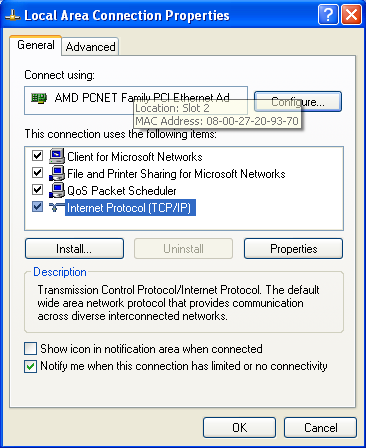
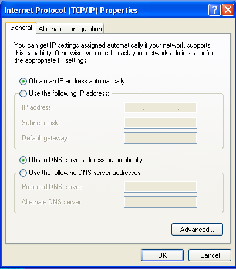

## DHCP


> 
> Thực hiện: **Nguyễn Thanh Nhựt**
> 
> Cập nhật lần cuối: **30/08/2016**

### Mục lục

[1. Giới thiệu](#1)

[2. Chức năng](#2)

[3. Cách thức hoạt động](#3)

[4. Các thuật ngữ trong DHCP](#4)

[5. Các thông điệp trong DHCP](#5)

[6. Ưu điểm và nhược điểm của DHCP]($6)

[7. Cấu hình DHCP Server Ubuntu - DHCP Client Window XP](#7)

---


<a name="1"></a>
##1.Giới thiệu

###1.1 Khái niệm

Dynamic Host Configuration Protocol (DHCP - giao thức cấu hình động máy chủ) là một giao thức cấu hình tự động địa chỉ IP. Máy tính được cấu hình một cách tự động vì thế sẽ giảm việc can thiệp vào hệ thống mạng. Nó cung cấp một database trung tâm để theo dõi tất cả các máy tính trong hệ thống mạng. Mục đích quan trọng nhất là tránh trường hợp hai máy tính khác nhau lại có cùng địa chỉ IP.

###1.2 Lịch sử

DHCP đầu tiên được định nghĩa trong RFC 1531 vào tháng 10/1993, là phần mở rộng của Bootstrap Protocol(BOOTP). Động cơ để cải tiến BOOTP là BOOTP đòi hỏi phải cấu hình thủ công để thêm thông tin cho từng máy client, và không cung cấp cơ chế tái sử dụng lại địa chỉ IP. Năm 1997, RFC 2131 ra đời,vẫn còn chuẩn IPv4 cho đến năm 2011. DHCPv6 được định nghĩa trong RFC 3315 RFC 3633 được thêm vào DHCPv6 cơ chế prefix delegation.

Giao thức BOOTP lần đầu tiên được định nghĩa trong RFC 951 thay thê cho RARP (Reverse Address Resolution Protocol), mà động cơ thiết yếu để thay thế RARP bằng BOOTP là RARP hoạt động ở tầng data link, điều này làm cho việc thực hiện trên nhiều máy server trở nên khó khăn, và đòi hỏi một server xử lý trên riêng trên từng network. BOOTP có đổi mới relay agent, cho phép forwarding đến gói BOOTP trong mạng cục bộ, vì vậy BOOTP server có thể phục vụ cho nhiều IP subnet.

###1.3 Tại sao phải sử dụng DHCP

- Trong một hệ thống mạng các máy tính liên lạc với nhau bằng Protocol TCP/IP do đó các máy tính này phải được cấu hình theo một thông số IP nhất định.

- Một hệ thống mạng thông thường khoảng 20-30 máy tính trở xuống thì việc đặt địa chỉ IP có thể thực hiện bằng tay nhưng nếu có nhiều hơn 30 máy tính thì việc cấu hình thủ công như vậy gặp rất nhiều vấn đề:

-- Cấu hình cùng lúc cho nhiều máy có thể dẫn đến sai sót như: trùng địa chỉ IP giữa các máy tính,sai các thông tin về Default Getway ,Prefrred DNS…

-- Tốn công bảo trì và nâng cấp hệ thống : Vd có sự thay đổi thông số về DG hoặc Preffered DNS , lắp đặt thêm nhiều máy tính mới..

-- Để khác phục những nhược điểm trên bạn có thể triển khai dịch vụ có tên là DHCP(Dynamic Host Configuration Protocol).Dịch vụ này có năng cấp phát một cách tự động tất cả các thông số về địa chỉ IP cho những máy tính tham gia vào hệ thống mạng.

<a name="2"></a>
##2. Chức năng 

– Mỗi thiết bị trên mạng cơ sở TCP/IP phải có một địa chỉ IP duy nhất để truy cập mạng và các tài nguyên của nó. Không có DHCP, cấu hình IP phải được thực hiện một cách thủ công cho các máy tính mới, các máy tính di chuyển từ mạng con này sang mạng con khác, và các máy tính được loại bỏ khỏi mạng.

– Bằng việc phát triển DHCP trên mạng, toàn bộ tiến trình này được quản lý tự động và tập trung. DHCP server bảo quản vùng của các địa chỉ IP và giải phóng một địa chỉ với bất cứ DHCP client có thể khi nó có thể ghi lên mạng. Bởi vì các địa chỉ IP là động hơn tĩnh, các địa chỉ không còn được trả lại một cách tự động trong sử dụng đối với các vùng cấp phát lại.

<a name="3"></a>
##3. Cách hoạt động của DHCP

DHCP tự động quản lý các địa chỉ IP và loại bỏ được các lỗi có thể làm mất liên lạc. Nó tự động gán lại các địa chỉ chưa được sử dụng. DHCP cho thuê địa chỉ trong một khoảng thời gian, có nghĩa là những địa chỉ này sẽ còn dùng được cho các hệ thống khác. Bạn hiếm khi bị hết địa chỉ. DHCP tự động gán địa chỉ IP thích hợp với mạng con chứa máy trạm này. Cũng vậy, DHCP tự động gán địa chỉ cho người dùng di động tại mạng con họ kết nối.

Trình tự thuê Địa chỉ IP DHCP là một giao thức Internet có nguồn gốc ở BOOTP (bootstrap protocol), được dùng để cấu hình các trạm không đĩa. DHCP khai thác ưu điểm của giao thức truyền tin và các kỹ thuật khai báo cấu hình được định nghĩa trong BOOTP, trong đó có khả năng gán địa chỉ. Sự tương tự này cũng cho phép các bộ định tuyến hiện nay chuyển tiếp các thông điệp BOOTP giữa các mạng con cũng có thể chuyển tiếp các thông điệp DHCP. Vì thế, máy chủ DHCP có thể đánh địa chỉ IP cho nhiều mạng con.

Quá trình đạt được địa chỉ IP được mô tả dưới đây:

- Bước 1:

 Máy trạm khởi động với "địa chỉ IP rỗng" cho phép liên lạc với máy chủ DHCP bằng giao thức TCP/IP. Nó chuẩn bị một thông điệp chứa địa chỉ MAC (ví dụ địa chỉ của card Ethernet) và tên máy tính. Thông điệp nầy có thể chứa địa chỉ IP trước đây đã thuê. Máy trạm phát tán liên tục thông điệp này lên mạng cho đến khi nhận được phản hồi từ máy chủ.

- Bước 2:

 Mọi máy chủ DHCP có thể nhận thông điệp và chuẩn bị địa chỉ IP cho máy trạm. Nếu máy chủ có cấu hình hợp lệ cho máy trạm, nó chuẩn bị thông điệp "chào hàng" chứa địa chỉ MAC của khách, địa chỉ IP "chào hàng", mặt nạ mạng con (subnet mask), địa chỉ IP của máy chủ và thời gian cho thuê. Địa chỉ "chào hàng" được đánh dấu là "reserve" (để dành). Máy chủ DHCP phát tán thông điệp chào hàng này lên mạng.

- Bước 3:

 Khi khách nhận thông điệp chào hàng và chấp nhận một trong các địa chỉ IP, máy trạm phát tán thông điệp này để khẳng định nó đã chấp nhận địa chỉ IP và từ máy chủ DHCP nào.

- Bước 4: 
 
 Cuối cùng, máy chủ DHCP khẳng định toàn bộ sự việc với máy trạm. Để ý rằng lúc đầu máy trạm phát tán yêu cầu về địa chỉ IP lên mạng, nghĩa là mọi máy chủ DHCP đều có thể nhận thông điệp nầy. Do đó, có thể có nhiều hơn một máy chủ DHCP tìm cách cho thuê địa chỉ IP bằng cách gởi thông điệp chào hàng. Máy trạm chỉ chấp nhận một thông điệp chào hàng, sau đó phát tán thông điệp khẳng định lên mạng. Vì thông điệp nầy được phát tán, tất cả máy chủ DHCP có thể nhận được nó. Thông điệp chứa địa chỉ IP của máy chủ DHCP vừa cho thuê, vì thế các máy chủ DHCP khác rút lại thông điệp chào hàng của mình và hoàn trả địa chỉ IP vào vùng địa chỉ, để dành cho khách hàng khác.

<a name="3"></a>
##4. Các thuật ngữ trong DHCP

- DHCP Server: máy quản lý việc cấu hình và cấp phát địa chỉ IP cho Client

- DHCP Client: máy trạm nhận thông tin cấu hình IP từ DHCP Server

- Scope: phạm vi liên tiếp của các địa chỉ IP có thể cho một mạng.

- Exclusion Scope: là dải địa chỉ nằm trong Scope không được cấp phát động cho Clients.

- Reservation: Địa chỉ đặt trước dành riêng cho máy tính hoặc thiết bị chạy các dịch vụ (tùy chọn này thường được thiết lập để cấp phát địa chỉ cho các Server, Printer,…..)

- Scope Options: các thông số được cấu hình thêm khi cấp phát IP động cho Clients như DNS Server(006), Router(003)

<a name="5"></a>
##5. Các thông điệp DHCP

- DHCP Discover: Thời gian đầu tiên một máy tính DHCP Client nỗ lực để gia nhập mạng, nó yêu cầu thông tin địa chỉ IP từ DHCP Server bởi việc broadcast một gói DHCP Discover. Địa chỉ IP nguồn trong gói là 0.0.0.0 bởi vì client chưa có địa chỉ IP.

- DHCP Offer: Mỗi DHCP server nhận được gói DHCP Discover từ client đáp ứng với gói DHCP Offer chứa địa chỉ IP không thuê bao và thông tin định cấu hình TCP/IP bổ sung(thêm vào), chẳng hạn như subnet mask và gateway mặc định. Nhiều hơn một DHCP server có thể đáp ứng với gói DHCP Offer. Client sẽ chấp nhận gói DHCP Offer đầu tiên nó nhận được.

- DHCP Request: Khi DHCP client nhận được một gói DHCP Offer, nó đáp ứng lại bằng việc broadcast gói DHCP Request mà chứa yêu cầu địa chỉ IP, và thể hiện sự chấp nhận của địa chỉ IP được yêu cầu.

- DHCP Acknowledge : DHCP server được chọn lựa chấp nhận DHCP Request từ Client cho địa chỉ IP bởi việc gửi một gói DHCP Acknowledge. Tại thời điểm này, Server cũng định hướng bất cứ các tham số định cấu hình tuỳ chọn. Sự chấp nhận trên của DHCP Acknowledge, Client có thể tham gia trên mạng TCP/IP và hoàn thành hệ thống khởi động.

- DHCP Nak: Nếu địa chỉ IP không thể được sữ dụng bởi client bởi vì nó không còn giá trị nữa hoặc được sử dụng hiện tại bởi một máy tính khác, DHCP Server đáp ứng với gói DHCP Nak, và Client phải bắt đầu tiến trình thuê bao lại. Bất cứ khi nào DHCP Server nhận được yêu cầu từ một địa chỉ IP mà không có giá trị theo các Scope mà nó được định cấu hình với, nó gửi thông điệp DHCP Nak đối với Client.

- DHCP Decline : Nếu DHCP Client quyết định tham số thông tin được đề nghị nào không có giá trị, nó gửi gói DHCP Decline đến các Server và Client phải bắt đầu tiến trình thuê bao lại.

- DHCP Release: Một DHCP Client gửi một gói DHCP Release đến một server để giải phóng địa chỉ IP và xoá bất cứ thuê bao nào đang tồn tại.

<a name="6"></a>
##6. Ưu điểm và nhược điểm của DHCP

###Ưu điểm

- Quản lý TCP/IP tập trung

Thay vì phải quản lý địa chỉ IP và các tham số TCP/IP khác vào một cuốn sổ nào đó (đây là việc mà quản trị mạng phải làm khi cấu hình TCP/IP bằng tay) thì DHCP server sẽ quản lý tập trung trên giao diện của nó. Giúp các nhà quản trị vừa dễ quản lý, cấu hình, khắc phục khi có lỗi xảy ra trên các máy trạm.

- Giảm gánh nặng cho các nhà quản trị hệ thống

Thứ nhất, trước đây các nhà quản trị mạng thường phải đánh cấu hình IP bằng tay (gọi là IP tĩnh) nhưng nay nhờ có DHCP server nó sẽ cấp IP một cách tự động cho các máy trạm. Nhất là trong môi trường mạng lớn thì sự cần thiết và hữu ích của dịch vụ mạng này mới thấy rõ ràng nhất.

Thứ hai, trước đây với kiểu cấu hình bằng tay thì người dùng họ có thể thay đổi IP. Anh thì táy máy thích vọc chơi, có anh thay đổi lung tung DNS server sau đó quên không nhớ IP của DNS server là gì để đặt lại cho đúng lại ới quản trị mạng, có anh đặt IP làm trùng với IP của người khác, anh khác đặt IP trùng với Defaul Gateway ... làm cho quản trị mạng khốn khổ vì phải chạy. Nhưng kiểu này không có ở IP động đâu nhé. Anh nào thích thay đổi cũng chịu chết. Chỉ có người quản trị DHCP server họ mới có quyền thích làm gì thì làm thôi.

- Giúp hệ thống mạng luôn được duy trì ổn định

Điều đó hiển nhiên rồi. Địa chỉ IP cấp phát động cho các máy trạm lấy từ dải IP cấu hình sẵn trên DHCP server. Các tham số (DG, DNS server ...) cũng cấp cho tất cả các máy trạm là chính xác. Sự trùng lặp IP không bao giờ xảy ra. Các máy trạm luôn luôn có một cấu hình TCP/IP chuẩn. Làm cho hệ thống hoạt động liên tục, vừa giảm gánh nặng cho người quản trị vừa tăng hiệu quả làm việc cho user nói riêng và doanh nghiệp nói chung.

- Linh hoạt và khả năng mở rộng

Người quản trị có thể thay đổi cấu hình IP một cách dễ dàng khi cơ sở hạ tầng mạng thay đổi. Do đó làm tăng sự linh hoạt cho người quản trị mạng. Ngoài ra DHCP phù hợp từ mạng nhỏ đến mạng lớn. Nó có thể phục vụ 10 máy khách cho đến hàng ngàn máy khách.

Trong bài viết này mình chỉ điểm qua về khái niệm và ưu điểm mà DHCP mang lại cho CSHT mạng và người quản trị hệ thống. Loạt bài viết sau sẽ đi vào chi tiết: cách mà DHCP client và DHCP server làm việc với nhau, cài đặt cấu hình DHCP server ra sao ? các cách để bảo mật DHCP server ...

###Nhược điểm

Tuy có nhiều ưu điểm, nhưng giao thức DHCP hoạt động lại khá đơn giản, suốt quá trình trao đổi thông điệp giữa DHCP Server và DHCP Client không có sự xác thực hay kiểm soát truy cập. DHCP Server không thể biết được rằng nó đang liên lạc với một DHCP Client bất hợp pháp hay không, ngược lại DHCP Client cũng không thể biết DHCP Server đang liên lạc có hợp pháp không.

Địa chỉ IP được cấp sẽ bị thay đổi không bảo đảm có một địa chỉ riêng biệt cho một client trong mọi lúc, khi client cần một địa chỉ IP tỉnh.

<a name="7"></a>
##7. Cấu hình DHCP Server Ubuntu - DHCP Client Win 

###Cài đặt và cấu hình DHCP Server

```
$ sudo apt-get -y install isc-dhcp-server

$ sudo vi /etc/dhcp/dhcp.conf

#dòng 16: điền domain name

option domain-name "nhutnguyen";

#dòng 17: điền nameserver hostname hoặc địa chỉ IP

option domain-name-servers dlp.nhutnguyen;

#dòng 24: bỏ ghi chú

authoritative;

#thêm các dòng sau

#điền network address và subnet-mask

subnet 192.168.1.0 netmask 255.255.255.0{

#thêm default-getway

option routers 192.168.1.1;

#thêm subnet-mask 

option subnet-mask 255.255.255.0;

#xác định phạm vi địa chỉ cho thuê

range dynamic-bootp 192.168.1.200 192.168.1.254;

}

$ system restart isc-dhcp-server
 
```

###DHCP CLient

#####Vaò *My Computer* chọn *My Network Place* tiếp theo chọn *Network Connection*



##### Click vào *Local Area Connection* chọn *Properties*



#####Tiếp theo chọn *Internet Protocol (TCP/IP)*



##### check vào *Obtian an IP address automatically* và *Obtain DNS server address automatically* rồi chọn *Ok*




 