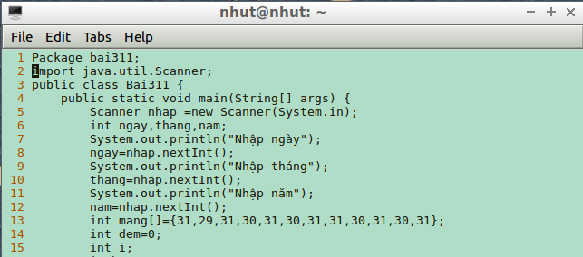
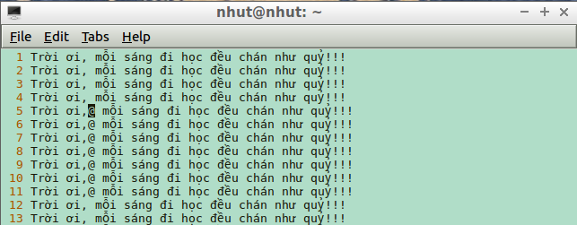
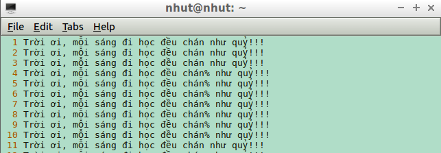
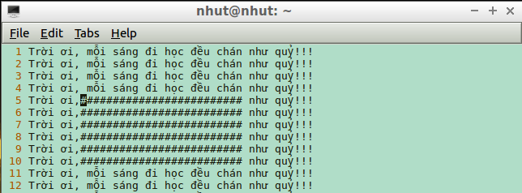
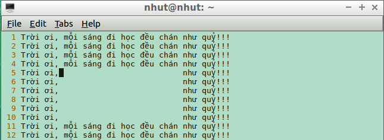
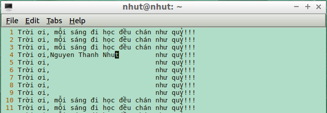

## Vi Editor


> 
> Thực hiện: **Nguyễn Thanh Nhựt**
> 
> Cập nhật lần cuối: **31/08/2016**

### Mục lục

[1.Giới thiệu](#1)

[2.Cài đặt Vim/Vi và cấu hình cơ bản](#2)

[3.Các chế độ làm việc và cú pháp lệnh của Vi Editor](#3)

- [3.1 INSERT MODE](#31)

- [3.2 COMMAND MODE](#32)

- [3.3 VISUAL MODE](#33)

---

<a name="1"></a>
##1. Giới thiệu

Vi  là chương trình soạn thảo văn bản trên máy tính được viết bởi *Bill Joy* năm 1976 để dùng cho hệ điều hành *BSD*. Sau này nó được AT&T dùng và trở thành tiêu chuẩn (dù không chính thức) trong Unix. Vi được dùng ở chế độ văn bản (text mode) như trạm cuối (terminal) và console. Tên gọi lấy từ chữ viết tắt (hai chữ đầu) của lệnh visual trong chương trình ex. Lệnh này chuyển chế độ biên tập dòng (line mode) của ex sang chế độ trực quan (visual mode).

Thông thường, vì lí do thuận tiện, cùng một chương trình sẽ khởi động ở chế độ vi hay ex, tuỳ theo tên lệnh được gõ. Tên "vi" được xem là viết tắt chữ đầu nên được phát âm từng chữ cái là [vi: aɪ] (theo IPA) mà không đọc thành một từ.

Vi có thể khó dùng đối với người mới biết, vì nó là trình biên tập theo chế độ (modal editor), tức là nó quy định các phím có ý nghĩa khác nhau tuỳ theo chế độ hiện dùng. Hai chế độ chính của vi là insert (điền) và command (lệnh). Ở chế độ insert, văn bản được nhập vào bình thường. Ở chế độ command, các phím được dùng để ra lệnh, như để di chuyển con trỏ, xoá kí tự, v.v. Ưu điểm của việc có chế độ lệnh riêng là nó làm đơn giản nhiều thao tác soạn thảo, thay vì phải dùng một ngón tay giữ phím Alt, phím Ctrl, hay các phím đặc biệt khác.

###Các dòng và biến thể của Vi

- Vi được chuyển từ vi 3.7 trên BSD cổ điển sang các hệ thống Unix hiện đại. Nó dùng ed làm cơ sở mã (codebase), được phân phối tự do theo kiểu BSD từ tháng 1 năm 2002.

- nvi sử dụng vi nguyên thuỷ vào BSD thứ 4 (4BSD).

- Elvis là một dòng vi chạy trên Unix và các hệ điều hành khác.

- Vigor thêm Vigor Assistant (cố ý dựa theo nhân vật hoạt họa Clippy của Microsoft Office) vào vi.

- VILE bổ sung tính năng nhiều bộ đệm và cửa sổ.

- vim - "Vi IMproved" - bản nâng cấp và mở rộng cho vi.

- bvi "Binary VI" - trình biên tập tập tin nhị phân.

- svicc - "Small VI Clone for the Commodore (64)"

<a name="2"></a>
##2. Cài đặt Vim/Vi và cấu hình cơ bản

VIM hay VI là như nhau, VIM là bản nâng cấp của Vi có thêm highlight đọc config dễ dàng hơn, hiện tại để đáp ứng nhu cầu ngày càng đa dạng của coder VIM đã phát triển nhiều plugin để gia tăng sức mạnh nhằm biến nó thành một IDE cho dân lập trình. Mặc định VI được cài sẵn trên hầu hết hệ điều hành linux rồi, nếu chưa có chạy lệnh sau:

- **CentOS** yum install vim

- **Ubuntu** apt-get install vim

Ta cần cấu hình vim một chút để dùng bản Vim đầy đủ vào ```vi /etc/vim/profile ``` thêm ```alias vi='vim'```

Gõ lệnh ```source /etc/profile ``` để apply thay đổi

Để hiển thị số dòng trong Vi, hightlight chữ viết  và nhìn comment dễ hơn,  mở file config ``` vi /etc/vim/vimrc```  thêm vào các dòng sau:

```
set number

syntax on

highlight Comment ctermfg=LightCyan

```

Sau khi config xong bạn sẽ thấy Vi như sau



<a name="3"></a>
##3. Các chế độ làm việc và cú pháp lệnh của Vi Editor

<a name="31"></a>
###3.1 INSERT MODE

Bạn ấn i hoặc phím Insert  để chuyển sang chế độ Insert, chế độ này dùng để nhập liệu sửa hoặc thêm thắt ký thự kiểu như dùng notepad , chủ yếu là kết hợp với các Mode khác.

<a name="32"></a>
###3.2 COMMAND MODE

Đây là chế độ mặc định khi mở bất kỳ một file nào bằng VI.

####Các lệnh xóa:

**x** hoặc phím **delete** xao 1 ký tự

**dd** xóa 1 dòng, tính từ vị trí con trỏ

**2dd** xóa 2 dòng, muốn xóa nhiều dòng bạn thêm số bất kỳ vào.

**dw** xóa 1 từ bên phải con trỏ

**db** xóa từ bên trái con trỏ

####Các lệnh copy past

**yy** copy 1 dòng tại vị trí con trỏ

**y1** copy 2 dòng, giá trị được tính từ 0, copy 3 dòng là **y2**, 4 dòng là **y3**

**p** dán kết quả copy tại vị trí con trỏ.

####Lệnh lưu và thoát

**:w** lưu và không thoát VI

**:w newfile.txt** lưu file đang làm việc sang một file mới, giống save as trong MSWord.

**:wq** lưu và thoát VI

**:q!** không lưu và thoát VI

####Tìm kiếm thay thế

**/text1** tìm kiếm từ text1 từ trên xuống

**?text1** tìm kiếm từ text1 từ dưới lên

**n** để nhảy đến kết quả tìm kiếm tiếp theo

**:%s/text1/text2/g** thay text1 bằng text2

####Cuộn màn hình

**Ctrl + F** cuộn xuống 1 màn hình

**Ctrl + B** cuộn lên một màn hình

####Chia màn hình làm việc

**:vsplit** Chia theo chiều dọc

**:split** Chia theo chiều ngang

**Ctrl + w** chuyển giữa 2 cửa sổ, giữ Ctrl ấn w 2 lần

Có thể chia ra nhiều màn hình làm việc khác nhau theo cả chiều dọc chiều ngang, để thoát màn hình làm việc nào  dùng  **:q**

<a name="33"></a>
###3.3 VISUAL MODE

Chế độ này được được dùng kết hợp với Insert Mode để xử lý khối.

**Chọn và xóa 1 cột hoặc cả khối:** Ctrl + v, di chuyệt con trỏ lên xuống để chọn cột cần xóa, ấn d hoặc phím delete, cái này dùng xóa dấu comments (#) thì rất tiện.

**Chèn ký tự vào một khối:**

Muốn chèn ký tự @ vào cột đầu tiên của khối ấn phím Shift + i, văn bản chuyển sang Insert Mode, con trỏ sẽ nhảy về vị trí đầu tiên của khối, bạn nhập ký tự @ vào rồi ấn **Esc** để kết thúc lệnh, sau đó ký tự sẽ tự động chèn vào cột đầu tiên.



Nếu muốn chèn ký tự **%** vào cột cuối của khối thay vì ấn Shift + i ta ấn Shift + a, như hình.



**Thay thế ký tự toàn khối:** thử thay thế toàn bộ khối bằng ký tự #, ấn Ctrl + v để chọn khối như các bước trên, ấn tiếp **r#** để nhập ký tự cần chèn, được kết quả



Chúng ta có thể dùng cách này để tạo ô ghi chú cũng rất hay, thay vì ấn **r#**, ta ấn **r + (space)** dấu cách



Tạo vùng ghi chú xong, tiếp theo ấn Shift + r chuyển sang **Replace** để thay khoảng trắng bằng ký tự bất kỳ mà không bị vỡ vùng ghi chú, sau đó nhập nội dung cần ghi chú vào, xong đâu đấy ấn **Esc** để thoát lệnh.

