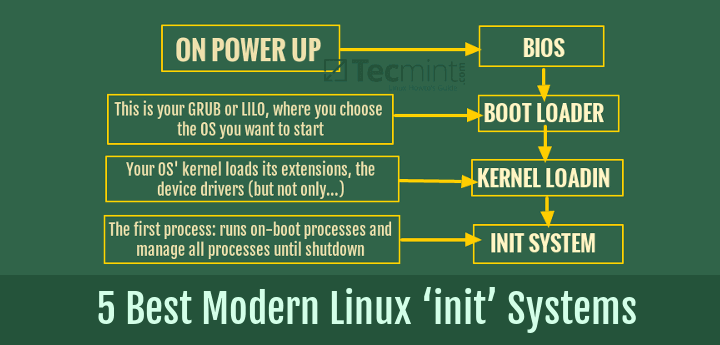

## Tìm hiểu Init System

> 
> 
> Thực hiện: **Nguyễn Thanh Nhựt**
> 
> Cập nhật lần cuối: **4/9/2016**

---

Trong Linux và các hệ điều hành giống như Unix, init (khởi tạo) quá trình là quá trình đầu tiên được thực hiện bởi hạt nhân vào lúc khởi động. Nó có một quá trình ID (PID) là 1, nó được thực hiện trong nền cho đến khi hệ thống được tắt.

Quá trình init khởi động tất cả các quá trình khác, đó là trình nền, dịch vụ và các quá trình nền khác, do đó, nó là mẹ của tất cả các quá trình khác trên hệ thống. Một quá trình có thể bắt đầu nhiều tiến trình con khác trên hệ thống, nhưng trong trường hợp có một quá trình cha mẹ qua đời, init sẽ trở thành mẹ của quá trình trẻ mồ côi



Qua nhiều năm, nhiều hệ thống init đã xuất hiện trong các bản phân phối Linux lớn và trong hướng dẫn này, chúng ta sẽ có một cái nhìn tại một số các hệ thống init tốt nhất bạn có thể làm việc trên các hệ điều hành Linux.

##1.SystemD

SystemD là một hệ thống và quản lý dịch vụ cho Linux, tương thích với SysV và LSB init script. Systemd cung cấp khả năng song song mạnh mẽ, sử dụng ổ cắm và D-Bus kích hoạt cho các dịch vụ bắt đầu, cung cấp xuất theo yêu cầu của daemon, theo dõi các quá trình sử dụng cgroups Linux, hỗ trợ snapshotting và phục hồi tình trạng hệ thống, duy trì gắn kết  automount điểm và thực hiện một xây dựng giao dịch logic phụ thuộc dựa trên điều khiển dịch vụ. Nó có thể làm việc như một sự thay thế cho sysvinit.

###Cách thức hoạt động

Các Systemd mới bắt đầu daemon tại cùng một thời gian và chạy song song này của daemon có nghĩa là một khởi động rất nhanh, systemd sử dụng ổ cắm cho tất cả các dịch vụ. Nó thiết lập ổ cắm cho daemon và phối giữa chúng khi chúng bắt đầu lên. Vì vậy, khi một daemon yêu cầu hỗ trợ từ daemon khác, systemd phối hợp các dữ liệu từ ổ cắm của chúng. Ví dụ, daemon A bắt đầu và nó cần một sự hỗ trợ từ daemon B, tuy nhiên, daemon B đã chưa bắt đầu. Do đó, systemd viết yêu cầu daemon A tới daemon ổ cắm B (đệm) và nó tiếp tục. Vì vậy daemon A không cần phải chờ đợi cho daemon B. Ngay khi daemon B bắt đầu, nó sẽ đọc socket của nó. Điều này có nghĩa là xử lý song song và hệ thống khởi động rất nhanh. Việc kích hoạt ổ cắm được thiết kế bởi hệ điều hành OS X của Apple. 

###Các câu lệnh của systemd

**Làm thế nào để bắt đầu / dừng hoặc kích hoạt / vô hiệu hóa các dịch vụ?**

Kích hoạt một dịch vụ ngay lập tức:

```
  systemctl start foo 
```

Hủy kích hoạt một dịch vụ ngay lập tức:
```
  systemctl stop foo

```   

Khởi động lại một dịch vụ:
```
  systemctl restart foo 
```
Hiển thị trạng thái của một dịch vụ bao gồm cả cho dù nó đang chạy hay không:
```
   systemctl  status foo
```
Cho phép một dịch vụ sẽ được bắt đầu vào lúc khởi động:
```
  systemctl enable foo 
```
Vô hiệu hóa một dịch vụ để không bắt đầu trong quá trình khởi:
```
  systemctl disable foo 
```
Ngăn chặn một dịch vụ này khởi động hoặc thậm chí tay, trừ khi lột mặt nạ:
```
  systemctl mask foo 
```
Kiểm tra xem một dịch vụ đã được kích hoạt hay không:
```
  systemctl is-enable foo 
```

**Làm thế nào để thay đổi target (runlevel)?**

systemd có khái niệm về các mục tiêu đó là một sự thay thế linh hoạt hơn cho runlevel trong sysvinit.

Runlevel3 được mô phỏng bởi multi-user.target. Runlevel5 được mô phỏng bởi graphical.target. runlevel3.target là một liên kết tượng trưng đến multi-user.target và runlevel5.target là một liên kết tượng trưng đến graphical.target.

Bạn có thể chuyển sang 'runlevel 3' bằng cách chạy
```
  systemctl isolate multi-user.target 
```
Bạn có thể chuyển sang 'runlevel 5' bằng cách chạy
```
  systemctl isolate graphical.target 
```
**Làm thế nào để thay đổi mục tiêu mặc định?**
```
  systemctl set-default <tên của target> .target
```

**Làm thế nào để tôi biết các mục tiêu hiện tại?**
```
  systemctl set-default 
```

**Có hoạt động lệnh dịch vụ với systemd**

Có. Nó đã được sửa đổi để gọi systemctl tự động khi đối phó với các tập tin dịch vụ systemd. Vì vậy, một trong các lệnh sau đây không cùng một kiểu

```
systemctl stop NetworkManager
```

hoặc là 

```
service NetworkManager stop
```

Có, bật dịch vụ / tắt, tính tương thích đã được cung cấp cả hai cách. chkconfig đã được sửa đổi để gọi systemctl khi giao dịch với các tập tin dịch vụ systemd. Cũng systemctl tự động gọi chkconfig khi giao dịch với một tập tin sysv init truyền thống.

Vì vậy, một trong các lệnh sau đây không cùng một kiểu
```
  systemctl disable NetworkManager 
```
hoặc là
```
  chkconfig NetworkManager off
```   

**Làm thế nào để thay đổi số lượng Gettys chạy theo mặc định?**

Cách đơn giản nhất là để chỉnh sửa /etc/systemd/logind.conf:
```
 [Login]
 ...
 NAutoVTs = 8
```
Thiết lập này sẽ có hiệu lực sau khi khởi động lại.

Ngoài ra, getty @ .services mà mở cửa sổ đăng nhập có thể được kích hoạt và bắt đầu cá nhân.

Để thêm getty khác:
```
 systemctl enable getty @ tty8
 systemctl start getty @ tty8
```
Để loại bỏ một getty:
```
 systemctl disable getty @ tty8
 systemctl stop getty @ tty8
```
systemd không sử dụng / etc / inittab.

**Làm thế nào để thiết lập tự động đăng nhập vào một giao diện điều khiển terminal ảo?**

Đầu tiên tạo ra một dịch vụ mới tương tự như getty @ .service:
```
 # Cp /lib/systemd/system/getty@.service \
      /etc/systemd/system/autologin@.service
 # Ln -s /etc/systemd/system/autologin@.service \
         /etc/systemd/system/getty.target.wants/getty@tty8.service
```
sau đó chỉnh sửa ExecStart, Restart và Alias ​​giá trị, như thế này:
```
 ...
 ExecStart = - / sbin / mingetty --autologin USERNAME% I
 Khởi động lại = không
 ...
 Alias=getty.target.wants/getty@tty8.service
```
và cuối cùng  daemon lại và bắt đầu các dịch vụ:
```
 systemctl daemon-reload
 systemctl start getty@tty8.service
```
Lưu ý rằng nếu bạn thoát khỏi phiên tty8, bạn sẽ không thể sử dụng nó cho đến khi khởi động lại hoặc khởi động bằng tay của systemctl, trừ khi bạn để  Khởi động lại như 'always', nhưng  nên tránh điều này theo lý do an ninh.

**Làm thế nào để tùy chỉnh một tập tin đơn vị / thêm một tập tin đơn vị tùy chỉnh?*

Cách tốt nhất để tùy chỉnh các file đơn vị là thêm /etc/systemd/system/foobar.service.d/*.conf nơi foobar.service là tên của dịch vụ mà bạn muốn tùy chỉnh. Nếu một thư mục không tồn tại, tạo ra một và thả một file conf với các thiết lập mà bạn muốn ghi đè lên. Ví dụ,

/etc/systemd/system/httpd.service.d/restart.conf
```
 [Service]
 Restart = always
 RestartSec = 30
```

**Đừng quên để tải lại daemon systemd sử dụng systemctl daemon-reload và systemctl restart foobar sau khi chỉnh sửa một tập tin đơn vị nơi foobar là tên của đơn vị. Cũng lưu ý rằng bạn có thể systemd-delta để liệt kê các tập tin đơn vị đã được tùy biến và cũng có những khác biệt chính xác**

Chăm sóc đặc biệt phải được thực hiện khi trọng tùy chọn có thể được thiết lập lần muliple ( ExecStart , ExecStartPre , ExecStartPost là một ví dụ phổ biến). Gán một số giá trị cho các tùy chọn gắn thêm vào danh sách hiện có, trong khi assiging giá trị rỗng reset danh sách.

Ví dụ, giả sử chúng ta có một tập tin dịch vụ như thế này:
```
 [Service]
 ExecStart = /bin/echo execstart1 
 ExecStart =
 ExecStart = /bin/echo execstart2 
 ExecStartPost = /bin/echo post1 
 ExecStartPost = /bin/echo post2
``` 
Khi bắt đầu, dịch vụ này sẽ in
```
 execstart2
 post1
 post2
```
Các quy tắc tương tự áp dụng cho các đoạn trích trong thư mục ".d". Điều này có nghĩa rằng các đoạn đó ghi đè ExecStart và các thiết lập tương tự, thường nên bắt đầu với việc chuyển nhượng trống ExecStart= , tiếp theo là thiết lập mới. 

###Vị trí lưu file cấu hình

- /usr/lib/systemd/system/  đơn vị cung cấp bới các gói cài đặt

- /etc/systemd/system/ đơn vị cung cấp bởi người quản trị hệ thống

###Những dòng hệ điều hành sử dụng systemd

- Fedora

- Mageia

- OpenSuSe

- Arch Linux

- Debian 

- Ubuntu

- Core OS

- CentOS

- Red Hat Enterprise Linux

- SUSE Linux Enterprise Server

###Ưu điểm

- Thiết kế sạch sẽ, đơn giản và hiệu quả

- Xử lý đồng thời và song song khi khởi động

- APIv tốt hơn

- Cho phép loại bỏ các quy trình bắt buộc

- Hỗ trợ sự kiện khai thác gỗ sử dụng journald

- Hỗ trợ lập lịch công việc sử dụng tính giờ lịch systemd

- Lưu trữ các bản ghi trong các tập tin nhị phân

- Bảo quản của nhà nước systemd để tham khảo trong tương lai

- Tích hợp tốt hơn với GNOME cộng thêm nhiều hơn


##2.Upstart 

Upstart là một hệ thống init dựa trên sự kiện được phát triển bởi các nhà sản xuất của Ubuntu như là một thay thế cho hệ thống init SysV. Nó bắt đầu nhiệm vụ hệ thống khác nhau và các quá trình, kiểm tra chúng trong khi hệ thống đang chạy và dừng chúng trong hệ thống đóng cửa.

###Cấu hình và các câu lệnh

Một khi bạn đã tải về và giải nén mới nổi, bạn sẽ cần phải cấu hình cây nguồn, xây dựng và cài đặt nó. 

Nếu muốn cấu hình các nguồn như là các phần thực thi được đặt trên hệ thống tập tin gốc và các phần dữ liệu là ở các vị trí thông thường.
```
 ./configure --prefix =/ usr --exec-prefix = --sysconfdir = / etc
```
Mọi người khác sẽ muốn cài đặt nó dưới một tiền tố thay thế như /opt/upstart . Bạn sẽ cần phải khởi động với một hạt nhân dòng lệnh thay thế như init=/opt/upstart/sbin/init .
```
 ./configure --prefix = /opt/upstart --sysconfdir = / etc
```

**Exec và script**


Exec cho đường dẫn đến một hệ nhị phân trên hệ thống tập tin và đối số tùy chọn để vượt qua nó; bất kỳ ký tự đặc biệt (ví dụ như dấu ngoặc kép hoặc ' $ ') sẽ dẫn đến các lệnh được thông qua vào một vỏ để giải thích thay thế.
```
 exec / bin / foo --opt -xyz foo bar
```
script thay cho mã kịch bản đó sẽ được thực hiện sử dụng /bin/sh . Các -e tùy chọn vỏ được sử dụng, vì vậy bất kỳ lệnh nào không sẽ chấm dứt các kịch bản. Đoạn bị chấm dứt bởi một dòng chứa chỉ " end script ".
```
 script
     # Làm một số công cụ
     if [ ... ];  then
         ...
     fi
 end script
```

**Script trước khi bắt đầu và sau dừng script**

Mã shell bổ sung có thể được đưa ra để được chạy trước hoặc sau khi nhị phân hoặc script quy định với exec hoặc script . Đây không phải là dự kiến sẽ bắt đầu quá trình này, trên thực tế, họ không thể. Chúng được sử dụng để chuẩn bị môi trường và làm sạch sau đó.

pre-start script chỉ định mã shell để chạy trước khi quá trình chính, như với script bất kỳ lệnh nào sẽ không chấm dứt các kịch bản và nó được chấm dứt với " end script "
```
 pre-start script
     # prepare environment
     mkdir -p / var / run / foo
 end script
```
post-stop script định mã shell để chạy sau khi quá trình chính kết thúc hoặc bị giết, như với script và post-start script bất kỳ lệnh nào sẽ không chấm dứt các kịch bản và nó được chấm dứt với " end script "
```
 post-stop script
     # clean up
     rm -rf / var / run / foo
 end script
```

**Bắt đầu và dừng lại**

Công việc của bạn bây giờ có thể được bắt đầu và dừng lại bằng tay bởi một quản trị viên hệ thống, tuy nhiên bạn cũng có thể muốn nó được bắt đầu và dừng tự động khi sự kiện được phát ra.

Các sự kiện chính được phát ra bởi startup là startup mà  khi máy tính khởi động lần đầu (không có hệ thống tập tin có thể ghi hoặc mạng).

Nếu bạn đang sử dụng các job ví dụ, bạn cũng sẽ có runlevel X sự kiện, nơi X là một trong 0 - 6 hoặc S . Jobs sẽ được chạy cùng với các init script cho runlevel đó.

Cuối cùng job khác tạo ra sự kiện khi chúng đang chạy; bạn có thể có của bạn chạy khi một công việc khác dừng lại bằng cách sử dụng stopped job . Sự kiện công việc hữu ích khác đang started job .

Bạn liệt kê các sự kiện mà bạn muốn bắt đầu công việc của bạn với start on , và các sự kiện dừng hẳn công việc của bạn với stop on .
```
 start on start up

 start on runlevel [23]

 start on stopped rcS

 start on started tty1
```

**Giao diện điều khiển**

Bạn có thể thay đổi các cài đặt cho nơi đầu ra của job đi, và nơi mà đầu vào của nó xuất phát , với đoạn console. Điều này sẽ là một trong những output (đầu vào và đầu ra từ /dev/console ), owner (như output với việc bổ sung rằng tín hiệu nhất định (chẳng hạn như Control-C) cũng được gửi đến quá trình) hay none (mặc định; đầu vào và đầu ra đến /dev/null ).
```
 exec echo example
 console output
``` 

**Kiểm soát job**

*Bắt đầu và dừng*

Jobs có thể được bắt đầu và dừng lại bằng tay bằng cách sử dụng start và stop lệnh, thường được cài đặt vào /sbin . Mỗi có một tên công việc, và kết quả đầu ra tình trạng cuối cùng (xem dưới đây).
```
 # Start tty1
 tty1 start / running, process 7490

 # Stop tty1
 tty1 stop / chạy, process 7490
```

*Trạng thái*

Tình trạng của bất kỳ job có thể được truy vấn bằng cách sử dụng các status lệnh, lại thường được cài đặt vào /sbin . Phải mất một tên job và kết quả đầu ra tình trạng hiện tại.
```
 # status tty1
 tty1 stop / waitting

 # start tty1
 tty1 start / running, process 4418

 # status tty1
 tty1 start / running, process 4418
```

*Danh sách initctl*

Một danh sách của tất cả các công việc và các quốc gia của họ có thể thu được bằng cách sử dụng initctl list .
```
 #Danh sách initctl
 Ctrl + Alt + Del stop / waitting
 rc stop / waitting
 rc-sysinit stop / waitting
 RCS stop / waitting
 tty1 start / running, process 4418
 tty2 start / running, process 7367
 tty3 start / running, process 7368
 tty4 start / running, process 7369
 tty5 start / running, process 7370
 tty6 start / running, process 7371
```
*initctl phát ra*

Một sự kiện tùy chỉnh có thể được phát ra bằng cách sử dụng initctl emit , bất kỳ job bắt đầu hoặc dừng lại bởi sự kiện này sẽ bị ảnh hưởng. Giả sử các job sau đây:
```
 start on bounce
 exec echo --Bounced--
 console output
```
Sau đây sẽ chạy nó:
```
 # Initctl emit bounce
 # --Bounced--
```
Sự kiện có thể lấy đối số (thông qua ngày emit dòng lệnh) trong các hình thức của các biến môi trường.


###Các hệ điều hành sử dụng Upstart

- Ubuntu 

- Debian

- Fedora

- Red Hat Enterprise Linux

- CentOS

-  Oracle Linux

- OpenSUSE

###Ưu điểm

- Được phát triển cho Ubuntu Linux nhưng có thể chạy trên tất cả các bản phân phối khác

- Khởi đầu dựa trên sự kiện và dừng công việc và dịch vụ

- Các sự kiện được tạo ra trong quá bắt đầu và dừng các nhiệm vụ và các dịch vụ

- Sự kiện có thể được gửi qua hệ thống các quy trình khác

- Truyền thông với quá trình init qua D-Bus

- Người dùng có thể bắt đầu và ngừng các quy trình riêng của họ

- Tái sinh sản của các dịch vụ mà chết đột ngột và nhiều hơn nữa

##3.OpenRC

OpenRC là một hệ thống init phụ thuộc dựa trên duy trì khả năng tương thích với các hệ thống cung cấp chương trình init, thường nằm trong / sbin / init. Nó không hoạt động như một sự thay thế cho các tập tin / sbin / init. OpenRC là 100% tương thích với các kịch bản Gentoo init, có nghĩa là một giải pháp có thể được tìm thấy để chạy hàng chục daemon trong kho Gentoo chính. Tuy nhiên, không được thiết kế để được độc quyền sử dụng Gentoo Linux và có thể được sử dụng trên các bản phân phối khác và hệ thống BSD.

###Cấu hình

**Quản lý mạng**

OpenRC có thể được sử dụng với một trong số các nhà quản lý mạng hoặc thậm chí với không .

**Hành vi phụ thuộc**

Thay đổi phụ thuộc mặc định của init script, có thể là cần thiết để phù hợp với các thiết lập phức tạp hơn. Xem /etc/rc.conf để làm thế nào để thay đổi hành vi mặc định; nhận thấy các tùy chọn rc_depend_strict. Ngoài ra, ví dụ mạng tiếp theo cho thấy cách linh hoạt OpenRC có thể được.

*Nhiều giao diện mạng (ví dụ)*

Các dịch vụ SSH phải đến với các mạng nội bộ, ví dụ eth0 và không bao giờ wlan0.

Bác bỏ sự phụ thuộc "net" từ /etc/init.d/sshd, và tinh chỉnh nó phụ thuộc vào "net.eth0":
```
 /etc/conf.d/sshd
  rc_need = "! net.eth0 net"
```
*Nhiều giao diện mạng trong nhiều runlevel (ví dụ)*

Các dịch vụ SSH phải bắt đầu với eth0 (không wlan0) trong runlevel "default", nhưng trong "office" runlevel nó phải bắt đầu với wlan0 (không eth0).

Giữ mặc định:
```
/etc/rc.conf
 # Rc_depend_strict = "YES"
```
Hãy liên kết tượng trưng bổ sung cho sshd với tên giao diện mạng:
```
root #  ln -s sshd /etc/init.d/sshd.eth0
root #  ln -s sshd /etc/init.d/sshd.wlan0
```
Cài đặt được đọc từ /etc/conf.d/sshd.eth0 và /etc/conf.d/sshd.wlan0 bây giờ:
```
root #  cp /etc/conf.d/sshd /etc/conf.d/sshd.eth0
root #  cp /etc/conf.d/sshd /etc/conf.d/sshd.wlan0
```
Thêm các phụ thuộc:
```
root #  echo 'rc_need="!net net.eth0"' >> /etc/conf.d/sshd.eth0
root #  echo 'rc_need="!net net.wlan0"' >> /etc/conf.d/sshd.wlan0
```
Trong ví dụ này net.eth0 và net.wlan0 đọc các thiết lập của họ từ /etc/conf.d/net, hoặc /etc/conf.d/net.office tùy thuộc vào runlevel hoạt động. Thêm tất cả runscripts để runlevel khác nhau:
```
root #  rc-update add sshd.eth0 default
root #  rc-update add sshd.wlan0 office
root #  rc-update add net.eth0 default office
root #  rc-update add net.wlan0 default office
```
Để chuyển đổi giữa "mặc định" runlevel và "office" runlevel mà không cần khởi động lại máy tính, thay đổi thành "nonetwork" runlevel ở giữa. Các giao diện mạng sẽ được ngừng lại theo cách này, và đọc lại cấu hình cụ thể runlevel của họ. Điều này làm việc tốt nhất khi "nonetwork" là một runlevel xếp chồng lên nhau trong cả hai "default" và "office" runlevel, quản lý hiển thị và các dịch vụ phi mạng khác được thêm vào "nonetwork" chỉ runlevel.
```
  default runlevel <---> nonetwork runlevel <---> office runlevel  
```
```
root #  rc nonetwork && rc office
root #  rc nonetwork && rc default
```
###Lựa chọn một runlevel cụ thể lúc khởi động
OpenRC đọc kernel dòng lệnh sử dụng tại thời điểm khởi động, và sẽ bắt đầu runlevel định bởi tham số "softlevel" nếu được cung cấp, thay vì 'mặc định'.

Ví dụ, bạn có thể chọn để khởi động vào 'mặc định' hoặc 'nonetwork' runlevel với cấu hình ví dụ grub.conf sau đây:
```
 /boot/grub/grub.conf Ví dụ grub.conf (grub di sản)
  ...

 title = Regular Start-up
 ...
 kernel (hd0,0) gốc /boot/kernel-3.7.10-gentoo-r1 = / dev / sda3

 title = Bắt đầu mà không cần mạng
 ...
 kernel (hd0,0) gốc /boot/kernel-3.7.10-gentoo-r1 = / dev / sda3 softlevel = nonetwork
```

###Sử dụng

**runlevel**

OpenRC có thể được kiểm soát và cấu hình bằng rc, rc-update và rc-status

**Liệt kê**

Sử dụng rc-update show -v để hiển thị tất cả các init script có sẵn và runlevel hiện tại của họ (nếu họ đã được thêm vào một):
```
root #  rc-update show -v
```
Chạy rc-update hoặc rc-update show sẽ chỉ hiển thị các init script đã được thêm vào một runlevel.

**runlevel đặt tên**

OpenRC runlevel là thư mục sống trong / etc / runlevel tạo runlevel bổ sung là đủ để phát hành
```
root #  install -d /etc/runlevels/$runlevel
```
**runlevel xếp chồng lên nhau**

Là có thể quản lý các biến thể sử dụng rc-update -s.

###Vị trí file cấu hình

- /etc/init

- /etc/init.d

- /lib/init

###Các hệ điều hành sử dụng OpenRC

- Gentoo Linux

- Arch Linux

- Debian 

- Manjaro Linux

- Parapola GNU Linux

- Calculate Linux


###Ưu điểm

- Nó có thể chạy trên nhiều bản phân phối Linux khác bao gồm Gentoo và cũng trên BSD

- Hỗ trợ phần cứng khởi xướng init script

- Hỗ trợ một tập tin cấu hình duy nhất

- Không có cấu hình cho mỗi dịch vụ hỗ trợ

- Chạy như một daemon

- Dịch vụ song song khởi động và nhiều hơn nữa

##4.Runit

runit cũng là một hệ thống init nền tảng có thể chạy trên GNU / Linux, Solaris, * BSD và Mac OS X và nó là một sự thay thế cho init SysV. Nó có thể được sử dụng kết hợp với OpenRC hoặc thậm chí thay thế OpenRC như quản lý dịch vụ.

###Cấu hình

**PID1 - init thay thế**

runit có thể được sử dụng như là init hệ thống. Để làm điều này, chỉ cần thêm init=/sbin/runit-init để kernel dòng lệnh và khởi động lại của bộ nạp khởi động. 

Ra khỏi hộp runit-init có một cấu hình rất tối thiểu mà sẽ chỉ nhận được một giao diện điều khiển đăng nhập. Mặc dù nó sẽ được tối ưu để có tất cả các daemon bắt đầu lên một cách thống nhất duy nhất, người dùng có thể tự do trộn và kết hợp giữa runit và OpenRC như mong muốn. init script có thể được tìm thấy trong "default" runlevel, có thể được bắt đầu tự động khi khởi động với các dịch vụ "local" hiện có:
```
/etc/local.d/rc-default.start - Bắt đầu mở default runlevel sau khi khởi động
  #! / bin / sh
 default rc
```

```
root #  chmod u+x /etc/local.d/rc-default.start
```


```
root #  rc-update add local boot
```


Ngoài ra, thêm RUNLEVEL=S /sbin/rc default vào / etc / runit / 1 như bên dưới
```
/etc/runit/1
  Runlevel = S / sbin / rc sysinit
 Runlevel = S / sbin / rc boot
 Runlevel = S / sbin / rc default
```
 Hoặc, đối với những người muốn làm điều đó bằng tay:

```
root #  rc default
```
**Init và quản lý dịch vụ**

Runit cũng có thể thay thế OpenRC làm quản lý dịch vụ. Để đạt được điều này, xóa tất cả các dòng bắt đầu bằng RUNLEVEL=S trong / etc / runit / 1. Tuy nhiên, người ta sẽ phải thay thế các kịch bản khởi động và tập lệnh dịch vụ OpenRC với riêng của nó (hoặc sử dụng một lớp phủ ) mà làm nhiệm vụ tương tự 

**Dịch vụ giám sát OpenRC**

Runit có thể giám sát các quy trình mà không cần chạy như init, hoặc thậm chí nhất thiết root:
```
user $  mkdir /path/to/service-dir/
```
```
user $  chmod a+x /path/to/service-dir/*/run
```

dịch vụ địa phương

OpenRC có thể bắt đầu việc này cho bạn sử dụng /etc/init.d/local (xem /etc/local.d/README để biết thêm chi tiết):
```
 /etc/local.d/runsvdir.start
 #! / bin / sh
 # Hãy nhớ thêm --user nếu bạn không muốn chạy như là root!
 start-stop-daemon --start --background --make-pidfile \
     --pidfile /run/runsvdir.pid \
     --exec / usr / bin / runsvdir - / path / to / dịch vụ-dir /
```
```
/etc/local.d/runsvdir.stop
  #! / bin / sh
 start-stop-daemon --stop --pidfile /run/runsvdir.pid
```

dịch vụ OpenRC

Điều này không giống như kịch bản local.d trên, nhưng sử dụng OpenRC thích hợp. Như vậy, bạn có thể sử dụng các tính năng bổ sung nó cung cấp như init script ghép.
```
/etc/init.d/runsvdir
  #! / sbin / openrc-run
 command = "runsvdir"
 command_args = "/ etc / service"
 pidfile = "/ run / $ {} SVCNAME .pid"
 command_background = "true"
 description = "start and monitors a collection ò runsv "
 retry = "SIGHUP / 5"

 depend () {
     need localmount
 }
```
###Cách thức hoạt động

Runit bắt đầu như một nuber một quá trình. Sau đó nó chạy / etc / scripts runit / 1, 2 và 3 khởi động, còn gọi là "giai đoạn". Bạn có thể định nghĩa lại chúng. Giai đoạn 1 được dành cho các tác vụ khởi động cần thiết, được xử lý bởi Initscript cũ. Giai đoạn 2 là cho quá trình bình thường khởi động kêu gọi runsv  vào thư mục / dịch vụ, trong đó dịch vụ runit đang nằm. Một dịch vụ runit trông giống như một thư mục với hai script thực thi: chạy và kết thúc. Ngoài ra còn có một thư mục giám sát, nơi các tập tin PID và các bản ghi đang nằm.  Một runit chạy script có giá trị nên thực hiện một daemon; daemon đang được thực thi nên ở tiền cảnh. Nếu daemon mà thoát, nó sẽ được khởi động lại bởi runit. Một script kết thúc là không cần thiết, tuy nhiên bạn có thể xác định nó.


###Các hệ điều hành sử dụng Runit

- Debian GNU / Linux (như chương trình init thay thế)

- FreeBSD

- OpenBSD

- NetBSD

- Ubuntu (như chương trình init thay thế)

- Gentoo

- Linux từ Scratch

- Finnix

- Linux-VServer

- GoboLinux

- Dragora GNU / Linux (như chương trình init mặc định)

- ArchLinux

- OpenSDE

- Zinux Linux (như chương trình init mặc định)

- deepOfix Mail Server (như chương trình init mặc định)

- Void Linux

###Ưu điểm

- Giám sát phục vụ, với mỗi dịch vụ có liên quan đến một thư mục dịch vụ

- Trạng thái quá trình làm sạch, nó đảm bảo mỗi quá trình Nhà nước trong sạch

- Nó có một cơ sở khai thác đáng tin cậy

- Hệ thống nhanh chóng khởi động và tắt máy

- Nó cũng là xách tay

- Gói thân thiện

- Mã kích thước nhỏ và nhiều hơn nữa