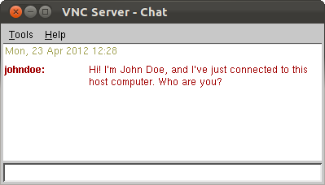

## Tìm hiểu VNC (Virtial Network Computing)


> Thực hiện: **Nguyễn Thanh Nhựt**
> 
> Cập nhật lần cuối: **15/9/2016**

### Mục lục

[1. Giới thiệu](#1)

[2. Hoạt động](#2)

[3. Cấu hình VNC server](#3)

 - [3.1 Trên Ubuntu](#31)
 
 - [3.2 Trên CentOS 6](#32)  

[4. Một số VNC Client](#4)

 - [4.1 RealVNC](#41)

 - [4.2 TightVNC](#42)

 - [4.3 TigerVNC](#43)


---
<a name="1"></a>
#1.Giới thiệu

Trong máy tính, Virtual Network Computing (VNC) là một đồ họa chia sẻ desktop  hệ thống sử dụng các Remote Frame Buffer protocol  (RFB) để điều khiển từ xa máy tính khác. Nó truyền bàn phím chuột và các sự kiện từ một máy tính khác, chuyển tiếp các đồ họa màn hình cập nhật lại theo hướng khác, trên một mạng . 

VNC là nền tảng độc lập - có client và server cho nhiều hệ điều hành dựa trên GUI và cho Java . Nhiều client có thể kết nối đến một VNC server cùng một lúc. Sử dụng phổ biến cho công nghệ này bao gồm hỗ trợ kỹ thuật từ xa và truy cập các tập tin trên một máy tính làm việc từ một máy tính tại nhà, hoặc ngược lại.


*Logo VNC*


*VNC trong KDE 3.1*

VNC ban đầu được phát triển tại Olivetti & Oracle Lab nghiên cứu ở Cambridge, Vương quốc Anh. Các VNC gốc mã nguồn và nhiều dẫn xuất hiện đại là mã nguồn mở dưới GNU General Public License .


Có một số biến thể của VNC  trong đó cung cấp các chức năng đặc biệt của riêng mình; ví dụ, một số tối ưu hóa cho Microsoft Windows , hoặc chuyển cung cấp tập tin (không một phần của VNC thích hợp), vv Nhiều tương thích (không có tính năng gia tăng của họ) với VNC đúng theo nghĩa là một người xem một hương vị có thể kết nối với một máy chủ của người khác ; những người khác được dựa trên mã VNC nhưng không tương thích với các VNC.

VNC và RFB được đăng ký thương hiệu của RealVNC Ltd ở Mỹ và ở các nước khác.

###Một số khuyết điểm trong sử dụng VNC

Có thể có một loạt các thách thức phải đối mặt với cách sử dụng một chương trình VNC. Họ thường liên quan đến một loạt các vấn đề bảo mật tiềm năng và các vấn đề hiệu suất. Có hay không những thế mạnh lớn hơn những thách thức này phụ thuộc vào lý do của bạn để sử dụng một chương trình như vậy. Nó cũng phụ thuộc vào loại an ninh và phần mềm đã có sẵn trên mạng máy tính.

Vấn đề an ninh có thể nhanh chóng trở thành một vấn đề lớn. Không có tính năng bảo mật trên hầu hết các chương trình mạng máy tính ảo có sẵn. Ví dụ, nếu khách hàng mỏng hiện tại của bạn có chứa virus, điều này có thể làm tổn hại toàn bộ mạng của bạn. Tuy nhiên, bạn có thể tải về các chương trình bảo mật khác mà có thể giúp bảo vệ mạng của bạn. điều quan trọng là để giữ an ninh hiện tại để tránh hack mới hơn và rủi ro thấp hơn.

Một vấn đề khác là hiệu suất. Chương trình của bạn chỉ là nhanh như các kết nối Internet chậm nhất có sẵn. Nếu kết nối Internet của bạn chậm, bạn có thể có một vấn đề với chạy các chương trình trên máy khách lớn của bạn. vấn đề hiệu suất cũng sẽ có xu hướng tăng lên khi bạn sử dụng các chương trình thời gian thực và các ứng dụng tương tác.

Phức tạp có thể gây ra một số người để cho lên trên bằng cách sử dụng hệ thống mạng máy tính ảo. Nếu bạn đang sử dụng nhiều hơn một mạng, giao thức, cung cấp dịch vụ, hoặc tập hợp các thiết bị phần cứng mạng để thiết lập các đường hầm VNC , sau đó bạn có thể có một thời gian khó khăn cố gắng để làm cho chương trình làm việc cùng nhau. Bạn có thể cần phải thuê một chuyên gia để làm cho mọi công việc. Điều này đặc biệt đúng nếu các chương trình không được thiết kế để làm việc cùng nhau.

###Lợi ích của việc sử dụng một hệ thống VNC

Nếu bạn có thể tìm cách để vượt qua những thách thức bằng cách sử dụng một hệ thống mạng máy tính, sau đó không có nghi ngờ rằng bạn sẽ tận hưởng những lợi ích của hệ thống này. Ngoài việc tiết kiệm dữ liệu, các lợi ích bao gồm tiết kiệm thời gian và tiền bạc.

Bạn có thể tiết kiệm tiền trên tổng số yêu cầu phần cứng. VNC có thể cho phép bạn sử dụng một máy tính cũ để chạy một chương trình gần đây. Điều này đôi khi cho phép các doanh nghiệp để mua máy tính ít hơn. Doanh nghiệp không còn cần cùng một loại bộ nhớ ổ đĩa hoặc khả năng xử lý, cho VNC làm cho mọi thứ dễ dàng hơn.

Trong trường hợp có thảm họa, bạn có khả năng có thể khôi phục bất kỳ dữ liệu bị mất đó là trên máy tính của khách hàng lớn. Điều này là bởi vì tất cả các dữ liệu mà một máy tính để bàn ảo có được lưu trữ trong một trung tâm dữ liệu thứ cấp. Điều này cho phép bạn truy cập tất cả dữ liệu của bạn không có công việc bình thường bị gián đoạn.


<a name="2"></a>
#2.Hoạt động

- VNC server là các chương trình trên máy tính mà chia sẻ màn hình của nó. Các server thụ động cho phép các client để kiểm soát nó.

- VNC client (hoặc người xem) là chương trình đồng hồ, điều khiển và tương tác với server. Các client điều khiển server.

- VNC protocol ( RFB protocol ) là rất đơn giản, dựa trên một đồ họa nguyên thủy từ server cho client 

Các VNC server đang chạy trên không cần phải có một màn hình vật lý. Trong phương pháp vận hành bình thường một người xem kết nối tới một cổng trên máy chủ (cổng mặc định 5900). Ngoài ra một trình duyệt có thể kết nối đến server (tùy thuộc vào việc thực hiện) (cổng mặc định 5800). Và một server có thể kết nối với người xem ở chế độ "lắng nghe" trên cổng 5500. Một lợi thế của chế độ nghe là các server trang web không phải cấu hình tường lửa để cho phép truy cập trên cổng 5900 (hoặc 5800); các trách nhiệm này thuộc về người xem, đó là hữu ích nếu các máy chủ trang web không có chuyên môn máy tính, trong khi người dùng xem sẽ được dự kiến ​​sẽ được hiểu biết nhiều hơn.

VNC theo mặc định sử dụng cổng TCP 5900+ N, [6] [7] trong đó N là số hiển thị (thường là: 0 cho một màn hình vật lý). Một số hiện thực cũng bắt đầu một cơ bản HTTP máy chủ trên cổng 5800+ N để cung cấp một trình xem VNC như một applet Java , cho phép kết nối dễ dàng thông qua bất kỳ trình duyệt web Java. cổng khác nhau có thể được sử dụng miễn là cả hai client và server được cấu hình cho phù hợp. Một HTML5 VNC thực hiện khách hàng cho các trình duyệt hiện đại (không bổ sung cần thiết) tồn tại quá. 

Sử dụng VNC qua Internet hoạt động tốt nếu người dùng có một băng thông rộng kết nối ở cả hai đầu. Tuy nhiên, nó có thể yêu cầu tiên tiến NAT , tường lửa và bộ định tuyến cấu hình như cổng chuyển tiếp để các kết nối để đi qua. Một số người dùng có thể chọn để sử dụng ngay lập tức Mạng riêng ảo (VPN) các ứng dụng như Hamachi để làm cho việc sử dụng trên Internet dễ dàng hơn nhiều. Ngoài ra, một kết nối VNC có thể được thành lập như là một kết nối mạng LAN nếu VPN được sử dụng như là một proxy.

###Các kiến trúc VNC và X server

Linux sử dụng Hệ thống Window X (gọi tắt là X ) là giao diện người dùng đồ họa (GUI). Một X server (X server) theo nghĩa đen là một chương trình máy chủ mạng. Các chương trình máy chủ mạng cung cấp cho các trình máy khách (client) truy cập vào các tài nguyên cục bộ trong trường hợp của một X server là màn hình hiển thị, bàn phím và chuột, mà người dùng sử dụng.

Tuy nhiên, khi X được sử dụng trên một mạng thì người dùng ngồi tại máy tính chạy X server và các X client chính là các chương trình mà người dùng muốn chạy trên một máy tính khác. Cấu hình này đòi hỏi một giao thức mạng thứ hai để khởi đầu kết nối. Giao thức thứ hai này có thể là telnet, Secure Shell (SSH) hoặc XDMCP. Trình máy chủ cho giao thức đăng nhập này chạy trên máy tính của X client và trình máy khách đăng nhập từ xa chạy trên máy tính của X server. Trình máy chủ đăng nhập từ xa khởi chạy các X client, mà các trình X client này lần lượt liên hệ với X server.Hình dưới đây mô tả các quan hệ này.


Kiểu thiết lập này hoạt động tốt trên nhiều mạng cục bộ, nhưng nó có nhược điểm là yêu cầu phải khởi đầu giao thức mạng hai chiều, mà có lẽ giao thức này không thể thực hiện được xuyên qua một số tường lửa hoặc các bộ định tuyến dịch địa chỉ mạng (NAT).

Trên Linux, VNC server hoặc phản chiếu các nội dung của màn hình của X server cục bộ đến máy tính từ xa hoặc bao gồm X server riêng của mình, có thể chạy một cách độc lập với trình máy chủ quản lý màn hình cục bộ. Cấu hình này giúp loại bỏ yêu cầu kết nối mạng đảo ngược và vì các trình máy khách và các VNC server đều có mặt trên nhiều hệ điều hành, nên những người dùng có thể sử dụng một chương trình máy khách duy nhất để truy cập bất kỳ trình máy chủ nào. Kết qủa như hình dưới.


Nhược điểm của VNC là ở chỗ việc xác thực RFB dựa trên các mật khẩu mà không cần các tên người dùng. Để giải quyết vấn đề này, bạn có thể kết hợp hai giải pháp. Bạn có thể cấu hình lại XDMCP server cục bộ của mình để giúp X server đã tích hợp vào VNC cung cấp việc xác thực nhiều người dùng còn thiếu. Bây giờ, khi những người dùng VNC từ xa liên hệ với máy tính của VNC server, họ sẽ có thể nhập vào các tên người dùng và mật khẩu của mình để truy cập các phiên làm việc VNC duy nhất riêng của họ, vì thế máy tính có thể xử lý bao nhiêu người dùng tùy ý bạn.


<a name="3"></a>
#3.Cấu hình VNC server trên Ubuntu và CentOS6

<a name="31"></a>
###3.1 Trên Ubuntu

####Cài đặt VNC server

```
# apt-get -y install vnc4server  
```

####Đăng nhập với user mà bạn muốn nhưng để bảo mật nên tạo riêng 1 tài khoản để remote. 
```
adduser vncuser
```

Chọn password đăng nhập. Những thông tin tiếp theo bạn có thể nhấn Enter để mặc định.
```
Enter new UNIX password:
Retype new UNIX password:
passwd: password updated successfully
Changing the user information for vncuser
Enter the new value, or press ENTER for the default
 Full Name []:
 Room Number []:
 Work Phone []:
 Home Phone []:
 Other []:
Is the information correct? [Y/n] y
```

Để thay đổi pass user bạn chọn
```
passwd vncuser
```

Giờ hãy chuyển qua tài khoản vnc để cài đặt file xstartup để khởi động xfce4 mỗi khi kết nối VNC.
```
su - vncuser
```


####Khởi động VNC server với tài khoản đã chọn để tiến hành cài đặt
```
vncserver
```

####Tiếp theo VNC sẽ hỏi password để kết nối remote cho tài khoản này, hãy nhập vào password mong muốn.
```
vncuser@chiasecoupon:~$ vncserver
You will require a password to access your desktops.
Password:
Verify:
xauth: file /home/vncuser/.Xauthority does not exist

New 'chiasecoupon:1 (vncuser)' desktop is chiasecoupon:1

Creating default startup script /home/vncuser/.vnc/xstartup
Starting applications specified in /home/vncuser/.vnc/xstartup
Log file is /home/vncuser/.vnc/chiasecoupon:1.log
```

####Sau khi VNC Server đã khởi động, chúng ta cần tắt nó đi để chỉnh sửa xstartup file để đảm bảo luôn khởi động xfce4 thay vì gnome.

####Kill VNC Server session
```
vncserver -kill :1
```
####Chỉnh sửa xstartup file
```
cd ~
> .vnc/xstartup
nano .vnc/xstartup
```

####Điền nội dung bên dưới:
```
#!/bin/sh
unset SESSION_MANAGER
unset DBUS_SESSION_BUS_ADDRESS
startxfce4 &
[ -x /etc/vnc/xstartup ] && exec /etc/vnc/xstartup
[ -r $HOME/.Xresources ] && xrdb $HOME/.Xresources
xsetroot -solid grey
vncconfig -iconic &
```

####Lưu lại và tiến hành tạo VNC Server statup script

```
su -
nano /etc/init.d/vncserver
```

####Với nội dung

```
#!/bin/bash
unset VNCSERVERARGS
VNCSERVERS=""
[ -f /etc/vncserver/vncservers.conf ] && . /etc/vncserver/vncservers.conf
prog=$"VNC server"
start() {
 . /lib/lsb/init-functions
 REQ_USER=$2
 echo -n $"Starting $prog: "
 ulimit -S -c 0 >/dev/null 2>&1
 RETVAL=0
 for display in ${VNCSERVERS}
 do
 export USER="${display##*:}"
 if test -z "${REQ_USER}" -o "${REQ_USER}" == ${USER} ; then
 echo -n "${display} "
 unset BASH_ENV ENV
 DISP="${display%%:*}"
 export VNCUSERARGS="${VNCSERVERARGS[${DISP}]}"
 su ${USER} -c "cd ~${USER} && [ -f .vnc/passwd ] && vncserver :${DISP} ${VNCUSERARGS}"
 fi
 done
}
stop() {
 . /lib/lsb/init-functions
 REQ_USER=$2
 echo -n $"Shutting down VNCServer: "
 for display in ${VNCSERVERS}
 do
 export USER="${display##*:}"
 if test -z "${REQ_USER}" -o "${REQ_USER}" == ${USER} ; then
 echo -n "${display} "
 unset BASH_ENV ENV
 export USER="${display##*:}"
 su ${USER} -c "vncserver -kill :${display%%:*}" >/dev/null 2>&1
 fi
 done
 echo -e "\n"
 echo "VNCServer Stopped"
}
case "$1" in
start)
start $@
;;
stop)
stop $@
;;
restart|reload)
stop $@
sleep 3
start $@
;;
condrestart)
if [ -f /var/lock/subsys/vncserver ]; then
stop $@
sleep 3
start $@
fi
;;
status)
status Xvnc
;;
*)
echo $"Usage: $0 {start|stop|restart|condrestart|status}"
exit 1
esac
```

####Chmod vncserver script
```
chmod +x /etc/init.d/vncserver
```

Giờ tạo file cấu hình VNC Server trong thư mục /etc/
```
mkdir -p /etc/vncserver
nano /etc/vncserver/vncservers.conf
```

Copy đoạn sau vào, dòng đầu tiên là VNC port và VNC user, nếu muốn add thêm user thì điền thêm ở dòng này. Dòng tiếp theo là kích thước màn hình khi connect VNC.
```
VNCSERVERS="1:vncuser"
VNCSERVERARGS[1]="-geometry 1024x768"
```

####Cuối cùng đảm bảo VNC Server luôn khởi động cùng Ubuntu
```
update-rc.d vncserver defaults 99
```

####Khởi động lại Ubuntu Server
```
reboot
```

<a name="32"></a>
###3.2 Trên CentOS 6

####Cài đặt VNC server
```
yum install tigervnc-server -y
```

Để đảm bảo bảo mật cho VPS, mình sẽ sử dụng một tài khoản vncuser chuyên để remote.
```
adduser vncuser
```

Chuyển sang tài khoản này và cài đặt VNC password
```
su vncuser
vncpasswd
```

Quay trở lại tài khoản root
```
exit
```

Tiếp theo cài đặt local password cho vncuser, có thể giống với VNC password cũng được
```
passwd vncuser
```

File cấu hình TightVNC có đường dẫn /etc/sysconfig/vncservers trên CentOS. Bạn hãy mở file này lên
```
nano /etc/sysconfig/vncservers
```

Và thêm đoạn sau vào cuối file
```
VNCSERVERS="2:vncuser"
VNCSERVERARGS[2]="-geometry 1024x768"
```

Trong đó dòng đầu tiên là port (2 hoặc 5902) và account kết nối VNC. Dòng thứ 2 là screen resolution.

Giờ khởi động VNC Server
```
service vncserver start
```

Nếu bạn VNC Server luôn được khởi động cùng server thì dùng lệnh:
```
chkconfig vncserver on
```
<a name="4"></a>
#4. Một số VNC Client

<a name="41"></a>
###4.1 RealVNC

RealVNC làm việc trền Windows, Mac OS X, Linux, Solaris, HP-UX và AIX. Đối với Windows, phần mềm hỗ trợ nhiều phiền bản: Windows XP, Windows Vista, Windows 7 và cả Windows 8.

####Sử dụng cở bản VNC

để cài đặt RealVNC vào trang https://www.realvnc.com/download/vnc/ và chọn hệ điều hành tương ứng ở đây, mình chọn DEBx64


Sau khi tải về mở gói vừa tải chọn VNC-Viewer-5.3.2-Linux-x64.deb cửa sổ dưới sẽ hiện lên


Click vào Install package sẽ tự động cài đặt


Sau khi cài đặt hoàn tất mở VNC-Viewer xuất hiện cửa sổ chọn ngôn ngữ English và chọn *I read and accept these terms and conditions*


Giờ thì kết nối tới VNC Server thôi


**1.Chuyển các tập tin giữa các máy tính**

Bạn có thể chuyển các tập tin đến và đi từ VNC Viewer chạy trên một máy tính để bàn và VNC Server với một doanh nghiệp hoặc một giấy phép cá nhân.

**Gửi tập tin vào VNC Server**

- Nhấp vào File Transfer VNC Viewer  nút thanh công cụ. Hộp thoại File Transfer mở:


- Nhấp vào nút Gửi file. Hộp thoại tập tin Gửi mở ra.

- Chọn một tập tin hoặc thư mục. Để chọn nhiều tập tin và / hoặc thư mục, giữ phím SHIFT.

- Nhấn Open (OK dưới UNIX). Hộp thoại File Transfer mở trên máy tính VNC Server:


Các hoạt động chuyển tập tin gần đây nhất được tô sáng. Bạn có thể kiểm tra tình trạng của nó, hoặc tạm dừng hoặc dừng việc chuyển giao nếu phải mất nhiều hơn một vài giây.

Theo mặc định, các tập tin được tải về máy tính để bàn ( Downloads thư mục trên Mac OS X). Để thay đổi điều này cho các hoạt động chuyển tập tin trong tương lai, chọn một tùy chọn từ các tập tin Fetch để thả xuống ở dưới cùng của hộp thoại File Transfer. Lưu ý bạn phải có quyền ghi cho thư mục bạn chọn. Ngoài ra, bạn có thể yêu cầu được nhắc mỗi lần.

**Lấy tập tin từ máy chủ VNC**

Lưu ý rằng nếu bạn lấy tập tin, họ cũng sẽ được công bố cho tất cả người dùng máy tính để bàn VNC Viewer khác kết nối tại cùng một thời gian như bạn

- Trong cửa sổ VNC Viewer, nhấp chuột phải vào biểu tượng  (thường là bóng mờ màu đen), và từ menu chuột phải, chọn File Transfer. Hộp thoại File Transfer mở:


- Nhấp vào nút Gửi file. Hộp thoại tập tin Gửi mở ra.

- Chọn một tập tin hoặc thư mục. Để chọn nhiều tập tin và / hoặc thư mục, giữ phím SHIFT.

- Nhấn Open (OK dưới UNIX). Hộp thoại File Transfer mở trên máy tính của bạn:


**2.Sao chép và dán văn bản**

Bạn có thể sao chép và dán văn bản giữa các máy tính và các thiết bị.

Bạn không thể sao chép và dán các hình ảnh hay hiện vật mà không phải là văn bản.

Các thiết bị bạn đang dán vào phải hỗ trợ các ngôn ngữ của văn bản sao chép để cho nó được dán đầy ý nghĩa. Ngoài ra, bất kỳ định dạng áp dụng cho các văn bản sao chép, như in nghiêng, sẽ bị mất.

**Sao chép và dán văn bản với VNC Server**

- Sao chép văn bản trong cách tiêu chuẩn trên thiết bị của bạn, ví dụ bằng cách chọn nó và nhấn Ctrl + C trên Windows hoặc Cmd + C trên Mac. Các văn bản được sao chép vào Clipboard.

- Trong cửa sổ VNC Viewer, đưa con trỏ một cách thích hợp và dán văn bản trong cách dự kiến ​​cho các nền tảng mục tiêu, ví dụ bằng cách nhấn Ctrl + V cho Windows và Cmd + V cho Mac. Nếu bạn đang kết nối với một máy Mac từ một phi-Mac, nhấn Alt + V để thi đua Cmd + V.

**Sao chép và dán từ VNC Server**

- Các văn bản bạn chọn và sao chép vào máy tính của VNC Server sẽ có sẵn cho tất cả người dùng VNC Viewer khác kết nối tại cùng một thời gian như bạn.

- Trong cửa sổ VNC Viewer, sao chép văn bản trong cách dự kiến ​​cho các nền tảng mục tiêu, ví dụ bằng cách chọn nó và nhấn Ctrl + C cho Windows và Cmd + C cho Mac. Nếu bạn đang kết nối với một máy Mac từ một phi-Mac, nhấn Alt + C để thi đua Cmd + C. Các văn bản được sao chép vào Clipboard.

- Dán văn bản trong cách tiêu chuẩn cho thiết bị của bạn, ví dụ bằng cách nhấn Ctrl + V trên Windows hoặc Cmd + V trên Mac.

**3.Giao tiếp an toàn**

Để tham gia vào một cuộc trò chuyện, hoặc bắt đầu một cái mới, nhấp vào VNC Viewer trò chuyện bắt đầu phiên  nút thanh công cụ. Một hộp thông báo sẽ xuất hiện ở dưới cùng của cửa sổ VNC Viewer:


Nhập tin nhắn và nhấp vào nút Send. Thông điệp này được phát sóng với một hộp thoại trò chuyện hiển thị cho bạn và cho tất cả các người dùng khác:



**Trò chuyện như một người sử dụng VNC Server**

Để bắt đầu một cuộc trò chuyện với người sử dụng VNC Viewer kết nối:

- Mở VNC Server shortcut menu.

- Chọn Chat. Hộp thoại trò chuyện sẽ mở ra. Gõ văn bản trong các lĩnh vực ở phía dưới:


Bấm phím ENTER để gửi tin nhắn:


<a name="42"></a>
###4.2 TightVNC

TightVNC là một phần mềm điều khiển từ xa, TightVNC có thể kiểm soát một máy tính khác từ máy tính của bạn với chuột và bàn phím giống như bạn đang ngồi trực tiếp trên máy tính đó.

- TightVNC là phần mềm mã nguồn mở.

- TightVNC có chứa sằn 2 phần TightVNC server(chạy trên máy chủ) và TightVNC client(máy khách). TightVNC server khi chạy sẽ biến máy bạn trở thành máy chủ cho phép các máy khách truy cập từ xa để điền khiển máy này. TightVNC client phía bên máy khách thì sẽ cung cấp cho bạn cách để truy cập vào máy chủ.

**Sử dụng TightVNC**

Cài đặt TIghtVNC viewer

- Link download phiên bản cài đặt 64 bit cho windows:

http://www.tightvnc.com/download/2.7.10/tightvnc-2.7.10-setup-64bit.msi

- Link download phiên bản cài đặt 32 bit cho windows:

http://www.tightvnc.com/download/2.7.10/tightvnc-2.7.10-setup-32bit.msi

Sau khi tải về -> double click vào file *tightvnc-2.7.10-setup-32bit.msi* hoặc *tightvnc-2.7.10-setup-64bit.msi* để cài đặt chương trình. Chon Custom


Chọn TightVNC Viewer → Entire feature will be unavailable → Next


Next → Install → Finish


Khởi chạy TightVnc viewer từ máy client Start → All Programs → thư mục TightVNC → TightVNC Viewer


Nhập password đã thiết lập trước đó → OK


Kết nối thành công đến máy TightVnc server


<a name="43"></a>
###4.3 TigerVNC

TigerVNC là một nguồn và đa nền tảng dự án mở cung cấp cho người dùng với một khách hàng và máy chủ thực hiện của VNC (Virtual Network Computing) giao thức kết nối máy tính từ xa. Nó hỗ trợ Linux, Microsoft Windows và các hệ điều hành Mac OS X.

**Sử dụng TigerVNC**

khi tigervnc-server đã được cấu hình, bạn có thể kết nối bất kì VNC Server, để thiết lập vncviewer nhập lệnh sau

```
#apt-get -y install tigervnc
```


Kết nối với một máy chủ VNC sử dụng lệnh sau đây. vd:

```
# vncviewer machine-name:port

# vncviewer maggie.localdomain:3
# vncviewer 192.168.0.4:3 
```

